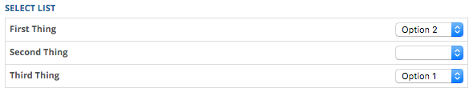
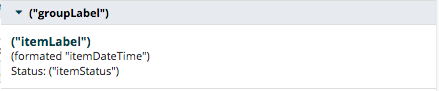

::: page-description
# What's new in the ADK? #
The following changelog has been provided to better communicate changes made to the ADK
:::

::: definition
Changes that will be reflected in this changelog:
- Any new additions or changes to ADK.UI components, API functionality, or code conventions
- Any other changes to the ADK that affect consumption/implementation for applet developers

Changes that will **NOT** be reflected:
- Any behind-the-scenes optimizations
- Non-relevant changes to the application
- Any other changes to the ADK that do not affect applet developers
:::

<!-- Update categories: Additions, Changes, Removals, and Fixes -->

## 2016-06-21 (June 21st, 2016) ##
### Changes ###
-  [Modal](ui-library/components.md#Modal)'s show function takes a parameter to override the last focused element that has triggered to open the modal instance.  See an example in the doc.

## 2016-06-02 (June 2nd, 2016) ##
### Changes ###
- The [Datepicker Control](ui-library/form-controls.md#Utility-Datepicker) now supports dyncamically changing date ranges through trigger events. Example: `$().trigger('control:startDate', '01/01/2016');` and `$().trigger('control:endDate', new Moment());`

## 2016-05-11 (May 11th, 2016) ##
### Changes ###
- [ADK.PatientRecordService](using-adk.md#ADK-Services-PatientRecordService)'s setCurrentPatient api has 'navigation' option to skip the navigation. By default the navigation option is set to true to navigate to an appropriate workspace.

## 2016-04-25 (April 25th, 2016) ##
### Changes ###
- [ADK.UI.AlertDropdown](ui-library/components.md#Alert-Dropdown-Options) supports having a `backdrop` when the dropdown menu is shown.

## 2016-04-18 (April 18th, 2016) ##
### Changes ###
- [ADK.UI.Notification](ui-library/components.md#Notification) supports sticky growl alert and onClick callback. See the api documentation for more info.

## 2016-03-31 (March 31th, 2016) ##
### Additions ###
- [How-to-build-Applets](getting-started.md#How-to-build-Applets) section has an example of specifying a list of contexts.

### Changes ###
- [ADK.PatientRecordService](using-adk.md#ADK-Services-PatientRecordService)'s setCurrentPatient api does navigation checking prior to displaying modal. By default it always asks to confirm, and this can be overwritten by an option **reconfirm**.

## 2016-03-31 (March 31th, 2016) ##
### Additions ###
- [ADK.PatientRecordService](using-adk.md#ADK-Services-PatientRecordService)'s setCurrentPatient api has a callback example.
### Changes ###
- [ADK.Navigation](using-adk.md#Navigation)'s navigate api has optional parameter.
- [Comment Box Form Control](ui-library/form-controls.md#Special-Comment-Box) now supports a `disabled` boolean and the corresponding `control:disabled` event.
- [Tray](ui-library/components.md#Tray) now supports `buttonView` which will override the `buttonLabel` and `iconClass` options and inject a view into (not replace) the button.

## 2016-03-30 (March 30th, 2016) ##
### Additions ###
- [ADK.Checks](using-adk.md#Checks) now available for use. This generalizes the concept of [Navigation Checks](using-adk.md#Navigation-Navigation-Checks), which are now considered deprecated. Please register any and all checks through `ADK.Checks.register`.

## 2016-03-23 (March 23rd, 2016) ##
### Additions ###
- ADK now supports [Modal](ui-library/components.md#Modal-Options) config option `wrapperClasses` where its value is a string or an array of strings to be used as classes that get added to the top level wrapping element of the modal component.  This option can be used in conjunction with custom css, to apply a unique look to the modal's container or elements.

## 2015-03-22 (March 22st, 2016) ##
### Additions ###
- [WorkspaceContextRepository](using-adk.md#ADK-Services-WorkspaceContextRepository) is added to ADK documentation.
- [Chrome Notifications](using-adk#Applet-Chrome-Adding-Notifications-to-Chrome-Container) allow the injection of one or more notification badges into the chrome header.

## 2016-03-21 (March 21st, 2016) ##
### Additions ###
- The [Tray Summary List View](using-adk.md#ADK-Views-Tray-Summary-List-View) now supports the `attributeMapping.nodes` option. Collections with additional nodes will create a nested accordion.
    - Default: "nodes"
    - Example:
        ```JavaScript
        ADK.Views.TraySummaryList.extend({
            initialize: function() {
                // place where collection can be created
            },
            options: {
                label: 'ITEMS',
                onClick: function(model) {
                    //...
                },
                attributeMapping: {
                    nodes: 'addenda'
                }
            }
        });
        ```

## 2015-03-21 (March 21st, 2016) ##
### Additions ###
- [Sub Tray Button View](using-adk.md#ADK-Views-Sub-Tray-Button-View) is available to be used as a button view that resembles a workflow sub-tray component.

## 2015-03-18 (March 18th, 2016) ##
### Changes ###
- [Select Form Control](ui-library/form-controls.md#Basic-Select)
  upgraded select2 from 4.0.1 to 4.0.2, and listens to "change selected" instead of "change select".
- [Modal component](ui-library/components.md#Modal-Options) uses starting z-index of 1111 instead of 10,000.

## 2015-03-16 (March 16th, 2016) ##
### Changes ###
- [ADK.PatientRecordService](using-adk.md#ADK-Services-PatientRecordService)'s setCurrentPatient api skips patient confirmation modal screen if the given patient is same as the current patient.

### Additions ###
- Added a [Select List Form Control](ui-library/form-controls.md#Utility-Select-List).
    

## 2015-03-15 (March 15th, 2016) ##
### Changes ###
- [ADK.PatientRecordService](using-adk.md#ADK-Services-PatientRecordService) is pointing to api/PatientRecordService, and ResourceService.patientRecordService was removed.
### Additions ###
- [ADK.PatientRecordService](using-adk.md#ADK-Services-PatientRecordService) has new API 'setCurrentPatient' to bypass patient search screen and and to go straight to a patient confirmation modal from anywhere.

## 2016-03-14 (March 14th, 2016) ##
### Additions ###
- The [Tray Summary List View](using-adk.md#ADK-Views-Tray-Summary-List-View) now supports `itemTemplate`, `getItemTemplate`, and `emptyViewTemplate` options. These allow for more flexibility in the content and layout / styling of the individual rows.
    - `itemTemplate` should be used when the layout needs to change from the default AND there is not a lot of conditional logic required. Can be either a string or Handlebars.compile template. The row's model is available in the template. Example: `itemTemplate: '<p>{{myAttribute}}</p>'`
    - `getItemTemplate` should be used when different states of the view / model result in substantially different templates (i.e. after the view logic.). This option should be defined as an function that returns a Handlebars.compile template.
        - Example:
            ```JavaScript
            getItemTemplate: function() {
                if (this.model.get('different')) {
                    return Handlebars.compile('<button>Different Template</button>');
                }
                return Handlebars.compile('<p>Default Template!</p>');
            }
            ```
    - `emptyViewTemplate` can be used to overwrite the default empty view template. Current default is "This patient currently has no [label]." where [label] is set by the `label` option. Can be either a string or Handlebars.compile template. Example: `emptyViewTemplate: '<p>No Items :(</p>'`

## 2015-03-11 (March 11th, 2016) ##
### Additions ###
- [Alert Dropdown Component](ui-library/components.md#Alert-Dropdown) is available to inject alert dropdowns into the navigation header.

## 2016-03-02 (March 2nd, 2016) ##
### Additions ###
- ADK now supports [Checklist](ui-library/form-controls.md#Utility-Checklist) config option `filterChecked` where 'true' shows only checked items and 'false' shows only unchecked items.

## 2016-02-29 (February 29th, 2016) ##
### Changes ###
- The [Textarea](ui-library/form-controls.md#Basic-Textarea) control now supports dynamically inserting text at the last caret position. See [Textarea Dynamic Events](ui-library/form-controls.md#Basic-Textarea-Dynamic-Events) at `control:insert:string`
    - Example:
        ```JavaScript
        // No options
        this.ui.textarea.trigger('control:insert:string', 'String to insert');
        // With options
        this.ui.textarea.trigger('control:insert:string', ['String to insert', {
            prependWith: "<block>",
            appendWith: "</block>"
        }]);
        ```
- The [Textarea](ui-library/form-controls.md#Basic-Textarea) control now supports a `charCount` option which determines whether the remaining characters allowed before reaching the textarea's **maxlength**  is displayed to the user. This must be used in conjunction with the `maxlength` option.
    - Example: `charCount: true`.

## 2016-02-12 (February 12th, 2016) ##
### Changes ###
- The [Comment Box](ui-library/form-controls.md#Special-Comment-Box) control now supports a `addCommentPosition` option which determines the position of the add comment area relative to the list of comments.
    - See [Add Comment Positioning](ui-library/form-controls.md#Special-Comment-Box-Add-Comment-Positioning) for more details. Example: `addCommentPosition: "top"`.
    - Note: bottom positioning is the default.

## 2016-02-11 (February 11th, 2016) ##
### Additions ###
- ADK now supports [Treepicker](ui-library/form-controls.md#Special-Treepicker) control. The examples below show a full tree or fetchable tree being registered inside a writeback form.

    ```JavaScript
    // full tree
    var ExampleFormView = ADK.UI.Form.extend({
        model: new Model(),
        fields: [
            {
                 control: 'treepicker',
                 name: 'selectAddProblems',
                 attributeMapping: {
                     treeItemDescription: 'someDescription',
                     treeItemNodes: 'someNodesArray'
                 },
                 selectableNodes: true
            }
        ]
    });
    ```
    ``` JavaScript
    // fetchable tree
    var ExampleFormView = ADK.UI.Form.extend({
        model: new Model(),
        fields: [
            {
                 control: 'treepicker',
                 name: 'selectAddOtherDiagnosis',
                 attributeMapping: {
                     href: 'childHref'
                 },
                 itemTemplate: '{{preferredText}} ({{icdCode}})'
            }
        ]
    });
    ```

## 2016-02-03 (February 3rd, 2016) ##
### Changes ###
- The [Comment Box](ui-library/form-controls.md#Comment-Box) and [Nested Comment Box](ui-library/form-controls.md#Nested-Comment-Box) controls now support `maxComments`, `allowEdit`, `allowDelete`, and `commentTemplate` options. The editing functionality has also changed to [Inline Editing](ui-library/form-controls.md#Special-Comment-Box-Inline-Editing). All of these changes should be backwards compatible with the slight caveat that `allowEdit` and `allowDelete` default to **true** instead of restricting access to the current user. Please review the [Comment Box](ui-library/form-controls.md#Comment-Box) documentation for full details.
	- `allowEdit` and `allowDelete` ([Access Control Documentation](ui-library/form-controls.md#Special-Comment-Box-Access-Control)) can take in either a boolean or a function that will return a boolean. This function will be run every time a comment is added, so the check can be as specific as needed. For example, all users might have the access to edit any comment but can only delete the comments they authored. So `allowDelete` would need a user check. The function receives the individual comment's model as its only argument.
	- `maxComments` sets the limit on comments allowed before the add comment input is disabled ([Max Comments Documentation](ui-library/form-controls.md#Special-Comment-Box-Maximum-Comment-Limit)). Example: `maxComments: 2`.
	- `commentTemplate`  allows for [Custom Templating](ui-library/form-controls.md#Special-Comment-Box-Custom-Templating). This can be used to achieve a different appearance or content.
		- Example: `commentTemplate: '{{comment}}'` would display only the comment.

## 2016-01-26 (January 26th, 2016) ##
### Changes ###
- The [Datepicker Control](ui-library/form-controls.md#Utility-Datepicker) now supports date ranges (endDate and startDate), outputFormat, and with `flexible: true` input format restriction. Please review the updated [Datepicker Documentation](ui-library/form-controls.md#Utility-Datepicker) for more details regarding these changes.
	- While these changes are backwards compatible, the use of `options` is not officially supported. If the date range is currently being set using something like:
		```JavaScript
		{
			control: "datepicker",
			name: "datepicker1",
			label: "Pick a date",
			options: {
				startDate: "01/01/2000" // some date
				endDate: "0d" // or some date
			}
		}
		```

		**Please change to:**

		```JavaScript
		{
			control: "datepicker",
			name: "datepicker1",
			label: "Pick a date",
			startDate: "01/01/2000" // some date
			endDate: new Moment() // or some date
		}
		```

	- In order to reduce the amount of pre-submit parsing required by form developers, an `outputFormat` option has been added and takes in a Moment-compatible string.
		- Example:
			```JavaScript
			{
				control: "datepicker",
				name: "datepicker1",
				label: "Pick a date",
				outputFormat: "YYYYMMDD"
			}
			```
		- Note: if `flexible: true` is specified, the date string that is saved to the model will only be formatted if the date has a year, month, and day. If the date lacks one of those fields, the date string saved on the model will represent the level of precision entered by the user. To easily construct formatted dates, an external model is now being saved to the form model on the attribute of the `name` option string prepended by "_". So if `name: "datepicker1"` the external model's attribute would be `_datepicker1`. This model contains: the **date** (the same as the date string saved to the form model), **formattedDate** (will be null if date is in a less precise format), **format** (from `outputFormat`), **year** (will be null only if no valid date is entered), **month** (will be null if month and day are not entered), and **day** (will be null if day is not entered)

	- When `flexible: true` input will be restricted according to the full list of acceptable formats specified within the [Datepicker Documentation](form-controls.md#Datepicker).
		- The user is provided with a helpful tooltip specifying the acceptable formats.

## 2016-01-09 (January 19th, 2016) ##
### Additions ###
- ADK now supports registering [Navigation Checks](using-adk#Navigation-Navigation-Checks).  The example below shows a navigation check being registered inside a writeback form to ensure that the user is warned when navigating to a different context other than "patient" when the form is in-progress.

    ```JavaScript
    var formView = ADK.UI.Form.extend({
        onRender: function() {
            this.listenToOnce(this.model, 'change', function() {
                ADK.Navigation.registerCheck(new ADK.Navigation.PatientContextCheck({
                    id: 'appletid-writeback-in-progress',
                    failureMessage: 'Writeback Workflow In Progress! Any unsaved changes will be lost if you continue.',
                    onCancel: _.bind(function() {
                        this.$el.trigger('tray.show');
                    }, this)
                }));
            });
        }
        //....
    });
    ```

## 2016-01-12 (January 12th, 2016) ##
### Changes ###
- The [Select Form Control](ui-library/form-controls.md#Basic-Select) control supports multiple & showFilter & fetchFunction & fetchDelay options in combination.
- The [Select Form Control](ui-library/form-controls.md#Basic-Select) control has a different function signature for fetchFunction. needMoreInput param is no longer supported. It fetches as user types.

## 2015-12-17 (December 17th, 2015) ##

### Additions ###
- Applets developers can now [register an application component](ui-library/application-component-registration.md#Application-Component-Registration-Registering-Components).  Application components are pieces of functionality that get used and placed in the wrapping context layouts of the screen.  One example of this would be the slide-out trays used for patient writeback.  Through messaging, an applet can register an ui component or view to be rendered as part of the application wrapper.
    + Below is an example of the observations applet registering a "[_tray_](ui-library/components.md#Tray)" component with the unique key of "_observations_" to the "_writeback_" group.
        ```JavaScript
        var trayView = ADK.UI.Tray.extend({...});

        ADK.Messaging.trigger('register:component', {
            type: "tray",
            group: "writeback",
            key: "observations",
            orderIndex: 1,
            view: trayView,
            shouldShow: function() {
                return true;
            }
        });
        ```
        For this example, now that the component has been registered with the ADK, the patient demographic bar can use the "_writeback_" group refernece and the "_tray_" type reference to render out a view for every tray that wants to be added to that area.

    + With this same pattern a component can be registered to multiple groups or areas on the screen like so:
        ```JavaScript
        var trayView = ADK.UI.Tray.extend({...});

        ADK.Messaging.trigger('register:component', {
            type: "tray",
            group: ["writeback", "writeback2"],
            key: "observations",
            orderIndex: 1,
            view: trayView,
            shouldShow: function() {
                return true;
            }
        });
        ```
        For the above example, the trayView will be included in areas that use the "_writeback_" and "_writeback2_" group references.
    + **Important:** To add a tray component to the current patient demographics bar you must specify `type: "tray"` and `group: "writeback"`
    + As of today there are three components registered to the ADK.  All three of them are of type "_tray_" and are in the group "_writeback_".  Their keys are: "_observations_", "_tasks_", and "_notes_".

- Some registered components require logic from multiple applets, so following the same pattern applets developers can now register an "[_application component item_](ui-library/application-component-registration.md#Application-Component-Registration-Registering-Items)".  Application component items are pieces of functionality that get used within a registered "[_application component_](ui-library/application-component-registration.md#Application-Component-Registration-Registering-Components)".  One example of this would be the registration of component items for each destinct applet domain that wants to be included under the observations tray.  Again, through messaging, an applet can register a piece of itself to be included and used inside a registered "_application component_".
    + Below is an example of the allergies and vitals applets registering "_application component items_" under the observations tray.
        ```JavaScript
        // the following would be placed inside the allergies applet
        ADK.Messaging.trigger('register:component:item', {
            type: "tray",
            key: 'observations',
            label: 'Allergy',
            onClick: function(){...},
            shouldShow: function() {
                return true;
            }
        });

        //--------------------------------------------------------

        // the following would be placed inside the vitals applet
        ADK.Messaging.trigger('register:component:item', {
            type: "tray",
            key: 'observations',
            label: 'Vitals',
            onClick: function(){...},
            shouldShow: function() {
                return true;
            }
        });
        ```
        For this example, now allergies and vitals are registered as items under the observations tray. The observations tray can now display its items properly in a dropdown list of actions a user can take to create a new observations writeback.

- For the 2.0 tray design we have abstracted out a reusable Marionette view that UI developers can use called an "[**Action Summary List**](using-adk.md#ADK-Views-Tray-Action-Summary-List-View)".  The basic goal of the action summary list view is to abstract out the layout and logic of retriving the appropriate "_application component items_" registerted to the tray and displaying them in a dropdown list / action item format.  It also sets up the region in which the list view of the 2.0 tray design will be displayed.  Please reference the "_Action Summary List_" documentation for more information on its options and uasage.
    + One example useage of the "_application component items_" being used inside an "_Action Summary List_" is the observations tray.  The design for 2.0 observations tray shows the capability for a user to open the tray and select from a dropdown what type of new observation they would like to create.  In that list there are items like: "New Allergy", "New Vital", and "New Immunization".  In order to achieve this structure and still maintain separation between each applet domain's code, we can utalize the power of registering "_application component items_" with some additional options to a particular tray, in this case it would be to the observations tray.  Then inside the observation's applet when extending the ADK.UI.Tray options and defining the tray option, an "_Action Summary List_" view can be passed in with the appropriate options, as seen in the sample code below:
        ```JavaScript
        // inside observations applet
        var TrayView = ADK.UI.Tray.extend({
            options: {
                tray: ADK.Views.TrayActionSummaryList.extend({
                    options: {
                        key: "observations",
                        headerLabel: "Add A New Observation",
                        dropdownLabel: "New Observation",
                        listView: ObservationsTraySummaryView
                    }
                })
                //...
            }
            //...
        });

        ADK.Messaging.trigger('register:component', {
            type: "tray",
            group: "writeback",
            key: "observations",
            orderIndex: 1,
            view: trayView,
            shouldShow: function() {
                return true;
            }
        });
        ```
        - As seen in the above sample code, options for the ADK.Views.TrayActionSummaryList include the following:
            * "_key_": corresponds to the key provided when defining an application component item
            * "_headerLabel_": used to display the appropriate title in the header region of the tray container
            * "_dropdownLabel_": the text a user will see on the dropdown button if there are multiple application component items registered to that specific tray
            * "_listView_": a Backbone / Marionette View Definition that will be shown below the list of actionable items

            Below is a diagram that helps depict where the options are being used.
            

        - For the dropdown action items to work correctly, each "[_application component item_](ui-library/application-component-registration.md#Application-Component-Registration-Registering-Items)" registered must also pass in an **onClick** method. This method is called when the item in the dropdown list is clicked.
            ```JavaScript
            // the following would be placed inside the allergies applet
            ADK.Messaging.trigger('register:component:item', {
                type: "tray",
                key: 'observations',
                label: 'Allergy',
                onClick: function(){
                    // this is where the allergy workflow would be triggered to show in the tray
                },
                shouldShow: function() {
                    return true;
                }
            });
            ```
    + As of today the "_Action Summary List_" view is only being used for the writeback trays.  Again, applets can be added to them by registering as an "_application component item_" as seen above.
- For the 2.0 tray design we have also abstracted out another resueable Marionette view that UI developers can use called a "[**TraySummaryList**](using-adk.md#ADK-Views-Tray-Summary-List-View)".  The basic goal of this view is to display a collection of grouped models (a.k.a. collection of collections).  For an example the new 2.0 design for the notes tray shows a view with the list of notes grouped by their signed/co-signed status.  Below is the sample code pulled from the notes applet example.
    ```JavaScript
    // the following would be placed inside the notes applet
    var NotesTraySummaryView = ADK.Views.TraySummaryList.extend({
        initialize: function() {
            // here goes the logic to fetch the collection of grouped models
        },
        options: {
            label: "Notes",
            onClick: function(model) {
                // logic to determine what happens onClick of one of the note items.
                // ex. "Show pre-populated form in tray with the data from the selected note."
            },
            attributeMapping: {
                groupLabel: 'name',
                itemUniqueID: 'count',
                itemLabel: 'localTitle',
                itemStatus: 'statusDisplayName',
                itemDateTime: 'referenceDateTime'
            }
        }
    });

    var TrayView = ADK.UI.Tray.extend({
        options: {
            tray: ADK.Views.TrayActionSummaryList.extend({
                options: {
                    key: "notes",
                    headerLabel: "All Notes",
                    dropdownLabel: "New Note",
                    listView: NotesTraySummaryView
                }
            }),
            //...
        },
        //...
    });
    ```
    For more specifics on options passed into the "_TraySummaryList_" view please review the [documentation](using-adk.md#ADK-Views-Tray-Summary-List-View) and the helpful screenshot below.

    

- Writeback Workflows and Forms can now be shown inside a tray.  Becuase it is not just one single tray in application but instead multiple, in order to properly show the ADK.UI.Workflow inside the tray you must pass in a show object with the following attributes:
    + "**inTray**": a string that corresponds to the key specified when registering an application component of `type: tray`

    Below is an example of showing the notes form inside the tray:
    ```JavaScript
        // the following would be placed inside the notes applet
        var workflow = new ADK.UI.Workflow(workflowOptions);
        workflow.show({
            inTray: 'notes'
        });
    ```
    Note: If no options object is passed into the show method of the Workflow then the workflow will be shown inside a modal.


## 2015-12-14 (December 14th, 2015) ##
### Changes ###
- Select control's needMoreInput has more flexible minimumInputLength.
    | User typed search string | minimumInputLength |
    |---|---|
    | "A" | 3 |
    | "Al" | 3 |
    | "Ala" | Too many match. needMoreInput is invoked.  4 |
    | "Alas" | Too many match. needMoreInput is invoked.  5 |
    | "Ala" | Back to 4 |
    | "Al" | Back to 3 |
    | "Ala" | 4 |
    | "Alas" | 5 |
    | "Alask" | List matched list. 5 |
    | "Alas" | Remove the matched list. 5 |

## 2015-12-09 (December 9th, 2015) ##
### Additions ###
- The [Comment Box](form-controls.md#Comment-Box) and [Nested Comment Box](ui-library/form-controls.md#Special-Nested-Comment-Box) now supports 'inputOptions' which will get passed into the input control used to enter text.
	- Example usage:
	```JavaScript
	//...
	control: "commentBox",
	inputOptions: {
		maxlength: 100
	},
	//...
	control: "nestedCommentBox",
	inputOptions: {
		placeholder: "Custom placeholder"
	},
	//...
	```

## 2015-12-03 (December 3rd, 2015) ##
### Changes ###
- Here is a list of updated libraries in ADK.
    + jquery from 1.9.1 to 1.11.2 API
    + lodash from 1.3.1 to 3.10.1 API
    + backbone from 1.1.3 to 1.2.3 API
    + marionette from 2.4.1 to 2.4.3 API
    + handlebar from 2.0.0 to 3.0.3 API
    + jasmine-jquery from 2.1.0 to 2.1.1
    + hbs 2.0.0 is added. API
    + placeholders.js is removed.

- Watch out for these Backbone 1.2.x Pitfalls
    - Direct manipulation on events hash is not allowed.

    Backbone 1.2 doc says,

    > Views now always delegate their events in setElement. You can no longer modify the events hash or your view's el property in initialize.

    Use delegateEvents or delegate function to modify events dynamically.
    ```JavaScript
    this.delegateEvents(_.defaults({
      'register:control:validate:method': function(event, func) {
          if (_.isFunction(func)) {
              if (_.isFunction(this.model.validate)) {
                  this.model.validate = _.compose(func, this.model.validate);
              } else {
                  this.model.validate = func;
              }
          }
      }
    }, this.events))
    ```

    - Dom manipulation element cannot be set directly.

        This would not work:
        ```JavaScript
        this.$el[0] = this.el = document.createElement(this.tagName);
        ```

        This works:
        ```JavaScript
        this.setElement(document.createElement(this.tagName));
        ```

        Model instance assignment for Backbone/Marionette view

        This would not work:

        ```JavaScript
        initialize(model) {
            this.model = model;
        }
        ```

    - Pass an object with model property. Backbone will set it as the view's model automatically.

## 2015-11-09 (November 9th, 2015) ##
### Changes ###
- The [Datepicker control](ui-library/form-controls.md#Utility-Datepicker) now supports the same functionality seen in the datejspicker control. The datejspicker should no longer be used for the free-text parsing capabilities; instead the [Datepicker control](ui-library/form-controls.md#Utility-Datepicker) should be used.
	- To utilize the free-text parsing capabilities of datepicker, use `flexible: true` instead:
		``` JavaScript
		// ...
		control: "datepicker",
		flexible: true,
		// ...
		```

### Removals ###
- The **datejspicker** is now deprecated. Please use the [Datepicker control](ui-library/form-controls.md#Utility-Datepicker) with `flexible: true`.

## 2015-10-29 (October 29th, 2015) ##
### Fixes ###
- Resolved issue with duplicate ids in the multiselectSideBySide control when specifying additionalColumns.
- Resolved issue with model binding in the multiselectSideBySide control when utilizing the "_collection_" config option.

### Additions ###
- The [Workflow component](ui-library/components.md#Workflow-Options) now offers a "**startAtStep**" option.
	- Example Usage:
		``` JavaScript
		var workflowOptions = {
	        'startAtStep': 1
	        //...other options
	    }
	    var workflowView = new ADK.UI.Workflow({view: view, options: workflowOptions});
	    workflowView.show(); // Opens the workflow with the second step shown.
		```
- [Multiselect Side-By-Side Form Control](ui-library/form-controls.md#Utility-Multiselect-Side-By-Side) now supports the "**required**" option.  This allows you to ensure that there is at least one or more items added to the selected side on submit of the form.

## 2015-10-06 (October 6th, 2015) ##
### Fixes ###
- Resolved issues caused when triggering control events when class "hidden" is passed into `extraClasses` option of a form control.
	+ **Important Note**: Please use new `hidden` option to set inital control state to "hidden" (hidden option is now documentated under each supported control) instead of adding it to the `extraClasses` option.  Also as a reminder, please make sure to only use the `"control:hidden"` control view event and not custom jQuery to hide and show form controls dynamically.

### Additions ###
- New Form Control: [Multiselect Side-By-Side Form Control](ui-library/form-controls.md#Utility-Multiselect-Side-By-Side).  It allows you to select items from a collection and add/edit additional information for each selected item.


## 2015-09-25 (September 25th, 2015) ##
### Fixes ###
- Removed an extra render event from the individual checkbox view in the [Checklist Form Control](ui-library/form-controls.md#Utility-Checklist) which was causing the checkbox to lose focus on click.
- Class attribute is no longer add to the form control's label if there are no classes to add.
- Fixed issue with the [Select Form Control's](ui-library/form-controls.md#Basic-Select) dropdown not opening when the control toggles between the enabled and disabled states.
- Fixed issue with the [Typeahead Form Control's](ui-library/form-controls.md#Utility-Typeahead) `control:hidden` trigger event not acting properly.
- Removed extra set of quotes around the [Radio Form Control's](ui-library/form-controls.md#Basic-Radio) value attribute.
	+ Value on model was being saved as and presented in the DOM as: `'"option1"'`
	+ Now the value on model is being saved as and presented in the DOM as: `'option1'`
	+ **Important Note**: this will have an impact on how the selected value for a radio control gets saved to the form model.

### Changes ###
- The [Select Form Control](ui-library/form-controls.md#Basic-Select) now displays / defaults to an empty option even when specifying `required: true`
- The [Container Form Control](ui-library/form-controls.md#Wrappers-Container) now supports displaying the selected values label inside it's template for the following controls: [Select](ui-library/form-controls.md#Basic-Select), [Typeahead](fui-library/orm-controls.md#Utility-Typeahead)
	+ **Note**: this will impact areas that make use of the [Container Form Control's](ui-library/form-controls.md#Wrappers-Container) _template_ option to display the form's model values (ex. A preview container that shows a list of whats selected/entered)

## 2015-09-16 (September 16th, 2015) ##
### Additions ###
- The [Workflow component](ui-library/components.md#Workflow-Options) and [Modal component](ui-library/components.md#Modal-Options) now support the size: "**small**".
	- Example Usage:
		``` JavaScript
		var modalOptions = {
	        'size': "small"
	        //...other options
	    }
	    var modalView = new ADK.UI.Modal({view: view, options: modalOptions});
	    modalView.show();
		```
		``` JavaScript
		var workflowOptions = {
	        'size': "small"
	        //...other options
	    }
	    var workflowView = new ADK.UI.Workflow({view: view, options: workflowOptions});
	    workflowView.show();
		```
- The [Checklist Form Control](ui-library/form-controls.md#Utility-Checklist) now supports following trigger events: `control:item:disabled` `control:item:value`.
	- Example Usage:
		``` JavaScript
		$().trigger('control:item:disabled', {itemName:'uniqueName',booleanValue:true})
		```
		``` JavaScript
		$().trigger('control:item:value', {itemName:'uniqueName',booleanValue:true})
		```

## 2015-09-09 (September 9th, 2015) ##
### Additions ###
- The [Workflow component](ui-library/components.md#Workflow-Options) now allows you to change the workflow modal header dynamically. The following [methods](ui-library/components.md#Workflow-Extra-Workflow-Methods) are now available: **changeHeaderTitle**, **changeHeaderActionItems**, **changeHeaderCloseButtonOptions**.
	- Example Usage:
		``` JavaScript
		var workflowController = new ADK.UI.Workflow(workflowOptions);

		workflowController.changeHeaderTitle('New Header Title');

		workflowController.changeHeaderActionItems([{
		    label: 'Close',
		    onClick: function(){
		        ADK.UI.Workflow.hide();
		    }
		}]);

		workflowController.changeHeaderCloseButtonOptions({
		    title: 'Press enter to save and close',
		    onClick: function(){
		        //custom code to go here
		    }
		});
		```
		Another example that shows methods being used in conjunction with the onBeforeShow of a workflow step:
		``` JavaScript
		... // additional workflow options
		steps: [{
            ... // additional step options (view, viewModel, stepTitle)
            onBeforeShow: function() {
                this.changeHeaderTitle('Header Title - Step 1');
            }
        }, {
            ... // additional step options (view, viewModel, stepTitle)
            onBeforeShow: function() {
                this.changeHeaderTitle('Header Title - Step 2');
            }
        }]
		```
- The [Workflow component](ui-library/components.md#Workflow-Workflow-Step-Object) now allows an **onBeforeShow** callback function to be passed in as an option to each step.
	- Example:
		``` JavaScript
		... // additional workflow options
		steps: [{
            ... // additional step options (view, viewModel, stepTitle)
            onBeforeShow: function() {
                console.log("ON BEFORE SHOW OF STEP 1");
            }
        }
        ... // additional step objects
        ]
		```

## 2015-09-08 (September 8th, 2015) ##
### Additions ###
- The [Checklist Form Control](ui-library/form-controls.md#Utility-Checklist) now supports the following options:
	- hideCheckboxForSingleItem
	- itemTemplate
	- selectedCountName
	- srOnlyLabel

## 2015-08-28 (August 28th, 2015) ##
### Changes ###
- The [Select](form-controls.md#Basic-Select) sorts the resulting suggestion list when filtering is enabled by either showFilter or fetchFunction option. In case of groupEnabled, it sorts only items within each group, but not the groups.
### Fixes ###
- The [Checklist Form Control](form-controls.md#Utility-Checklist) now creates each checkbox's input id from the checklist control's name string concatenated with the collection items's name.  This change was made to prevent against duplicated ids.

## 2015-08-26 (August 26th, 2015) ##
### Changes ###
- Examples of using Marionette's **ui** hash have been updated for both the [ADK UI Library](ui-library.md) and [Form Controls](ui-library/form-controls.md) pages.
	- Was: `this.$(this.ui.selector1)`
	- Now: `this.ui.selector1`
	- **Note:** Specifically the changes can be seen in the form control's "Example of dynamically changing the controls config attributes" section and under the [ADK.UI.Form](ui-library/components.md#Form) UI component documentation

## 2015-08-19 (August 19th, 2015) ##
### Additions ###
- The [Typeahead Form Control](ui-library/form-controls.md#Utility-Typeahead) control provides a way to show/hide a loading spinner.
- The [Typeahead Form Control](ui-library/form-controls.md#Utility-Typeahead) control provides a way to update the control upon successful _asynchronous_ fetching.

## 2015-08-12 (August 12th, 2015) ##
### Additions ###
- The [Drilldown Checklist](ui-library/form-controls.md#Special-Drilldown-Checklist) control can be used for when you have a grouping of options.
- The [Select Form Control](ui-library/form-controls.md#Basic-Select) control provides a way to update the control upon successful _asynchronous_ fetching.

## 2015-07-28 (July 28th, 2015) ##
### Additions ###
- Images for each [ADK.UI.Form controls](ui-library/form-controls.md). These were added to make it more clear what each control is.
### Changes ###
- [Nested Comment Box](ui-library/form-controls.md#Special-Nested-Comment-Box) column `title` option now is `columnTitle`. This change was made in order to avoid conflicts with each _additionalColumns_ object, which allows for all options of controls. In other words, the change to `columnTitle` will allows there to be a specific `title` option passed in for the desired control.
	- **Note**: this change takes effect in the `itemColumn`, `commentColumn`, and `additionalColumns` options object. Please review the [Nested Comment Box documentation](ui-library/form-controls.md#Special-Nested-Comment-Box) for a full list of options.
	- Was:
		``` JavaScript
		...
		additionalColumns: [{
			// this also set the title for the control specified
			title: "Header title"
			...
		}]
		```
	- Now:
		``` JavaScript
		...
		additionalColumns: [{
			// now allows for separate control-specific title option
			columnTitle: "Header Title",
			title: "Control-specific title"
			...
		}]
		```

## 2015-07-22 (July 22nd, 2015) ##
### Additions ###
- **headerOptions** option added to [Workflow](ui-library/components.md#Workflow). This enables the use of the dropdown menu through specifying an **actionItems** array.
### Fixes ###
- HTML updated for [Nested Comment Box](ui-library/form-controls.md#Special-Nested-Comment-Box) and [Comment Box](ui-library/form-controls.md#Special-Comment-Box). These now match the prescribed 508 compliant HTML.
	- **Note**: you can use the columnClasses option in the [Nested Comment Box](ui-library/form-controls.md#Special-Nested-Comment-Box) to pass in style classes to each column, for example `columnClasses: ["percent-width-50"]`

## 2015-07-17 (July 17th, 2015) ##
_Initial Entry (recent changes)_

### Additions ###
- Growl Notifications added as [ADK.UI.Notification](ui-library/components.md#Notification)
- New ADK.UI.Form controls: [Collapsible Container](ui-library/form-controls.md#Wrappers-Collapsible-Container), [Comment Box](ui-library/form-controls.md#Special-Comment-Box), [Dropdown](ui-library/form-controls.md#Utility-Dropdown), [Nested Comment Box](ui-library/form-controls.md#Special-Nested-Comment-Box), [Popover](ui-library/form-controls.md#Wrappers-Popover)
### Changes ###
- Update to the way ADK.UI components are instantiated (please see [ADK.UI Library's Component documentation](ui-library/components.md), in the code examples)
	- For example, instantiating [ADK.UI.Alert](ui-library/components.md#Alert) used to look like:
		```JavaScript
		var alertView = ADK.UI.Alert.create(options);
		ADK.UI.Alert.show(alertView);
		```
	- Now instantiating [ADK.UI.Alert](ui-library/components.md#Alert) looks like:
		```JavaScript
		var alertView = new ADK.UI.Alert(options);
		alertView.show();
		```
- ADK.UI.Form controls now support jquery trigger eventing. This can be used for dynamically changing ADK.UI.Form controls dynamically (after initial load)
	- The syntax would look similar to: "$('[_selector for control or group of controls_]').trigger('control:[_specific event_]', [_parameters_])"
		- Example (will hide all [**input**](ui-library/form-controls.md#Basic-Input) controls):
			```JavaScript
			// only an example selector, better to use form view's $el
			$('.control.input-control').trigger('control:hidden', true)
			```
	- **Note**: These events will only work when the top level control is selected
	- Each control has "control:hidden" built in. Review the [ADK.UI.Form controls documentation](ui-library/form-controls.md) for an extensive list of options for each control

[UILibrary]: ui-library.md
[FormControls]: form-controls.md
