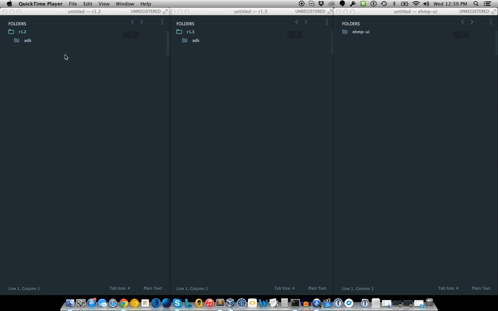

::: page-description
# CSS #
Standards for creating and maintaining scalable CSS
:::

## CSS Architecture ##

### Overview of EHMP-UI ###
**The CSS Architecture of the EHMP-UI has not changed since r1.2 and remains the same moving forward**

<p>Applet specific sass files can be found inside the individual applet sass folder. These get combined, compressed, and compiled into the applets.scss and applets.css files.</p>

```JavaScript
// Example paths to individual applet sass
/Projects/vistacore/ehmp-ui/product/production/app/applets/encounters/assets/sass/styles.scss
/Projects/vistacore/ehmp-ui/product/production/app/applets/addOrder/assets/sass/styles.scss

// All these individual applet scss files get compiled to:
/Projects/vistacore/ehmp-ui/product/production/assets/sass/applets.scss
/Projects/vistacore/ehmp-ui/product/production/assets/css/applets.css
```

<br /><br />
### Overview of ADK ###
**The CSS Architecture of ADK r1.2 and r1.3 are all located in the assets folder**

```
// Path to CSS (scss files)
/Projects/vistacore/adk/product/production/_assets/sass/*
```
<br /><br />
### Video Walkthrough ###
**Hands on look at the CSS Architecture of r1.2, r1.3 and ehmp-ui**

<a href="https://wiki.vistacore.us/download/attachments/9736848/CSS-Architecture-r1.2_r1.3.mp4" target="_blank">Launch Vistacore Wiki to Play Video</a><br /><a href="https://wiki.vistacore.us/download/attachments/9736848/CSS-Architecture-r1.2_r1.3.mp4" target="_blank"></a><br />

<br /><br />
## Updating CSS & Requesting Code Review ##
### User Stories & Defects ###
**Helper classes should be used where applicable instead of creating custom styles. If CSS updates are required, it needs to go through a review process.** <br />

* Create a Rally 'CSS Review' task within the defect/story
* Assign the task to <a href="mailto:curtis.scott@accenturefederal.com" target="_blank">Curtis Scott</a> on Team Comet, leaving it 'Defined'.
* When ready for review, create a Crucibl that encompasses all the changes
* Include the Crucible link, and any other details (branch info *) to the description or discussion section of the CSS review Rally task
	* *If you are on another branch, please make sure you have merged in the latest from dev before creating the Crucible and requesting the review
* Move the task state to 'In-Progress' and will be under review
* If edits are necessary, ownership of the task will be assigned back to the developer in Rally
* Once the developer is complete with the revisions, repeat the process until it is approved

<br /><br />

## Helper Classes ##
**Helper classes are predetermined CSS class definitions** <br />
Helper classes should be used to alter base styles for UI components in lieu of creating new CSS. This prevents duplicate CSS and new CSS from being created for such as colors, padding, margins etc. that might be inconsistent and should be made at the root level.<br />

For styles such as float/text align right/left, please review <a href="http://getbootstrap.com/css/#helper-classes" target="_blank">Bootstrap Helper Classes</a>.<br />

**Example of Helper Classes**
<br />To style the default button, it requires both _btn_ and _btn-default_ (see button documentation below)
```JavaScript
// btn-sm is a local helper class 
// button component based located:
// /Projects/vistacore/adk/product/production/_assets/sass/partials/ui-components/_buttons.scss
// local helper classes are only available to those components
<button type="button" class="btn btn-default btn-sm" title="title">Button</button>

// bottom-margin-lg is a global helper class 
// global helper classes can be applied to any element in the application
<button type="button" class="btn btn-default bottom-margin-lg" title="title">Button</button>
```
<br /><br />

### Global Helper Classes Location  ###
**Helper classes are located in ADK, and are available to be used in both ADK and eHMP-UI** <br />
Path:
```JavaScript
/Projects/vistacore/adk/product/production/_assets/sass/partials/adk/helper-classes.scss
```

<br />
### Available Global Classes ###
**To view the _helper-classes.scss_ sass CSS compiled file, below is the path: (you may need to 'prettify' the compiled code** <br />
```JavaScript
/Projects/vistacore/adk/product/production/_assets/css/partials/adk/helper-classes.css
```

**Global Helper Classes Available for:**
* **Padding / Margin** (left-padding-sm, right-margin-lg etc)
* **Width** (percent-width-60, pixel-width-50)
* **Font Size** (size-font-12, size-font-14)
* **Font Colors** (color-pure-white, color-primary)
* **Background Colors** (background-color-pure-white, background-color-primary)
* **Display Properties** (inline-block-display)
* **Overflow Properties** (hidden-overflow)
* **Vertical Align** (valign-top, valign-bottom)

<br /><br />
### Compiled Global Helper Classes  ### 
**DO NOT USE THESE EXACT CLASSES // compiled helper-classes.css file as of 10/13/15<br /> <br /> _These class definitions are subject to change. Instead refer to the latest dev, [helper files from above](#Where-are-The-Global-Helper-Classes-Located-)._**


<br />
### Width ###
```JavaScript
.percent-width-5 {width: 5% !important; max-width: 5% !important; min-width: 5% !important}
.percent-width-10 {width: 10% !important; max-width: 10% !important; min-width: 10% !important}
.percent-width-15 {width: 15% !important; max-width: 15% !important; min-width: 15% !important}
.percent-width-20 {width: 20% !important; max-width: 20% !important; min-width: 20% !important}
.percent-width-25 {width: 25% !important; max-width: 25% !important; min-width: 25% !important}
.percent-width-30 {width: 30% !important; max-width: 30% !important; min-width: 30% !important}
.percent-width-35 {width: 35% !important; max-width: 35% !important; min-width: 35% !important}
.percent-width-40 {width: 40% !important; max-width: 40% !important; min-width: 40% !important}
.percent-width-45 {width: 45% !important; max-width: 45% !important; min-width: 45% !important}
.percent-width-50 {width: 50% !important; max-width: 50% !important; min-width: 50% !important}
.percent-width-55 {width: 55% !important; max-width: 55% !important; min-width: 55% !important}
.percent-width-60 {width: 60% !important; max-width: 60% !important; min-width: 60% !important}
.percent-width-65 {width: 65% !important; max-width: 65% !important; min-width: 65% !important}
.percent-width-70 {width: 70% !important; max-width: 70% !important; min-width: 70% !important}
.percent-width-75 {width: 75% !important; max-width: 75% !important; min-width: 75% !important}
.percent-width-80 {width: 80% !important; max-width: 80% !important; min-width: 80% !important}
.percent-width-85 {width: 85% !important; max-width: 85% !important; min-width: 85% !important}
.percent-width-90 {width: 90% !important; max-width: 90% !important; min-width: 90% !important}
.percent-width-95 {width: 95% !important; max-width: 95% !important; min-width: 95% !important}
.percent-width-100 {width: 100% !important; max-width: 100% !important; min-width: 100% !important}
.pixel-width-1 {width: 1px !important; max-width: 1px !important; min-width: 1px !important}
.pixel-width-2 {width: 2px !important; max-width: 2px !important; min-width: 2px !important}
.pixel-width-3 {width: 3px !important; max-width: 3px !important; min-width: 3px !important}
.pixel-width-4 {width: 4px !important; max-width: 4px !important; min-width: 4px !important}
.pixel-width-5 {width: 5px !important; max-width: 5px !important; min-width: 5px !important}
.pixel-width-6 {width: 6px !important; max-width: 6px !important; min-width: 6px !important}
.pixel-width-7 {width: 7px !important; max-width: 7px !important; min-width: 7px !important}
.pixel-width-8 {width: 8px !important; max-width: 8px !important; min-width: 8px !important}
.pixel-width-9 {width: 9px !important; max-width: 9px !important; min-width: 9px !important}
.pixel-width-10 {width: 10px !important; max-width: 10px !important; min-width: 10px !important}
.pixel-width-11 {width: 11px !important; max-width: 11px !important; min-width: 11px !important}
.pixel-width-12 {width: 12px !important; max-width: 12px !important; min-width: 12px !important}
.pixel-width-13 {width: 13px !important; max-width: 13px !important; min-width: 13px !important}
.pixel-width-14 {width: 14px !important; max-width: 14px !important; min-width: 14px !important}
.pixel-width-15 {width: 15px !important; max-width: 15px !important; min-width: 15px !important}
.pixel-width-16 {width: 16px !important; max-width: 16px !important; min-width: 16px !important}
.pixel-width-17 {width: 17px !important; max-width: 17px !important; min-width: 17px !important}
.pixel-width-18 {width: 18px !important; max-width: 18px !important; min-width: 18px !important}
.pixel-width-19 {width: 19px !important; max-width: 19px !important; min-width: 19px !important}
.pixel-width-20 {width: 20px !important; max-width: 20px !important; min-width: 20px !important}
.pixel-width-21 {width: 21px !important; max-width: 21px !important; min-width: 21px !important}
.pixel-width-22 {width: 22px !important; max-width: 22px !important; min-width: 22px !important}
.pixel-width-23 {width: 23px !important; max-width: 23px !important; min-width: 23px !important}
.pixel-width-24 {width: 24px !important; max-width: 24px !important; min-width: 24px !important}
.pixel-width-25 {width: 25px !important; max-width: 25px !important; min-width: 25px !important}
.pixel-width-26 {width: 26px !important; max-width: 26px !important; min-width: 26px !important}
.pixel-width-27 {width: 27px !important; max-width: 27px !important; min-width: 27px !important}
.pixel-width-28 {width: 28px !important; max-width: 28px !important; min-width: 28px !important}
.pixel-width-29 {width: 29px !important; max-width: 29px !important; min-width: 29px !important}
.pixel-width-30 {width: 30px !important; max-width: 30px !important; min-width: 30px !important}
.pixel-width-31 {width: 31px !important; max-width: 31px !important; min-width: 31px !important}
.pixel-width-32 {width: 32px !important; max-width: 32px !important; min-width: 32px !important}
.pixel-width-33 {width: 33px !important; max-width: 33px !important; min-width: 33px !important}
.pixel-width-34 {width: 34px !important; max-width: 34px !important; min-width: 34px !important}
.pixel-width-35 {width: 35px !important; max-width: 35px !important; min-width: 35px !important}
.pixel-width-36 {width: 36px !important; max-width: 36px !important; min-width: 36px !important}
.pixel-width-37 {width: 37px !important; max-width: 37px !important; min-width: 37px !important}
.pixel-width-38 {width: 38px !important; max-width: 38px !important; min-width: 38px !important}
.pixel-width-39 {width: 39px !important; max-width: 39px !important; min-width: 39px !important}
.pixel-width-40 {width: 40px !important; max-width: 40px !important; min-width: 40px !important}
.pixel-width-41 {width: 41px !important; max-width: 41px !important; min-width: 41px !important}
.pixel-width-42 {width: 42px !important; max-width: 42px !important; min-width: 42px !important}
.pixel-width-43 {width: 43px !important; max-width: 43px !important; min-width: 43px !important}
.pixel-width-44 {width: 44px !important; max-width: 44px !important; min-width: 44px !important}
.pixel-width-45 {width: 45px !important; max-width: 45px !important; min-width: 45px !important}
.pixel-width-46 {width: 46px !important; max-width: 46px !important; min-width: 46px !important}
.pixel-width-47 {width: 47px !important; max-width: 47px !important; min-width: 47px !important}
.pixel-width-48 {width: 48px !important; max-width: 48px !important; min-width: 48px !important}
.pixel-width-49 {width: 49px !important; max-width: 49px !important; min-width: 49px !important}
.pixel-width-50 {width: 50px !important; max-width: 50px !important; min-width: 50px !important}
.pixel-width-51 {width: 51px !important; max-width: 51px !important; min-width: 51px !important}
.pixel-width-52 {width: 52px !important; max-width: 52px !important; min-width: 52px !important}
.pixel-width-53 {width: 53px !important; max-width: 53px !important; min-width: 53px !important}
.pixel-width-54 {width: 54px !important; max-width: 54px !important; min-width: 54px !important}
.pixel-width-55 {width: 55px !important; max-width: 55px !important; min-width: 55px !important}
.pixel-width-56 {width: 56px !important; max-width: 56px !important; min-width: 56px !important}
.pixel-width-57 {width: 57px !important; max-width: 57px !important; min-width: 57px !important}
.pixel-width-58 {width: 58px !important; max-width: 58px !important; min-width: 58px !important}
.pixel-width-59 {width: 59px !important; max-width: 59px !important; min-width: 59px !important}
.pixel-width-60 {width: 60px !important; max-width: 60px !important; min-width: 60px !important}
.pixel-width-61 {width: 61px !important; max-width: 61px !important; min-width: 61px !important}
.pixel-width-62 {width: 62px !important; max-width: 62px !important; min-width: 62px !important}
.pixel-width-63 {width: 63px !important; max-width: 63px !important; min-width: 63px !important}
.pixel-width-64 {width: 64px !important; max-width: 64px !important; min-width: 64px !important}
.pixel-width-65 {width: 65px !important; max-width: 65px !important; min-width: 65px !important}
.pixel-width-66 {width: 66px !important; max-width: 66px !important; min-width: 66px !important}
.pixel-width-67 {width: 67px !important; max-width: 67px !important; min-width: 67px !important}
.pixel-width-68 {width: 68px !important; max-width: 68px !important; min-width: 68px !important}
.pixel-width-69 {width: 69px !important; max-width: 69px !important; min-width: 69px !important}
.pixel-width-70 {width: 70px !important; max-width: 70px !important; min-width: 70px !important}
.pixel-width-71 {width: 71px !important; max-width: 71px !important; min-width: 71px !important}
.pixel-width-72 {width: 72px !important; max-width: 72px !important; min-width: 72px !important}
.pixel-width-73 {width: 73px !important; max-width: 73px !important; min-width: 73px !important}
.pixel-width-74 {width: 74px !important; max-width: 74px !important; min-width: 74px !important}
.pixel-width-75 {width: 75px !important; max-width: 75px !important; min-width: 75px !important}
.pixel-width-76 {width: 76px !important; max-width: 76px !important; min-width: 76px !important}
.pixel-width-77 {width: 77px !important; max-width: 77px !important; min-width: 77px !important}
.pixel-width-78 {width: 78px !important; max-width: 78px !important; min-width: 78px !important}
.pixel-width-79 {width: 79px !important; max-width: 79px !important; min-width: 79px !important}
.pixel-width-80 {width: 80px !important; max-width: 80px !important; min-width: 80px !important}
.pixel-width-81 {width: 81px !important; max-width: 81px !important; min-width: 81px !important}
.pixel-width-82 {width: 82px !important; max-width: 82px !important; min-width: 82px !important}
.pixel-width-83 {width: 83px !important; max-width: 83px !important; min-width: 83px !important}
.pixel-width-84 {width: 84px !important; max-width: 84px !important; min-width: 84px !important}
.pixel-width-85 {width: 85px !important; max-width: 85px !important; min-width: 85px !important}
.pixel-width-86 {width: 86px !important; max-width: 86px !important; min-width: 86px !important}
.pixel-width-87 {width: 87px !important; max-width: 87px !important; min-width: 87px !important}
.pixel-width-88 {width: 88px !important; max-width: 88px !important; min-width: 88px !important}
.pixel-width-89 {width: 89px !important; max-width: 89px !important; min-width: 89px !important}
.pixel-width-90 {width: 90px !important; max-width: 90px !important; min-width: 90px !important}
.pixel-width-91 {width: 91px !important; max-width: 91px !important; min-width: 91px !important}
.pixel-width-92 {width: 92px !important; max-width: 92px !important; min-width: 92px !important}
.pixel-width-93 {width: 93px !important; max-width: 93px !important; min-width: 93px !important}
.pixel-width-94 {width: 94px !important; max-width: 94px !important; min-width: 94px !important}
.pixel-width-95 {width: 95px !important; max-width: 95px !important; min-width: 95px !important}
.pixel-width-96 {width: 96px !important; max-width: 96px !important; min-width: 96px !important}
.pixel-width-97 {width: 97px !important; max-width: 97px !important; min-width: 97px !important}
.pixel-width-98 {width: 98px !important; max-width: 98px !important; min-width: 98px !important}
.pixel-width-99 {width: 99px !important; max-width: 99px !important; min-width: 99px !important}
.pixel-width-100 {width: 100px !important; max-width: 100px !important; min-width: 100px !important}
```
<br />
### Margin / Padding ###
```JavaScript
.all-margin-no {margin: 0 !important}
.all-margin-xs {margin: 5px !important}
.all-margin-sm {margin: 10px !important}
.all-margin-md {margin: 15px !important}
.all-margin-lg {margin: 20px !important}
.all-margin-xl {margin: 25px !important}
.all-padding-no {padding: 0 !important}
.all-padding-xs {padding: 5px !important}
.all-padding-sm {padding: 10px !important}
.all-padding-md {padding: 15px !important}
.all-padding-lg {padding: 20px !important}
.all-padding-xl {padding: 25px !important}
.top-margin-no {margin-top: 0 !important}
.top-margin-xs {margin-top: 5px !important}
.top-margin-sm {margin-top: 10px !important}
.top-margin-md {margin-top: 15px !important}
.top-margin-lg {margin-top: 20px !important}
.top-margin-xl {margin-top: 25px !important}
.top-padding-no {padding-top: 0 !important}
.top-padding-xs {padding-top: 5px !important}
.top-padding-sm {padding-top: 10px !important}
.top-padding-md {padding-top: 15px !important}
.top-padding-lg {padding-top: 20px !important}
.top-padding-xl {padding-top: 25px !important}
.left-margin-no {margin-left: 0 !important}
.left-margin-xs {margin-left: 5px !important}
.left-margin-sm {margin-left: 10px !important}
.left-margin-md {margin-left: 15px !important}
.left-margin-lg {margin-left: 20px !important}
.left-margin-xl {margin-left: 25px !important}
.left-padding-no {padding-left: 0 !important}
.left-padding-xs {padding-left: 5px !important}
.left-padding-sm {padding-left: 10px !important}
.left-padding-md {padding-left: 15px !important}
.left-padding-lg {padding-left: 20px !important}
.left-padding-xl {padding-left: 25px !important}
.right-margin-no {margin-right: 0 !important}
.right-margin-xs {margin-right: 5px !important}
.right-margin-sm {margin-right: 10px !important}
.right-margin-md {margin-right: 15px !important}
.right-margin-lg {margin-right: 20px !important}
.right-margin-xl {margin-right: 25px !important}
.right-padding-no {padding-right: 0 !important}
.right-padding-xs {padding-right: 5px !important}
.right-padding-sm {padding-right: 10px !important}
.right-padding-md {padding-right: 15px !important}
.right-padding-lg {padding-right: 20px !important}
.right-padding-xl {padding-right: 25px !important}
.bottom-margin-no {margin-bottom: 0 !important}
.bottom-margin-xs {margin-bottom: 5px !important}
.bottom-margin-sm {margin-bottom: 10px !important}
.bottom-margin-md {margin-bottom: 15px !important}
.bottom-margin-lg {margin-bottom: 20px !important}
.bottom-margin-xl {margin-bottom: 25px !important}
.bottom-padding-no {padding-bottom: 0 !important}
.bottom-padding-xs {padding-bottom: 5px !important}
.bottom-padding-sm {padding-bottom: 10px !important}
.bottom-padding-md {padding-bottom: 15px !important}
.bottom-padding-lg {padding-bottom: 20px !important}
.bottom-padding-xl {padding-bottom: 25px !important}
.center-margin {margin: 0 auto !important}
```
<br />
### Flex ###
```JavaScript
.flex-width-1 {flex: 1 !important}
.flex-width-2 {flex: 2 !important}
.flex-width-3 {flex: 3 !important}
.flex-width-4 {flex: 4 !important}
.flex-width-5 {flex: 5 !important}
.flex-width-6 {flex: 6 !important}
.flex-width-7 {flex: 7 !important}
.flex-width-8 {flex: 8 !important}
.flex-width-9 {flex: 9 !important}
.flex-width-10 {flex: 10 !important}
```
<br />
### Text / Background Color ###
```JavaScript
.color-primary {color: #003E4F !important}
.color-primary-light {color: #406E7B !important}
.color-primary-lighter {color: #B8C2CC !important}
.color-primary-lightest {color: #E7EBF0 !important}
.color-primary-lightester {color: #F3F5F7 !important}
.color-primary-dark {color: #00303F !important}
.color-secondary {color: #328563 !important}
.color-secondary-light {color: #CBE0D7 !important}
.color-secondary-lighter {color: #DBE6E4 !important}
.color-secondary-dark {color: #2C7B5B !important}
.color-secondary-darkest {color: #256B4F !important}
.color-tertiary {color: #FFC234 !important}
.color-tertiary-dark {color: #E6B131 !important}
.color-quaternary {color: #FDC145 !important}
.color-pure-black {color: #000 !important}
.color-pure-white {color: #fff !important}
.color-off-white {color: #FBFBFB !important}
.color-grey {color: #ccc !important}
.color-grey-light {color: #ddd !important}
.color-grey-lighter {color: #F2F2F2 !important}
.color-grey-lightest {color: #F9F9F9 !important}
.color-grey-dark {color: #bbb !important}
.color-grey-darker {color: #6E6E6E !important}
.color-grey-darkest {color: #555 !important}
.color-red {color: #C4262E !important}
.color-red-dark {color: #AE2229 !important}
.color-blue {color: #37779E !important}
.color-blue-dark {color: #2d6282 !important}
.background-color-primary {background-color: #003E4F !important}
.background-color-primary-light {background-color: #406E7B !important}
.background-color-primary-lighter {background-color: #B8C2CC !important}
.background-color-primary-lightest {background-color: #E7EBF0 !important}
.background-color-primary-lightester {background-color: #F3F5F7 !important}
.background-color-primary-dark {background-color: #00303F !important}
.background-color-secondary {background-color: #328563 !important}
.background-color-secondary-light {background-color: #CBE0D7 !important}
.background-color-secondary-lighter {background-color: #DBE6E4 !important}
.background-color-secondary-dark {background-color: #2C7B5B !important}
.background-color-secondary-darkest {background-color: #256B4F !important}
.background-color-tertiary {background-color: #FFC234 !important}
.background-color-tertiary-dark {background-color: #E6B131 !important}
.background-color-quaternary {background-color: #FDC145 !important}
.background-color-pure-black {background-color: #000 !important}
.background-color-pure-white {background-color: #fff !important}
.background-color-off-white {background-color: #FBFBFB !important}
.background-color-grey {background-color: #ccc !important}
.background-color-grey-light {background-color: #ddd !important}
.background-color-grey-lighter {background-color: #F2F2F2 !important}
.background-color-grey-lightest {background-color: #F9F9F9 !important}
.background-color-grey-dark {background-color: #bbb !important}
.background-color-grey-darker {background-color: #6E6E6E !important}
.background-color-grey-darkest {background-color: #555 !important}
.background-color-red {background-color: #C4262E !important}
.background-color-red-dark {background-color: #AE2229 !important}
.background-color-blue {background-color: #37779E !important}
.background-color-blue-dark {background-color: #2d6282 !important}
```
<br />
### Border ###
```JavaScript
.all-border-no {border: none !important}
.bottom-border-grey-light {border-bottom: 1px solid #ddd}
```
<br />
### Display ###
```JavaScript
.inline-block-display {display: inline-block !important}
.inline-display {display: inline !important}
.block-display {display: block !important}
.flex-display {display: flex !important}
.valign-middle,
.valign-bottom {display: flex !important}
.nowrap {overflow: hidden !important;white-space: nowrap !important}
.valign-top {vertical-align: top !important;justify-content: flex-start !important}
.valign-bottom {vertical-align: bottom !important;justify-content: flex-end !important}
```
<br />
### Font Size ###
```JavaScript
.bold-font {font-weight: bold !important}
.font-size-12 {font-size: 12px !important}
.font-size-14 {font-size: 14px !important}
.font-size-16 {font-size: 16px !important}
.font-size-18 {font-size: 18px !important}
```
<br />
### Misc ###
```JavaScript
.high-chart-placeholder {border: 1px solid #DDDDDD;background-image: url(data:image/gif;base64,R0lGODlhIANYArMAAO3t7fPz8/z8/OHh4fn5+ejo6N7e3tTU1OXl5evr69PT09ra2tfX19DQ0MzMzP///yH/C1hNUCBEYXRhWE1QPD94cGFja2V0IGJlZ2luPSLvu78iIGlkPSJXNU0wTXBDZWhpSHpyZVN6TlRjemtjOWQiPz4gPHg6eG1wbWV0YSB4bWxuczp4PSJhZG9iZTpuczptZXRhLyIgeDp4bXB0az0iQWRvYmUgWE1QIENvcmUgNS42LWMwMTQgNzkuMTU2Nzk3LCAyMDE0LzA4LzIwLTA5OjUzOjAyICAgICAgICAiPiA8cmRmOlJERiB4bWxuczpyZGY9Imh0dHA6Ly93d3cudzMub3JnLzE5OTkvMDIvMjItcmRmLXN5bnRheC1ucyMiPiA8cmRmOkRlc2NyaXB0aW9uIHJkZjphYm91dD0iIiB4bWxuczp4bXA9Imh0dHA6Ly9ucy5hZG9iZS5jb20veGFwLzEuMC8iIHhtbG5zOnhtcE1NPSJodHRwOi8vbnMuYWRvYmUuY29tL3hhcC8xLjAvbW0vIiB4bWxuczpzdFJlZj0iaHR0cDovL25zLmFkb2JlLmNvbS94YXAvMS4wL3NUeXBlL1Jlc291cmNlUmVmIyIgeG1wOkNyZWF0b3JUb29sPSJBZG9iZSBQaG90b3Nob3AgQ0MgMjAxNCAoTWFjaW50b3NoKSIgeG1wTU06SW5zdGFuY2VJRD0ieG1wLmlpZDozQ0IxNkZDRUYxQTYxMUU0ODVGOEY1OEM2NDJBQzY0NiIgeG1wTU06RG9jdW1lbnRJRD0ieG1wLmRpZDozQ0IxNkZDRkYxQTYxMUU0ODVGOEY1OEM2NDJBQzY0NiI+IDx4bXBNTTpEZXJpdmVkRnJvbSBzdFJlZjppbnN0YW5jZUlEPSJ4bXAuaWlkOkMxQjg0NjA5RjFBMzExRTQ4NUY4RjU4QzY0MkFDNjQ2IiBzdFJlZjpkb2N1bWVudElEPSJ4bXAuZGlkOkMxQjg0NjBBRjFBMzExRTQ4NUY4RjU4QzY0MkFDNjQ2Ii8+IDwvcmRmOkRlc2NyaXB0aW9uPiA8L3JkZjpSREY+IDwveDp4bXBtZXRhPiA8P3hwYWNrZXQgZW5kPSJyIj8+Af/+/fz7+vn49/b19PPy8fDv7u3s6+rp6Ofm5eTj4uHg397d3Nva2djX1tXU09LR0M/OzczLysnIx8bFxMPCwcC/vr28u7q5uLe2tbSzsrGwr66trKuqqainpqWko6KhoJ+enZybmpmYl5aVlJOSkZCPjo2Mi4qJiIeGhYSDgoGAf359fHt6eXh3dnV0c3JxcG9ubWxramloZ2ZlZGNiYWBfXl1cW1pZWFdWVVRTUlFQT05NTEtKSUhHRkVEQ0JBQD8+PTw7Ojk4NzY1NDMyMTAvLi0sKyopKCcmJSQjIiEgHx4dHBsaGRgXFhUUExIREA8ODQwLCgkIBwYFBAMCAQAAIfkEAAAAAAAsAAAAACADWAIABP/QvSfprPhqy3PfXgiOXyma5KmmLOqubwvPch3fNG7n/O7rwF7wJywSj8OkUYlcOptQpvSZnEap2KvWys12t94wePwti83kszrNRrvXb3J8Dq+37fS7Ps/H+/d/fYCDgoWBhymIhoSKjYyPi5GOkpCTlpWYlJp4m5mXnaCfop6koaWjpqmoq1Gqp6+usayysLO2tbi0ura3u7m9wL/CvsTBxcPGqMfLycjOzM/N0NPS1bDU0dnY29bc2t3g3+I44d7m5ejj6efq7exu7+vy7vPx9Pf2+dL6+PX+/QD5Cfw3MA3BgwERFlyosGHChyUYQnQosSLFixMzprKoESPHjx7/Q3Yc2UUkSJImU6JcebJlS5UvWcKcKbPmtpg4aea0qbMnz0o+dwoNSvTnUKNLjiotuhSp06Y4oTKd+pSq1KoyrWrFerXrVq/PwIr9SpZr2bGE0Ko9y9as27V32sKdK7fuW7sR8eq9y5du371A/AoGTPivYamFBx9OzHjxU8WQG0d2PHlaZcmYKWe+/GuzZ82gOYs2Njr059KoT3tJbbo169eq47qODXu27dqFcNPefZs3at29gwMfvtu3ceHHid9Wzjy5c+R9m0OXTv05SOvYp2evbpS79+3gtUP8Lp68+fDM0Ksvv/78OPfw28tnf21+fPr38/uxzx9/f/1p/Seg/38EArjRgAYiqGCBPCyYIIMQPsiHhA5WGKGDFF6oYYYcFmFhhxt+aB+IJIoY4okclIiiiSrqxuKLK8bIYYsw0ijjZjbmWOOOVfGo441AevfjkD4WSRKRQRqJJGJJNrmkkrQ96SSUU5Yn5ZVUYolMllxWqeVHX3YZppcEjWmmmGgCReaaZ7IZZZptxgnnGXK6aWedDM15p554ksbnn3sGWlGfggJKqCGGJlroovkcqqijjNL56KSRVpqepZRCqmlSmXaK6acHgurppqKqSeqpoyqJaqmratpqqqzCSoGstMZqKzy1vnrro7r2mquCv+4qrK82EGtssOYdOyyyaDK77P+zykLrbLSqTmuttLteSy22LW7rrbZvcguuuOS+MO635WJ47rrp3onuu+xGFu+87cIHb730CpnvvvjeyO+9AMsVcL8DD1fwvwj/lfDBBPvG8MML6wRxwxRTGHHFF4s28cYZe8QxxiDH13HIIwv28ckll5kyySxXtzLKLZ8F88wvl0NzzDi7mHPNO0d48888EwN0z0NfR3TQSD+WdNFLK9P00VAP9jTTUVNE9dVTK4J11VyPlXXXX7+z9dhhw0E22GgvVXbaa1vW9ttshwX32XQ7MffdccdSd954h7r3332rEDjfhC8EeOGDR3L44olj0DjikIv9OOORmz355ZWDgTn/5X9zvnnbnmceuhmfi156FaenbnoLo6vOtOuwr56X7LG3ToLtuGdd++6y507776D4LjzSvA8PvPHIl5w88LAX73zky0e/sPTMV0/H89QDnD328W5v/eXcfy8+F96Xf6754wcePvrRsr/+tO6nLz85879fP+v2x9+q/vn/2v/9Y+MfAKcmwAKm6n8GbFkCF8grBDqQZA9kYMUkSEE+VXCA34ugBie4wQt+yYMdnFMIMTgzEJIwYyZMIZRGqEJotfCFNYLhCSvHwhpyS4Y4/FAOZwgvG+6wWz4M4q1+KMQOFfGIrCIiD8+HRCUmqIlQtJQTo5ifKS4RbFTMoqCsyEX0/3Txir7S4heTJcYyemmMZnQZGNMIPzaukWhofCOq3BhH5tSRjsm5oxwPuMc+jk6PgDxNIP04KTwSUoGGHORvEsnICzVSkYJ8pCTxA8lDnmmSlaxMJjGZmE1aUoSfDCXdPElKgXFSlKAsJSqHpcpWfsWVq9TRKWGpFlrOUma3jCWXcmlLyvTylxLjpTBNM0xgRqeYyDyMMZeZkmQykyvPjKbVnEnNu1RTmt25pjaVpstu0myb2BwUOMdpk3CScyDnTCdLzOnN/7DznfJQJzzHI8960rOd+OSYPedpDn7u02b/zKd8AupPdxT0oH4SqEIPRtCGGtShCJXbQiGKHYpOVP9GEc3oLDR6UZ1x9KOfAGlHwyXSkh7Coiatz0hX2j6UurQzLH3pa1JKU07I9KanwGlNIbHTnkoqpkANY1B1iiOiDnU6Pj0qXYya1Dk0lak/fapS2QLVqQpHqlgVQlat6pWqbpV8Xg2rHMT6VQ9xlaymPKta41TWtU4FrW71JVzbegO6znUG4CTABAwwgQFs4AATCAAJBOuCBkwAAHudgGIJy9cbIPYBhnUBYff5S8U+VrGKrUBmN4BZ1iW2s52FgV4xewLQyrOyCVCAYgdQgAT4NbSjfcBjBfCABSQgsJ29rAII+4ABOOC3DkiAax9AWN5+NrCqJe4ERmtc23YWAYf/jWsorunX1K62AKC9QGw769zsYna3q31tARowXO+CNgDJNe8EuutdwFb2mtbta2sHIAAGOKABDQiAAxRw3wCgt78L4G9wa/vbBaCXAQv4LWEHIF7yDoAA9nVAAer729v6VsIBwK8DGCCA/wYXwvdVAAD+qwACFGAB5N0sLVEL3N/OFwELIK4D9IvdBRRAAdgtAIL5emIANKDDM3YAYsHb1xYLdwAwfsCJBxBjGitAAALY7YwFkF8FVNcBA2AAccmLYyXbuAGx1SZ1HxDf3s63u1LWK2sdEFvnJiDGCDCAb9E7ASL39rUTcC0BBmAAAyyAvQVo8Y3rrN/RVni9CWhx/wMKgGdw/rLMrHUtk2UbZDXfOMcIvu2bT0xmIbsXvGrGM5mZjN0sT5rGHI4yAD6N3itnecupva2OGS1dp9U6E2ROb6QfbF8F5JfNZv7vAQLgZgP/lgENUEByE7zg6uZ5zRsOboRva4DfDoDOD9ithxMA4v0mQNgBoPVtgXlN93o3zjKmrXrXze52u/vdKr7mLx8bWeg+gMISxuy4R/tY9xZ3ubh9gHvHXYFxL7az/5ZtdDGLXcw+drQEv7UmwnnZ0EqcMPtM+F15unG73q7jIJdByD0+O5KP3OQX58nIV/7xlKPccCw3ecxnHm+X01wgL1/5zWOec5sfaec+R2fQgf+Oc6J3vOdlNfrQNYL0oys9q093+tKbHhCqQ33qUa961ptq9btufa5dxzo+wv7Ur4v9JmbvKdnRmnayrv3s3Xi7T9sO9/fQnaZyD+vdvZr3ugtt734HBuDxPnid9r2mhQ/8MA7PVMYrXhaJL6njJR/5m1b+8baevEw1j/laXP6jnAf95106+s5PvPQHDb3lTY96rbWe9QGCvepN9Xp+zj6jtye97Gtv0937XmO8/70agm974lPW+MLXXPJzvwfmpx755oT+8ZcvfSQ4n6LVD+f1qT9W7m+/JN7PvlbFH/5ikZ+Z5z/n9wm6/vJPIf3uh0H73zn/f8J/mfWP/w/yH33//fM/B//nf/J3f2ImgAaoFAEYTQmYTgR4gJrVgCsGgdQkgQe4gA7IWRToShnoTBaIfxsYfx/YSh3oaCEoTCXofiN4gSpIgCdISin4XisYgxbRgrz0gvJGg9SHg5lkgxWog5zkg8vHgxEog+IHhIokhBxohJKkhL+HhP7nhBpIhFIIc1MIfVCITEwISFeIglnISF0oe1vogl+IRmOYSGFYg2WIeWk4RmfofW24SWtIR284S3OYg1V4h40Sh35Xh5Ckh1zEh5gEiMLnh2kkiFpIiHCHiE5kiI/EiLuniGLkiHUkiV6Ih1YIiVNHiayHiT+kiWzIiVAEipkoii/kiXhE/4pNZIqPp4pdhIpBx4qF6IoqJItFBIt7SIsXh4spZIuLqIs15IsSx4uRCIwVRIwsJIxnh4xEZIzSpYxU5IxYx4wUBI04RI2haInY2E/SGEHWOHTbuFbdWIrfaEDjyI3lqFTheETnWEDp6HLtOIvZSHzv6EPzmIvxeI9ug4+oV48gtI4IxI/H6I9DJZD6A5DNSJDvg5BBZZDTqJDm45Drw5AdJJFuBZEsRZELhJEaZJHlo5Fc5ZHkqI8i+Xcj+Xkg6UAciT0niY4pOVEtmT0rWZAvuTszuVAxmT83OZAluZN6U5PIk5Pu45O1A5QRKZTtZJQ/iZSnQ5QxpZTexJQd6XOUuSOVS0mVogSV3GOVuIOVHcWV26OVm+OVxSOWLsmTJgmWlkSW0oOWf8SWiaOWNGmWchk8bulHcClQdck5d5mUc1l4efmWfylHe9k8fVmYihOYnYOYd6OYgsmYo+SYbwOZYDSYTymZZGOZoIOZJESZwxMBADs=);background-position: center center; min-height: 20px;display: block}
.auto-overflow-y {overflow-y: scroll !important;}
.percent-height-100 {height: 100% !important}
.visible-overflow {overflow: visible !important}
.hidden-overflow {overflow: hidden !important}
.auto-overflow {overflow: auto !important}
```


<br /><br />
## Buttons ##
### How to Implement ###
Each button element that needs to follow base styling for buttons, <b>requires at least two classes</b> for styling. 
```JavaScript
// button example below with btn and btn-default, required classes 
// needed to display the button properly with no additional css required
// btn-default can be changed out for other classes

<button type="button" class="btn btn-default" title="title text">Button</button>
```
This btn-default class sets default styling, different colors can be passed using different btn helper classes in place of the btn-default class. e.g. - btn-primary, btn-success, btn-warning, etc.

### Required Classes ###
::: definition
#### **btn** - required ####
- "**btn**" - sets the base default styles for btn class [required]


#### **btn color/styling helper classes** - at least one is required, along with the btn class ####
(e.g. - btn btn-default for btn default styling, btn btn-primary for btn primary styling)
- "**btn-default**" - sets the color and default styling, other colors can be passed instead using btn helper classes below
- "**btn-primary**" - sets the color to the primary color from our color palette
- "**btn-success**" - sets the color to the success color from our color palette
- "**btn-warning**" - sets default styling for tertiary colored btns
- "**btn-danger**" - sets default styling for red colored btns
- "**btn-link**" - sets default styling for text links
- "**btn-info**" - sets default styling for primary-light colored btns


#### **btn sizing** -  optional classes ####
(font-size is 12px for btn by default, e.g. - btn btn-default btn-sm for btn default styling that has a small font-size)
- "**btn-sm**" - sets the btn to 11px font-size
- "**btn-lg**" - sets the btn to 14px font-size
:::

### Incorrect Use ###
Missing btn class
```JavaScript
<button type="button" class="btn-default" title="title">Button</button>
```
Missing btn-default [or btn-primary etc.] class
```JavaScript
<button type="button" class="btn btn-sm" title="title">Button</button>
```
Missing btn class
```JavaScript
<button type="button" class="btn-default btn-sm" title="title">Button</button> 
```
Missing btn-default[or btn-primary etc] class
```JavaScript
<button type="button" class="btn" title="title">Button</button>
```
### Correct Use ###
Basic default btn classes
```JavaScript
<button type="button" class="btn btn-default" title="title">Button</button>
```
Small primary btn classes
```JavaScript
<button type="button" class="btn btn-primary btn-sm" title="title">Button</button>
```
Large red button
```JavaScript
<button type="button" class="btn btn-danger btn-lg" title="title">Button</button> 
```
Custom padding / margins using global helper classes
```JavaScript
// adding all margin of 15px, margin: 15px; to a small default button 
<button type="button" 
		class="btn btn-default btn-sm all-margin-lg" title="title">Button</button>
```

#### Other examples of correct uses of btn and btn #### 
```JavaScript
//  Button States
<button type="button" class="btn btn-default" title="title">Active</button> 
<button type="button" class="btn btn-default active " title="title">Selected</button> 
<button type="button" class="btn btn-default disabled" title="title">Disabled</button>

// Button Colors
<button type="button" class="btn btn-default" title="title">Default</button>
<button type="button" class="btn btn-primary" title="title">Primary</button>
<button type="button" class="btn btn-success" title="title">Success</button>
<button type="button" class="btn btn-info" title="title">Info</button>
<button type="button" class="btn btn-warning" title="title">Warning</button>
<button type="button" class="btn btn-danger" title="title">Danger</button>

// Buttons with Icons
<button type="button" class="btn btn-default btn-icon" title="title">
		<i class="fa fa-th"></i> Coversheet</button> 
<button type="button" class="btn btn-default btn-icon" title="title">
		<i class="fa fa-bar-chart"></i> Timeline</button> 
<button type="button" class="btn btn-default btn-icon" title="title Review">
		<i class="fa fa-clipboard"></i> Meds Review</button>
<button type="button" class="btn btn-default btn-icon" title="title">
		<i class="fa fa-file-text-o"></i> Documents</button>

// Button Sizes
// btn-sm make the btn size 11px
<button type="button" class="btn btn-default btn-sm" title="title">Small Button</button>
// by default the size is 12px.
<button type="button" class="btn btn-default" title="title">Default Button</button> 
// btn-lg make the btn size 14px
<button type="button" class="btn btn-default btn-lg" title="title">Large Button</button> 
```

<br /><br />
## Faux Tables ##
**Our faux tables now use flex box to control the layout along with [flex-width-?](#Flex) helper classes to adjust column width based on content priority**

### Basic Example with default width of columns set to flex: 1; ###
```JavaScript
<div class="faux-table-container">
    <div class="faux-table">
        <div class="header table-row">
            <div class="table-cell">
                <div>Facility</div>
            </div>
            <div class="table-cell">
                <div>Name</div>
            </div>
            <div class="table-cell">
                <div>Analog Pager</div>
            </div>
            <div class="table-cell">
                <div>Digital Pager</div>
            </div>
            <div class="table-cell">
                <div>Office Phone</div>
            </div>
        </div>
        <div class="body">
            <div class="table-row">
                <div class="table-cell">
                    <span>TST1</span>
                </div>
                <div class="table-cell">
                    <span>John Doe</span>
                </div>
                <div class="table-cell">
                    <span>(123) 456-7890</span>
                </div>
                <div class="table-cell">
                    <span>(123) 456-7890</span>
                </div>
                <div class="table-cell">
                    <span>(123) 456-7890</span>
                </div>
            </div>
            <div class="table-row">
                <div class="table-cell">
                    <span>TST1</span>
                </div>
                <div class="table-cell">
                    <span>John Doe</span>
                </div>
                <div class="table-cell">
                    <span>(123) 456-7890</span>
                </div>
                <div class="table-cell">
                    <span>(123) 456-7890</span>
                </div>
                <div class="table-cell">
                    <span>(123) 456-7890</span>
                </div>
            </div>
        </div>
    </div>
</div>

```
### First Column Wider Example ###
**First column cell has a helper class of flex-width-2, padding a style of flex: 2; and styling this cell to be wider that other cells in this row**
```JavaScript
<div class="faux-table-container">
    <div class="faux-table">
        <div class="header table-row">
            <div class="table-cell flex-width-2">
                <div>Facility</div>
            </div>
            <div class="table-cell">
                <div>Name</div>
            </div>
            <div class="table-cell">
                <div>Analog Pager</div>
            </div>
            <div class="table-cell">
                <div>Digital Pager</div>
            </div>
            <div class="table-cell">
                <div>Office Phone</div>
            </div>
        </div>
        <div class="body">
            <div class="table-row">
                <div class="table-cell flex-width-2">
                    <span>TST1</span>
                </div>
                <div class="table-cell">
                    <span>John Doe</span>
                </div>
                <div class="table-cell">
                    <span>(123) 456-7890</span>
                </div>
                <div class="table-cell">
                    <span>(123) 456-7890</span>
                </div>
                <div class="table-cell">
                    <span>(123) 456-7890</span>
                </div>
            </div>
            <div class="table-row">
                <div class="table-cell flex-width-2">
                    <span>TST1</span>
                </div>
                <div class="table-cell">
                    <span>John Doe</span>
                </div>
                <div class="table-cell">
                    <span>(123) 456-7890</span>
                </div>
                <div class="table-cell">
                    <span>(123) 456-7890</span>
                </div>
                <div class="table-cell">
                    <span>(123) 456-7890</span>
                </div>
            </div>
        </div>
    </div>
</div>

```


<br /><br />
## Faux Table Accordion Rows ##
**These are accordions that reveal content once either the row or an actionable item inside the row is clicked** <br /> More examples to come.

<p>These faux-table accordion rows are styled to behave like a faux-table.</p>

### Example ###
```JavaScript
<div class="patient-info-revealed ftar-container">
    <div class="main-header">
        <div class="table-cell"><span>Provider Title</span></div>
        <div class="table-cell"><span>Name</span></div>
        <div class="table-cell"><span>Analog Pager</span></div>
        <div class="table-cell"><span>Digital Pager</span></div>
        <div class="table-cell"><span>Office Phone</span></div>
    </div>
    <div class="accordion-container panel-group small ftar" id="accordion" role="tablist" aria-multiselectable="true">
        <div class="panel panel-default">
            <div class="panel-heading" role="tab" id="headingOne">
                <a class="panel-title collapsed accordion-toggle" data-toggle="collapse" href="#collapseOne" aria-expanded="true" aria-controls="collapseOne">
                    <div class="sr-only"><span>You are on an accordion heading. The accordion is collapsed. To expanded the accordion press enter on the accordion heading.</span></div>
                    <div class="table-cell"><span>Inpatient Provider</span></div>
                    <div class="table-cell"><span>Last, First</span></div>
                    <div class="table-cell"><span>Not specified</span></div>
                    <div class="table-cell"><span>Not specified</span></div>
                    <div class="table-cell"><span>Not specified</span></div>
                </a>
            </div>
            <div id="collapseOne" class="panel-collapse collapse" role="tabpanel" aria-labelledby="headingOne">
                <div class="panel-body">
                    <div class="faux-table-container">
                        <div class="main-header">
                            <div>Other Site Care Providers</div>
                        </div>
                        <div class="faux-table all-margin-no">
                            <div class="header table-row">
                                <div class="table-cell">
                                    <div>Facility</div>
                                </div>
                                <div class="table-cell">
                                    <div>Name</div>
                                </div>
                                <div class="table-cell">
                                    <div>Analog Pager</div>
                                </div>
                                <div class="table-cell">
                                    <div>Digital Pager</div>
                                </div>
                                <div class="table-cell">
                                    <div>Office Phone</div>
                                </div>
                            </div>
                            <div class="body">
                                <div class="table-row">
                                    <div class="table-cell">
                                        <span>TST1</span>
                                    </div>
                                    <div class="table-cell">
                                        <span>John Doe</span>
                                    </div>
                                    <div class="table-cell">
                                        <span>(123) 456-7890</span>
                                    </div>
                                    <div class="table-cell">
                                        <span>(123) 456-7890</span>
                                    </div>
                                    <div class="table-cell">
                                        <span>(123) 456-7890</span>
                                    </div>
                                </div>
                            </div>
                        </div>
                    </div>
                </div>
            </div>
        </div>
        <div class="panel panel-default">
            <div class="panel-heading" role="tab" id="headingTwo">
                <a class="panel-title collapsed accordion-toggle" data-toggle="collapse" href="#collapseTwo" aria-expanded="false" aria-controls="collapseTwo">
                    <div class="sr-only"><span>You are on an accordion heading. The accordion is collapsed. To expanded the accordion press enter on the accordion heading.</span></div>
                    <div class="table-cell"><span>Inpatient Provider</span></div>
                    <div class="table-cell"><span>Last, First</span></div>
                    <div class="table-cell"><span>Not specified</span></div>
                    <div class="table-cell"><span>Not specified</span></div>
                    <div class="table-cell"><span>Not specified</span></div>
                </a>
            </div>
            <div id="collapseTwo" class="panel-collapse collapse" role="tabpanel" aria-labelledby="headingTwo">
                <div class="panel-body">
                    <div class="faux-table-container">
                        <div class="main-header">
                            <div>Other Site Care Providers</div>
                        </div>
                        <div class="faux-table all-margin-no">
                            <div class="header table-row">
                                <div class="table-cell">
                                    <div>Facility</div>
                                </div>
                                <div class="table-cell">
                                    <div>Name</div>
                                </div>
                                <div class="table-cell">
                                    <div>Analog Pager</div>
                                </div>
                                <div class="table-cell">
                                    <div>Digital Pager</div>
                                </div>
                                <div class="table-cell">
                                    <div>Office Phone</div>
                                </div>
                            </div>
                            <div class="body">
                                <div class="table-row">
                                    <div class="table-cell">
                                        <span>TST1</span>
                                    </div>
                                    <div class="table-cell">
                                        <span>John Doe</span>
                                    </div>
                                    <div class="table-cell">
                                        <span>(123) 456-7890</span>
                                    </div>
                                    <div class="table-cell">
                                        <span>(123) 456-7890</span>
                                    </div>
                                    <div class="table-cell">
                                        <span>(123) 456-7890</span>
                                    </div>
                                </div>
                            </div>
                        </div>
                    </div>
                </div>
            </div>
        </div>
        <div class="panel panel-default">
            <div class="panel-heading" role="tab" id="headingThree">
                <a class="panel-title collapsed accordion-toggle" data-toggle="collapse" href="#collapseThree" aria-expanded="false" aria-controls="collapseThree">
                    <div class="sr-only"><span>You are on an accordion heading. The accordion is collapsed. To expanded the accordion press enter on the accordion heading.</span></div>
                    <div class="table-cell"><span>Inpatient Provider</span></div>
                    <div class="table-cell"><span>Last, First</span></div>
                    <div class="table-cell"><span>Not specified</span></div>
                    <div class="table-cell"><span>Not specified</span></div>
                    <div class="table-cell"><span>Not specified</span></div>
                </a>
            </div>
            <div id="collapseThree" class="panel-collapse collapse" role="tabpanel" aria-labelledby="headingThree">
                <div class="panel-body">
                    <div class="faux-table-container">
                        <div class="main-header">
                            <div>Other Site Care Providers</div>
                        </div>
                        <div class="faux-table all-margin-no">
                            <div class="header table-row">
                                <div class="table-cell">
                                    <div>Facility</div>
                                </div>
                                <div class="table-cell">
                                    <div>Name</div>
                                </div>
                                <div class="table-cell">
                                    <div>Analog Pager</div>
                                </div>
                                <div class="table-cell">
                                    <div>Digital Pager</div>
                                </div>
                                <div class="table-cell">
                                    <div>Office Phone</div>
                                </div>
                            </div>
                            <div class="body">
                                <div class="table-row">
                                    <div class="table-cell">
                                        <span>TST1</span>
                                    </div>
                                    <div class="table-cell">
                                        <span>John Doe</span>
                                    </div>
                                    <div class="table-cell">
                                        <span>(123) 456-7890</span>
                                    </div>
                                    <div class="table-cell">
                                        <span>(123) 456-7890</span>
                                    </div>
                                    <div class="table-cell">
                                        <span>(123) 456-7890</span>
                                    </div>
                                </div>
                            </div>
                        </div>
                    </div>
                </div>
            </div>
        </div>
    </div>
</div>

```


<br /><br />
## Resources ##
* What about styles like float/text align right/left? <a href="http://getbootstrap.com/css/#helper-classes" target="_blank">Bootstrap Helper Classes</a>
* Need icons? - <a href="http://fontawesome.bootstrapcheatsheets.com/" target="_blank">Icon Cheat Sheet</a>
* Novice to Ninja - <a href="http://webdesign.tutsplus.com/courses/30-days-to-learn-html-css" target="_blank">30 Days of CSS</a>
* Good Site - <a href="http://css-tricks.com" target="_blank">CSS Tricks</a>