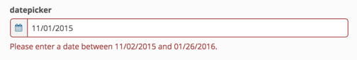
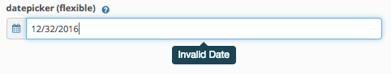
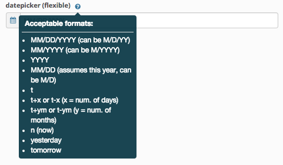
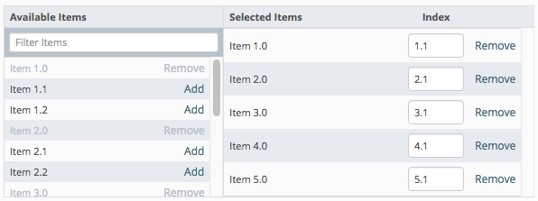
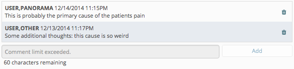
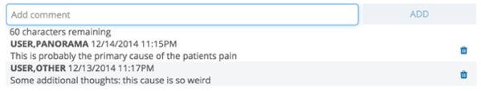
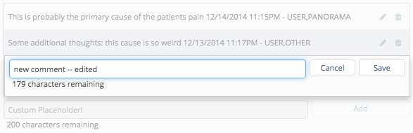
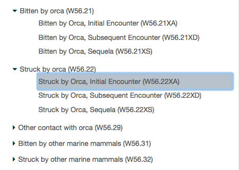

::: page-description
# Form Controls #
ADK UI Library's Standardized Form Controls that are 508 Compliant
:::

::: definition
#### All form Components/Controls have a required attribute of **"control"**!  The specified value of _"control"_ will determine which control is being used.
:::

## Basic ##
::: callout
Common HTML form elements. Use these when expecting normal HTML form controls.
:::

### Button ###
> control: **'button'**


| Required                         | Attribute       | Type       | Description / Example                                                           |
|:--------------------------------:|:---------------:|:----------:|:--------------------------------------------------------------------------------|
|<i class="fa fa-check-circle"></i>| **name**        | string     | Model attribute to be updated. <br />**Example:** `name: "Value"`|
|<i class="fa fa-check-circle"></i>| **label**       | string     | Label text for button. <br />**Example:** `label: "button label"`|
|                                  | **srOnlyLabel** | boolean    | Makes label tag for field hidden visually and only available for screen reader |
|                                  | **title**       | string     | Title to be placed on the button element. <br />**Example:** `title: "button title"`|
|                                  | **type**        | string     | Button's HTML type <br />**Supported Values:** `button`, `submit` <br />**Example:** `type: "button"` <br /><br />**Note:** If type is omitted, default type is "submit" |
|                                  | **id**          | string     | HTML id attribute <br />**Example:** `id: "button-id"`|
|                                  | **icon**        | string     | Icon for button <br />**Example:** `icon: "fa-th"`|
|                                  | **size**        | string     | Button size <br />**Example:** `size: "xs"`|
|                                  | **extraClasses**| array of strings | Classes to be added to button <br />**Example:** `extraClasses: ["col-md-2", "btn-danger"]`|
|                                  | **disabled**    | boolean    | Makes button disabled <br />**Example:** `disabled: true`|
|                                  | **hidden**      | boolean    | Makes control hidden <br />**Example:** `hidden: true`|

::: definition
#### Events that can be triggered to change control attributes dynamically ####
| Event                     | Parameter Type | Description / Example                                                      |
|:--------------------------|:---------:|:--------------------------------------------------------------------------------|
| **control:hidden**        | boolean   | hides/shows the full control <br/>**Example:** `$().trigger('control:hidden', true)` |
| **control:disabled**      | boolean   | toggles the disabled state of the control <br/>**Example:** `$().trigger('control:disabled', true)`|
| **control:label**         | string    | adds/updates the label of the button with the provided string <br/>**Example:** `$().trigger('control:label', 'New Button Label')`|
| **control:icon**          | string    | adds/updates the icon of the button <br/>**Example:** `$().trigger('control:icon', 'fa-th')`|
| **control:title**         | string    | adds/updates the title of the button <br/>**Example:** `$().trigger('control:title', 'Press enter to trigger button function')`|
:::

::: showcode Backbone Model Used In Examples:
```JavaScript
var Model = Backbone.Model.extend({
    defaults: {
        buttonValue: ""
    }
})
```
:::
::: showcode Example Form Instance:
```JavaScript
var ExampleFormView = ADK.UI.Form.extend({
    model: new Model(),
    fields: [
    // basic
    {
        control: "button",
        type: "button",
        label: "button label"
    },
    // sr-only label
    {
        control: "button",
        type: "button",
        label: "button label",
        icon: "fa-th",
        srOnlyLabel: true
    }
    // submit
    {
        control: "button",
        label: "button label",
        name: "model-attribute-to-tie-to"
    },
    // custom id
    {
        control: "button",
        type: "button",
        label: "button label",
        id: "example-button-id"
    },
    // icon
    {
        control: "button",
        type: "button",
        label: "button label",
        icon: "fa-th"
    },
    // disabled
    {
        control: "button",
        type: "button",
        label: "button label",
        disabled: true
    },
    // different sizes
    {
        control: "button",
        type: "button",
        label: "button label",
        size: "lg"
    },
    {
        control: "button",
        type: "button",
        label: "button label",
        size: "sm"
    },
    {
        control: "button",
        type: "button",
        label: "button label",
        size: "xs"
    },
    // extra css classes
    {
        control: "button",
        type: "button",
        label: "button label",
        extraClasses: ["btn-danger"]
    },
    {
        control: "button",
        type: "button",
        label: "button label",
        extraClasses: ["btn-warning"]
    },
    {
        control: "button",
        type: "button",
        label: "button label",
        extraClasses: ["btn-success"]
    }]
});
```
:::
::: showcode Example of dynamically changing the controls config attributes:
``` JavaScript
ui: {
    'nextButton' : '.next-button',
    'thirdButton' : '.button-control:nth-child(3)',
    'allButtons' : '.button-control'
}
```
``` JavaScript
this.ui.nextButton.trigger('control:disabled', false);
this.ui.thirdButton.trigger('control:label', 'New Button Label');

// you can trigger event on multiple at once!!
// just make sure your UI selector targets all that apply
this.ui.allButtons.trigger('control:hidden', false);
```
:::

### Checkbox ###
> control: **'checkbox'**


| Required                         | Attribute       | Type       | Description / Example                                                           |
|:--------------------------------:|:---------------:|:----------:|:--------------------------------------------------------------------------------|
|<i class="fa fa-check-circle"></i>| **name**        | string     | Model attribute to be updated. <br />**Example:** `name: "checkboxValue"`|
|<i class="fa fa-check-circle"></i>| **label**       | string     | Label text for checkbox. <br />**Example:** `label: "select label"`|
|                                  | **srOnlyLabel** | boolean    | Makes label tag for field hidden visually and only available for screen reader |
|                                  | **title**       | string     | HTML title attribute <br />**Example:** `title: "Option 1"`|
|                                  | **extraClasses**| array of strings | Classes to be added to checkbox <br />**Example:** `extraClasses: ["class1", "class2"]`|
|                                  | **disabled**    | boolean    | Makes checkbox disabled <br />**Example:** `disabled: true`|
|                                  | **hidden**      | boolean    | Makes control hidden <br />**Example:** `hidden: true`|


#### Listening For User Interaction ####

This control will fire a `change.inputted` and `change.inputted:<NAME FROM CONFIG>` event on the form's model when the user has taken action to change the value of the control. Use this event to differentiate between programmatic model changes and actual user interaction.

::: definition
#### Events that can be triggered to change control attributes dynamically ####
| Event                     | Parameter Type | Description / Example                                                      |
|:--------------------------|:---------:|:--------------------------------------------------------------------------------|
| **control:hidden**        | boolean   | hides/shows the full control <br/>**Example:** `$().trigger('control:hidden', true)` |
| **control:disabled**      | boolean   | toggles the disabled state of the control <br/>**Example:** `$().trigger('control:disabled', true)`|
| **control:label**         | string    | adds/updates the label of the checkbox with the provided string <br/>**Example:** `$().trigger('control:label', 'New checkbox label')`|
| **control:title**         | string    | adds/updates the title of the checkbox <br/>**Example:** `$().trigger('control:title', 'New title')`|
| **control:value**         | boolean   | changes/updates the value (checked or un-checked state) of the checkbox <br/>**Example:** `$().trigger('control:value', true)`|
:::

::: showcode Backbone Model Used In Examples:
```JavaScript
var Model = Backbone.Model.extend({
    defaults: {
        checkboxValue: "opt1"
    }
})
```
:::
::: showcode Example Form Instance:
```JavaScript
var ExampleFormView = ADK.UI.Form.extend({
    model: new Model(),
    fields: [
    // basic
    {
        control: "checkbox",
        name: "checkboxValue",
        label: "checkbox label",
        title: "Example basic checkbox."
    },
    // with extra classes
    {
        control: "checkbox",
        name: "checkboxValue",
        label: "checkbox label (with extra classes)",
        title: "Example checkbox with extra classes.",
        extraClasses: ["class1", "class2"]
    },
    // disabled
    {
        control: "checkbox",
        name: "checkboxValue",
        label: "checkbox (disabled)",
        title: "Example checkbox that is disabled.",
        disabled: true
    },
    // disabled
    {
        control: "checkbox",
        name: "checkboxValue",
        label: "checkbox (sr-only label)",
        title: "Example checkbox that has a sr-only label.",
        srOnlyLabel: true
    }]
});
```
:::

::: showcode Example of dynamically changing the checkbox controls config attributes:
``` JavaScript
ui: {
    'checkbox1' : '.control.checkbox-control:nth-of-type(1)',
    'checkbox2' : '.control.checkbox-control:nth-of-type(2)',
    'checkbox3' : '.control.checkbox-control:nth-of-type(3)',
    'allCheckboxes' : '.control.checkbox-control'
}
```
``` JavaScript
this.ui.checkbox1.trigger('control:disabled', false);
this.ui.checkbox2.trigger('control:label', 'New checkbox Label');
this.ui.checkbox3.trigger('control:value', true);

// you can trigger event on multiple at once!!
// just make sure your UI selector targets all that apply
this.ui.allCheckboxes.trigger('control:hidden', false);
```
:::

### Input ###
> control: **'input'**


| Required                         | Attribute       | Type       | Description / Example                                                           |
|:--------------------------------:|:---------------:|:----------:|:--------------------------------------------------------------------------------|
|<i class="fa fa-check-circle"></i>| **name**        | string     | Model attribute to be updated. <br />**Example:** `name: "inputValue"`|
|<i class="fa fa-check-circle"></i>| **label**       | string     | Label text for input. <br />**Example:** `label: "Input Label"`|
|                                  | **srOnlyLabel** | boolean    | Makes label tag for field hidden visually and only available for screen reader |
|                                  | **title**       | string     | Input's title attribute <br />**Example:** `title: "Example title"`|
|                                  | **placeholder** | string     | Input's placeholder <br />**Example:** `placeholder: "Enter text..."`|
|                                  | **type**        | string     | Input's html type <br />**Supported Values:** _"number"_, _"email"_, _"url"_, _"password"_ <br />**Example:** `type: "number"` <br /><br />**Note:** For Input field with type **email**, additional client side validation is required in order for validation to work properly in IE. |
|                                  | **extraClasses**| array of strings | Classes to be added to input <br />**Example:** `extraClasses: ["col-md-4", "text-danger"]`|
|                                  | **readonly**    | boolean    | Makes input readonly (value will still be submitted) <br />**Example:** `readonly: true`|
|                                  | **disabled**    | boolean    | Makes input disabled (value will not be submitted) <br />**Example:** `disabled: true`|
|                                  | **required**    | boolean    | Makes input required <br /> **Example:** `required: true`|
|                                  | **helpMessage** | string     | Message to be shown below input <br /> **Example:** `helpMessage: "This is a help message"`|
|                                  | **maxlength** | integer     | HTML maxlength attribute. Limits input to this many characters <br /> **Example:** `maxlength: 60`|
|                                  | **units**       | string <br />-- OR --<br /> array of objects | ■ If a string, or an array with 1 element is provided, the value will be used as text to display the units associated with the input field's value <br /> **Example:** `units: "minutes"`<br /><br />■ If an array of objects with 2 elements is provided it will be used to create radio buttons for choosing a unit, and if the array has 3 or more elements a select dropdown will be used <br /> **Example:** `units: [{label: "F",value: "f",title: "F Units"}, {label: "C",value: "c",title: "C Units"}]`<br />**Note:** for an array each should have the required properties of a radio button option [(click here for option attributes)][radioOptions]|
|                                  | **charCount**       | boolean | Turns on a character counter, which displays the difference between the _maxlength_ option specified and the length of the current input value.<br />**Note:** Requires `maxlength` to be specified<br />**Example:** `charCount: true` |
|                                  | **hidden**      | boolean    | Makes control hidden <br />**Example:** `hidden: true`|

#### Listening For User Interaction ####

This control will fire a `change.inputted` and `change.inputted:<NAME FROM CONFIG>` event on the form's model when the user has taken action to change the value of the control. Use this event to differentiate between programmatic model changes and actual user interaction.

::: definition
#### Events that can be triggered to change control attributes dynamically ####
| Event                     | Parameter Type | Description / Example                                                      |
|:--------------------------|:---------:|:--------------------------------------------------------------------------------|
| **control:hidden**        | boolean   | hides/shows the full control <br/>**Example:** `$().trigger('control:hidden', true)` |
| **control:required**      | boolean   | toggles the required state of the control <br/>**Example:** `$().trigger('control:required', true)`|
| **control:disabled**      | boolean   | toggles the disabled state of the control <br/>**Example:** `$().trigger('control:disabled', true)`|
| **control:readonly**      | boolean   | toggles the readonly state of the control <br/>**Example:** `$().trigger('control:readonly', true)`|
| **control:charCount**     | boolean   | hides/shows the character count <br/>**Example:** `$().trigger('control:charCount', true)`|
| **control:title**         | string    | adds/updates the title of the control with the provided string <br/>**Example:** `$().trigger('control:title', 'New Title of the Control')`|
| **control:placeholder**   | string    | adds/updates the placeholder of the control with the provided string <br/>**Example:** `$().trigger('control:placeholder', 'New Placeholder')`|
| **control:helpMessage**   | string    | adds/updates the help message of the control with the provided string <br/>**Example:** `$().trigger('control:helpMessage', 'This is a new help message.')`|
| **control:units**         | string    | adds/updates the units of the control with the new one provided <br/>**Example:** `$().trigger('control:units', 'inches')`|
| **control:maxlength**     | integer   | adds/updates the maxlength of the control <br/>**Example:** `$().trigger('control:maxlength', 15)`|
:::

#### Code Examples ####
::: showcode Backbone Model Used In Examples:
```JavaScript
var Model = Backbone.Model.extend({
    defaults: {
        inputValue: ''
    }
})
```
:::
::: showcode Example Form Instance:
```JavaScript
var ExampleFormView = ADK.UI.Form.extend({
    model: new Model(),
    fields: [
    // basic
    {
        control: "input",
        name: "inputValue",
        label: "input label",
        title: "Please enter a value",
        placeholder: "Enter text..."
    },
    // uneditable / readonly
    {
        control: "input",
        name: "inputValue",
        label: "uneditable input label",
        placeholder: "Enter text...",
        title: "Please enter a value",
        readonly: true
    },
    // extra classes
    {
        control: "input",
        name: "inputValue",
        label: "input (with extra classes) label",
        title: "Please enter a value",
        placeholder: "Enter text...",
        extraClasses: ["class1", "class2"]
    },
    // disabled
    {
        control: "input",
        name: "inputValue",
        label: "input (disabled) label",
        title: "Please enter a value",
        placeholder: "Enter text...",
        disabled: true
    },
    // required
    {
        control: "input",
        name: "inputValue",
        label: "input (required) label",
        title: "Please enter a value",
        placeholder: "Enter text...",
        required: true
    },
    // with help message
    {
        control: "input",
        name: "inputValue",
        label: "input (with help message) label",
        title: "Please enter a value",
        placeholder: "Enter text...",
        helpMessage: "This is a help message."
    },
    // with units
    {
        control: "input",
        name: "inputValue",
        label: "input (with units) label",
        title: "Please enter a number",
        placeholder: "Enter a Number...",
        type: "number",
        units: "minutes"
    },
    // number
    {
        control: "input",
        name: "inputValue",
        label: "input (number) label",
        title: "Please enter a number",
        placeholder: "Enter a Number...",
        type: "number"
    },
    // with email
    {
        control: "input",
        name: "inputValue",
        label: "input (email) label",
        placeholder: "Enter Your Email...",
        title: "Please enter a email",
        type: "email"
    },
    // url
    {
        control: "input",
        name: "inputValue",
        label: "input (url) label",
        title: "Please enter a url",
        placeholder: "Enter a URL...",
        type: "url"
    },
    // password
    {
        control: "input",
        name: "inputValue",
        label: "input (password) label",
        title: "Please enter your password",
        placeholder: "Enter your password...",
        type: "password"
    },
    // charCount
    {
        control: "input",
        name: "inputValue",
        label: "input (password) label",
        title: "Please enter your password",
        placeholder: "Enter your password...",
        maxlength: 60,
        charCount: true
    }]
});
```
:::
::: showcode Example of dynamically changing the controls config attributes:
``` JavaScript
ui: {
    'bloodPressureInput' : '.blood-pressure-container .control',
    'thirdInput' : '.control:nth-child(3)'
    'allControls' : '.control'
}
```
``` JavaScript
this.ui.bloodPressureInput.trigger('control:disabled', false)
this.ui.thirdInput.trigger('control:required', true)

// you can trigger event on multiple at once!!
// just make sure your UI selector targets all that apply
this.ui.allControls.trigger('control:hidden', false)
```
:::

### Radio ###
> control: **'radio'**


| Required                         | Attribute       | Type       | Description / Example                                                           |
|:--------------------------------:|:---------------:|:----------:|:--------------------------------------------------------------------------------|
|<i class="fa fa-check-circle"></i>| **name**        | string     | Model attribute to be updated. <br />**Example:** `name: "radioValue"`|
|<i class="fa fa-check-circle"></i>| **label**       | string     | Label text for radio button. <br />**Example:** `label: "radio label"`|
|                                  | **srOnlyLabel** | boolean    | Makes label tag for field hidden visually and only available for screen reader |
|                                  | **value**       | string     | Initial option to be checked, if not the first option <br />**Example:** `value: "opt1"`|
|                                  | **title**       | string     | HTML title attribute <br />**Example:** `title: "Option 1"`|
|                                  | **extraClasses**| array of strings | Classes to be added to radio <br />**Example:** `extraClasses: ["class1", "class2"]`|
|                                  | **disabled**    | boolean    | Makes radio disabled <br />**Example:** `disabled: true`|
|                                  | **required**    | boolean    | Makes radio required <br /> **Example:** `required: true`|
|                                  | **helpMessage** | string     | Message to be shown below radio <br /> **Example:** `helpMessage: "This is a help message"`|
|                                  | **options**     | array of objects | A radio button will be created for each object in the array <br /> **Example:** `options: [{label: "Option 1",value: "opt1",title: "Option 1"}, {label: "Option 2",value: "opt2",title: "Option 2"}]`|
|                                  | **hidden**      | boolean    | Makes control hidden <br />**Example:** `hidden: true`|

#### Listening For User Interaction ####

This control will fire a `change.inputted` and `change.inputted:<NAME FROM CONFIG>` event on the form's model when the user has taken action to change the value of the control. Use this event to differentiate between programmatic model changes and actual user interaction.

::: definition
#### Events that can be triggered to change control attributes dynamically ####
| Event                     | Parameter Type | Description / Example                                                      |
|:--------------------------|:---------:|:--------------------------------------------------------------------------------|
| **control:hidden**        | boolean   | hides/shows the full control <br/>**Example:** `$().trigger('control:hidden', true)` |
| **control:disabled**      | boolean   | toggles the disabled state of the control <br/>**Example:** `$().trigger('control:disabled', true)`|
| **control:required**      | boolean   | toggles the required state of the control <br/>**Example:** `$().trigger('control:required', true)`|
| **control:label**         | string    | adds/updates the label of the radio with the provided string <br/>**Example:** `$().trigger('control:label', 'New radio Label')`|
| **control:helpMessage**          | string    | adds/updates the help message of the radio control <br/>**Example:** `$().trigger('control:helpMessage', 'New help message')`|
:::

::: showcode Backbone Model Used In Examples:
```JavaScript
var Model = Backbone.Model.extend({
    defaults: {
        radioValue: "opt1"
    }
})
```
:::
::: showcode Example Form Instance:
```JavaScript
var ExampleFormView = ADK.UI.Form.extend({
    model: new Model(),
    fields: [
    // basic
    {
        control: "radio",
        name: "radioValue",
        label: "radio label",
        options: [{
            label: "Option 1",
            value: "opt1",
            title: "Option 1"
        }, {
            label: "Option 2",
            value: "opt2",
            title: "Option 2"
        }, {
            label: "Option 3",
            value: "opt3",
            title: "Option 3"
        }]
    },
    // extra css classes
    {
        control: "radio",
        name: "radioValue",
        label: "radio (with extra classes) label",
        options: [{
            label: "Option 1",
            value: "opt1",
            title: "Option 1"
        }, {
            label: "Option 2",
            value: "opt2",
            title: "Option 2"
        }, {
            label: "Option 3",
            value: "opt3",
            title: "Option 3"
        }],
        extraClasses: ["class1", "class2"]
    },
    // all options disabled
    {
        control: "radio",
        name: "radioValue",
        label: "radio (all options disabled) label",
        options: [{
            label: "Option 1",
            value: "opt1",
            title: "Option 1"
        }, {
            label: "Option 2",
            value: "opt2",
            title: "Option 2"
        }, {
            label: "Option 3",
            value: "opt3",
            title: "Option 3"
        }],
        disabled: true
    },
    // select options disabled
    {
        control: "radio",
        name: "radioValue",
        label: "radio (one option disabled) label",
        options: [{
            label: "Option 1",
            value: "opt1",
            title: "Option 1"
        }, {
            label: "Option 2",
            value: "opt2",
            title: "Option 2",
            disabled: true
        }, {
            label: "Option 3",
            value: "opt3",
            title: "Option 3"
        }]
    },
    // with help message
    {
        control: "radio",
        name: "radioValue",
        label: "radio (with help message) label",
        options: [{
            label: "Option 1",
            value: "opt1",
            title: "Option 1"
        }, {
            label: "Option 2",
            value: "opt2",
            title: "Option 2"
        }, {
            label: "Option 3",
            value: "opt3",
            title: "Option 3"
        }],
        helpMessage: "This is a help message."
    }]
});
```
:::

::: showcode Example of dynamically changing the radio control's config attributes:
``` JavaScript
ui: {
    'radio1' : '.control.radio-control:nth-of-type(1)',
    'radio2' : '.control.radio-control:nth-of-type(2)',
    'allRadios' : '.control.radio-control'
}
```
``` JavaScript
this.ui.radio1.trigger('control:disabled', false);
this.ui.radio2.trigger('control:label', 'New Label');

// you can trigger event on multiple at once!!
// just make sure your UI selector targets all that apply
this.ui.allRadios.trigger('control:hidden', false);
```
:::

### Select ###
> control: **'select'**


| Required                         | Attribute        | Type       | Description / Example                                                           |
|:--------------------------------:|:----------------:|:----------:|:--------------------------------------------------------------------------------|
|<i class="fa fa-check-circle"></i>| **name**         | string     | Model attribute to be updated. <br />**Example:** `name: "selectValue"`|
|<i class="fa fa-check-circle"></i>| **label**        | string     | Label text for select. <br />**Example:** `label: "select label"`|
|                                  | **srOnlyLabel**  | boolean    | Makes label tag for field hidden visually and only available for screen reader |
|                                  | **extraClasses** | array of strings | Classes to be added to select <br />**Example:** `extraClasses: ["class1", "class2"]`|
|                                  | **disabled**     | boolean    | Makes select disabled <br />**Example:** `disabled: true`|
|                                  | **required**     | boolean    | Makes select required <br /> **Example:** `required: true`|
|<i class="fa fa-check-circle"></i>| **pickList**    | array of objects<br />-- OR --<br />backbone collection<br />-- OR --<br />string value | Array of items that a user has to select from.  <br /> **Example:** `pickList: [{value: 'AL',label: 'Alabama'}, {value: 'AK',label: 'Alaska'}]`<br /><br />**Note:** That if a picklist item does not conatin a label, it's value will be shown as it's label in the list.<br /><br />**Also Note:** Each array object/model must have the attributes of _"value"_ and _"label"_ otherwise the **attributeMapping** property must also be defined to ensure that attribute titles are associated correctly.<br /><br />**Important:** If the attribute's value is of type _string_, it will be used to reference the overall Form's model attribute value.<br />**Example:** `pickList: 'mySelectsPicklist'` and then the Form Model would have the following: `Backbone.Model.extend({defaults: { mySelectsPicklist: [...] }})`|
|                                  | **multiple**         | boolean    | Enables multiple selection (**false by default**). It can be used with showFilter/fetchFunction/fetchDelay options. <br />**Example:** `multiple: true`|
|                                  | **size**         | integer    | Number of rows to be displayed (**1 by default**) <br />**Example:** `size: 6`|
|                                  | **groupEnabled** | boolean    | A flag to determine whether a given collection or an array has a group structure <br />**Example:** `groupEnabled: true`|
|                                  | **showFilter**   | boolean    | Shows a filter box along with options list. Sorts the filtered result list in alphabetical order. In case of groupEnabled, it sorts only items within each group, but not the groups. <br />**Example:** `showFilter: true`|
|                                  | **fetchFunction** | function    | Sets a callback function for fetching a picklist and enables fetching mode automatically. Enables filtering automatically so that there is no need to enable showFilter option. <br />**Example:** `fetchFunction: function(searchText, fetchSuccess, fetchFail)){ ... }` <br /> _See table below for more details on the arguments that get passed to your fetchFunction._ |
|                                  | **fetchDelay** | integer | Delay in milliseconds between user's keyboard typing on search input box when fetching is enabled. By default 750.
|                                  | **options**      | object | Sets options for [Select2 lib](https://select2.github.io). **Example:** `options: {minimumInputLength: 0}` By default the **minimumInputLength** is set to 3 so that it takes at least 3 characters typed by user to kick off filtering/fetching feature. See below for more about **sorter** option property |
|                                  | **hidden**      | boolean    | Makes control hidden <br />**Example:** `hidden: true`|

#### Listening For User Interaction ####

This control will fire a `change.inputted` and `change.inputted:<NAME FROM CONFIG>` event on the form's model when the user has taken action to change the value of the control. Use this event to differentiate between programmatic model changes and actual user interaction.

::: definition
#### How to customize the sorting order ####
The option's **sorter** property can be set to a custom function to sort on a matching data set as user types in.  By default the sorting function sorts alphabetically on each group. Notice that it requires showFilter enabled.
::: showcode Default sorter implementation:
```JavaScript
function(data, params) {
    var sortedData;
    if (this.groupEnabled) {
        sortedData = _.map(data, function (group) {
            group.children = _.sortBy(group.children, function(item) {
                return item.text;
            });
            return group;
        });
    } else {
        sortedData = _.sortBy(data, function(item) {
            return item.text;
        });
    }
    return sortedData;
}
```
:::
::: definition
#### The fetchFunction's callback function takes these parameters. ####
e.g. function (searchText, fetchSuccess, fetchFail)
| Arugment          | Parameter Type | Description                                                     |
|:------------------|:--------------:|:--------------------------------------------------------------------------------|
| **searchText**    | string         | User typed search string |
| **fetchSuccess**  | function       | A callback function to be invoked upon successful fetching. The format of **pickList** is same as above. **Example:** `fetchSuccess({results: [...]})`|
| **fetchFail**     | function       | A callback function to be invoked upon failed fetching. **Example:** `fetchFail()`|
:::
::: definition
#### Events that can be triggered to change select control's attributes dynamically ####
| Event                     | Parameter Type | Description / Example                                                      |
|:--------------------------|:---------:|:--------------------------------------------------------------------------------|
| **control:label**   | string    | adds/updates the label of the control with the provided string <br/>**Example:** `$().trigger('control:label', 'New Label')`|
| **control:hidden**        | boolean   | hides/shows the full control <br/>**Example:** `$().trigger('control:hidden', true)` |
| **control:required**      | boolean   | toggles the required state of the control <br/>**Example:** `$().trigger('control:required', true)`|
| **control:disabled**      | boolean   | toggles the disabled state of the control <br/>**Example:** `$().trigger('control:disabled', true)`|
| **control:size**     | integer   | adds/updates the size (number of options shown) of the select <br/>**Example:** `$().trigger('control:size', 5)`|
| **control:picklist:set** | Array or Backbone.Collection | Resets to the given list. Make sure to enclose the list in the square brackets <br/>**Example:** `$().trigger('control:picklist:set', [ [{label: 'Option 1', value: 'opt1'}, {label: 'Option 2', value: 'opt2'}] ])` |
:::

::: showcode Backbone Model Used In Examples:
```JavaScript
var Model = Backbone.Model.extend({
    defaults: {
        selectValue: "opt1"
    }
});

var exampleCollection = new Backbone.Collection([
    {
        code: 'AL',
        description: 'Alabama'
    }, {
        code: 'AK',
        description: 'Alaska'
    }, {
        code: 'Arizona'
    }, {
        code: 'Arkansas'
    }, {
        code: 'California'
    }
]);
```
:::
::: showcode Example Form Instance:
```JavaScript
var ExampleFormView = ADK.UI.Form.extend({
    model: new Model(),
    fields: [
    // basic
    {
        control: "select",
        name: "selectValue",
        label: "select label",
        pickList: [{
            label: "Option 1",
            value: "opt1"
        }, {
            label: "Option 2",
            value: "opt2"
        }, {
            label: "Option 3",
            value: "opt3"
        }]
    },
    // picklist as a backbone collection
    {
        control: "select",
        name: "selectValue",
        label: "select label",
        pickList: exampleCollection,
        attributeMapping: {
            label: 'description',
            value: 'code'
        }
    },
    // with extra classes
    {
        control: "select",
        name: "selectValue",
        label: "select label (with extra classes)",
        pickList: [{
            label: "Option 1",
            value: "opt1"
        }, {
            label: "Option 2",
            value: "opt2"
        }, {
            label: "Option 3",
            value: "opt3"
        }],
        extraClasses: ["class1", "class2"]
    },
    // disabled
    {
        control: "select",
        name: "selectValue",
        label: "select label (disabled)",
        pickList: [{
            label: "Option 1",
            value: "opt1"
        }, {
            label: "Option 2",
            value: "opt2"
        }, {
            label: "Option 3",
            value: "opt3"
        }],
        disabled: true
    },
    // required
    {
        control: "select",
        name: "selectValue",
        label: "select label (required)",
        pickList: [{
            label: "Option 1",
            value: "opt1"
        }, {
            label: "Option 2",
            value: "opt2"
        }, {
            label: "Option 3",
            value: "opt3"
        }],
        required: true
    },
    // list
    {
        control: "select",
        name: "selectValue",
        label: "select label (required)",
        pickList: [{
            label: "Option 1",
            value: "opt1"
        }, {
            label: "Option 2",
            value: "opt2"
        }, {
            label: "Option 3",
            value: "opt3"
        }, {
            label: "Option 4",
            value: "opt4"
        }, {
            label: "Option 5",
            value: "opt5"
        }],
        size: 6
    },
    // fetchFunction
    {
        control: "select",
        name: "selectValue",
        label: "select label (required)",
        pickList: [{
            label: "Option 1",
            value: "opt1"
        }, {
            label: "Option 2",
            value: "opt2"
        }, {
            label: "Option 3",
            value: "opt3"
        }, {
            label: "Option 4",
            value: "opt4"
        }, {
            label: "Option 5",
            value: "opt5"
        }],
        fetchFunction: function (input, setPickList, needMoreInput, onFetchError) {
            // logic for fetching new picklist

            //when fetch is successful you can run logic like this
                if (input.length < 4) {
                    needMoreInput(input);
                } else {
                    setPickList({pickList: [NEW PICKLIST HERE], input: input});
                }

            //if fetch is unsuccessful you can call
                onFetchError(input);
        },
    }]
});
```
:::
::: showcode Example of dynamically changing the controls config attributes:
``` JavaScript
ui: {
    'select1' : '.select-container-1 .control.select-control',
    'select2' : '.select-container-2 .control.select-control'
    'allControls' : '.control'
}
```
``` JavaScript
this.ui.select1.trigger('control:disabled', false);
this.ui.select2.trigger('control:required', true);

// you can trigger event on multiple at once!!
// just make sure your UI selector targets all that apply
this.ui.allControls.trigger('control:hidden', false);
```
:::
::: showcode Example of highlighting first group:
This code snippet should be places in the applet's styles.scss and selectValue should correspond to the name attribute.
``` css
#select2-selectValue-results {
    > li {
        &:first-child {
            background-color: $primary-lighter;
        }
        &.select2-results__message, &.loading-results {
            background-color: $pure-white;
        }
    }
}
```
:::

### Textarea ###
> control: **'textarea'**


#### Options ####

| Required                         | Attribute       | Type       | Description / Example                                                           |
|:--------------------------------:|:---------------:|:----------:|:--------------------------------------------------------------------------------|
|<i class="fa fa-check-circle"></i>| **name**        | string     | Model attribute to be updated. <br />**Example:** `name: "textareaValue"`|
|<i class="fa fa-check-circle"></i>| **label**       | string     | Label text for textarea. <br />**Example:** `label: "Textarea Label"`|
|                                  | **srOnlyLabel** | boolean    | Makes label tag for field hidden visually and only available for screen reader |
|                                  | **placeholder** | string     | Textarea's placeholder <br />**Example:** `placeholder: "Enter text..."`|
|                                  | **extraClasses**| array of strings | Classes to be added to textarea <br />**Example:** `extraClasses: ["class1", "class2"]`|
|                                  | **disabled**    | boolean    | Makes textarea disabled (value will not be submitted) <br />**Example:** `disabled: true`|
|                                  | **required**    | boolean    | Makes textarea required <br /> **Example:** `required: true`|
|                                  | **rows**        | integer    | Sets number of rows in textarea <br /> **Example:** `rows: 4`|
|                                  | **cols**        | integer    | Sets number of columns in textarea <br /> **Example:** `cols: 3`|
|                                  | **maxlength**   | integer    | Sets character limit of textarea.<br />**Default:** `200` <br /> **Example:** `maxlength: 20`|
|                                  | **hidden**      | boolean    | Makes control hidden <br />**Example:** `hidden: true`|
|                                  | **charCount**   | boolean    | Displays a count of remaining characters allowed before reaching the maxlength. <br />**Default:** `true` <br />**Note:** requires `maxlength` option to be specified.<br />**Example:** `charCount: false`|

#### Listening For User Interaction ####

This control will fire a `change.inputted` and `change.inputted:<NAME FROM CONFIG>` event on the form's model when the user has taken action to change the value of the control. Use this event to differentiate between programmatic model changes and actual user interaction.

#### Dynamic Events ####

| Event                     | Parameter Type | Description / Example                                                      |
|:--------------------------|:---------:|:--------------------------------------------------------------------------------|
| **control:hidden**        | boolean   | hides/shows the full control <br/>**Example:** `$().trigger('control:hidden', true)` |
| **control:required**      | boolean   | toggles the required state of the control <br/>**Example:** `$().trigger('control:required', true)`|
| **control:disabled**      | boolean   | toggles the disabled state of the control <br/>**Example:** `$().trigger('control:disabled', true)`|
| **control:title**         | string    | adds/updates the title of the control with the provided string <br/>**Example:** `$().trigger('control:title', 'New Title of the Control')`|
| **control:placeholder**   | string    | adds/updates the placeholder of the control with the provided string <br/>**Example:** `$().trigger('control:placeholder', 'New Placeholder')`|
| **control:helpMessage**   | string    | adds/updates the help message of the control with the provided string <br/>**Example:** `$().trigger('control:helpMessage', 'This is a new help message.')`|
| **control:maxlength**     | integer   | adds/updates the maxlength attribute of the control <br/>**Example:** `$().trigger('control:maxlength', 15)`|
| **control:cols**     | integer   | adds/updates the cols attribute of the control <br/>**Example:** `$().trigger('control:cols', 10)`|
| **control:rows**     | integer   | adds/updates the rows attribute of the control <br/>**Example:** `$().trigger('control:rows', 3)`|
| **control:insert:string**     | string (content)<br />object (options)   | Adds specified string to location of last caret position. Additional options can be passed in an object <br/>**Options:** `prependWith` (string) and `appendWith` (string) will both be added to the provided string.<br />**Example:** `$().trigger('control:insert:string', "String to insert")`|

#### Code Examples ####

::: showcode Backbone Model Used In Examples:
```JavaScript
var Model = Backbone.Model.extend({
    defaults: {
        textareaValue: "Lorem ipsum dolor sit amet, consectetur adipiscing elit. Maecenas blandit ex purus, quis cursus augue tempor vitae. Integer commodo tincidunt."
    }
})
```
:::
::: showcode Example Form Instance:
```JavaScript
var ExampleFormView = ADK.UI.Form.extend({
    model: new Model(),
    fields: [
    // basic
    {
        control: "textarea",
        name: "textareaValue",
        label: "textarea",
        placeholder: "Enter text..."
    },
    // disabled
    {
        control: "textarea",
        name: "textareaValue",
        label: "textarea label (disabled)",
        placeholder: "Enter text...",
        disabled: true
    },
    // required
    {
        control: "textarea",
        name: "textareaValue",
        label: "textarea label (required)",
        placeholder: "Enter text...",
        required: true
    },
    // row height set
    {
        control: "textarea",
        name: "textareaValue",
        label: "textarea label (with height set to 5 rows)",
        placeholder: "Enter text...",
        rows: 5
    },
    // col width set
    {
        control: "textarea",
        name: "textareaValue",
        label: "textarea label (with width set to 3 rows)",
        placeholder: "Enter text...",
        cols: 3
    },
    // with extra classes
    {
        control: "textarea",
        name: "textareaValue",
        label: "textarea label (with extra classes)",
        placeholder: "Enter text...",
        extraClasses: ["class1", "class2"]
    },
    // with set maxlength
    {
        control: "textarea",
        name: "textareaValue",
        label: "textarea label (with a set maxlength)",
        placeholder: "Enter text...",
        maxlength: 20
    },
    // with help message
    {
        control: "textarea",
        name: "textareaValue",
        label: "textarea label (with help message)",
        placeholder: "Enter text...",
        helpMessage: "This is a help message."
    }]
});
```
:::

::: showcode Example of dynamically changing the textarea control's config attributes:
``` JavaScript
ui: {
    'textarea1' : '.textarea-container-1 .control.textarea-control',
    'textarea2' : '.textarea-container-2 .control.textarea-control',
    'allControls' : '.control'
}
```
``` JavaScript
this.ui.textarea1.trigger('control:disabled', false)
this.ui.textarea2.trigger('control:required', true)
this.ui.textarea2.trigger('control:insert:string', ["New string!", {
    prependWith: "<noteobject>",
    appendWith: "</noteobject>"
}])

// you can trigger event on multiple at once!!
// just make sure your UI selector targets all that apply
this.ui.allControls.trigger('control:hidden', false)
```
:::

## Utility ##
::: callout
Commonly utilized controls. These controls will generally have a specific purpose but are widely used.
:::

### Alert Banner ###

> control: **'alertBanner'**


#### Options ####

| Required                         | Attribute       | Type       | Description / Example                                                           |
|:--------------------------------:|:---------------:|:----------:|:--------------------------------------------------------------------------------|
|<i class="fa fa-check-circle"></i>| **name**        | string     | Model attribute to be updated. <br />**Example:** `name: "alertMessage"`|
|                                  | **extraClasses**| array of strings | Classes to be added to input <br />**Example:** `extraClasses: ["special-class"]`|
|                                  | **dismissible**    | boolean    | Allows alert to be dismissible (shows x button) <br />**Example:** `dismissible: true`|
|                                  | **type**    | string    | bootstrap alert color class to be added to alert<br />**Default:** `info`. <br />**Options:** `info`, `warning`, `danger`, and `warning` <br />**Example:** `type: "success"`|
|                                  | **icon**    | string    | Font Awesome font to be displayed<br />**Example:** `icon: "fa-check"`|
|                                  | **title**    | string    | Alert title to be displayed<br />**Example:** `title: "Alert Title"`|


#### Hiding, Showing, and Changing Content ####
The Alert Banner's state should be controlled via the [Dynamic Events](#Utility-Alert-Banner-Dynamic-Events) available below.

**Please note that there is no `'control:hidden'` dynamic event.** This is to discourage the creation of multiple alert banner instances (i.e. one instance per desired state) and unnecessary content in the DOM (hidden with ".hidden"). The number of alert banner controls defined in the form should equal the total number that can be shown at one time, and the content and appearance can be changed dynamically.

##### Hiding #####
Programmatically, this can be achieved by simply setting the message to a blank string.
```JavaScript
this.$('.alertBanner-control.alertMessage').trigger('control:message', '');
//OR
this.model.unset('alertMessage');
//OR
this.model.set('alertMessage', '');
```

With `dismissible: true`, the user will be provided with a "x" (close) button in the alert banner. Clicking this button will unset the value on the model associated with the `name` option. There is no need to have the form listen for a click event to handle unsetting the value.

##### Showing #####
Similar to [Hiding](#Utility-Alert-Banner-Hiding--Showing--and-Changing-Content-Hiding), the alert banner can be shown (if currently hidden) by setting the value to a non-empty string.
```JavaScript
this.$('.alertBanner-control.alertMessage').trigger('control:message', 'New message body');
//OR
this.model.set('alertMessage', 'New message body');
```

##### Changing #####
The alert banner control supports changing both the content and appearance dynamically. Leverage this ability to manage the appearance and content as requirements dictate. See [Dynamic Events](#Utility-Alert-Banner-Dynamic-Events) below and cross-reference the [Options](#Utility-Alert-Banner-Options) for available settings.

Changing the text content is as simple as setting the message.
```JavaScript
this.$('.alertBanner-control.alertMessage').trigger('control:message', 'Different message body');
//OR
this.model.set('alertMessage', 'Different message body');
```

#### Dynamic Events ####
| Event                     | Parameter Type | Description / Example                                                      |
|:--------------------------|:---------:|:--------------------------------------------------------------------------------|
| **control:dismissible**      | boolean   | toggles the dismissible state of the control (hides/shows close button) <br/>**Example:** `$().trigger('control:dismissible', true)`|
| **control:title**         | string    | adds/updates the title of the control with the provide string <br/>**Example:** `$().trigger('control:title', 'New Title of the Alert')`|
| **control:message**   | string    | adds/updates the message of the control with the provide string <br/>**Example:** `$().trigger('control:message', 'New Message string')`|
| **control:type**   | string    | updates the Bootstrap color type of the alert with the provided string <br/>**Example:** `$().trigger('control:type', 'success')`|
| **control:icon**         | string    | adds/updates the icon of the alert with the new one provided <br/>**Example:** `$().trigger('control:icon', 'fa-check')`|

#### Examples ####

::: showcode Backbone Model Used In Examples:
```JavaScript
var Model = Backbone.Model.extend({
    defaults: {
        alertMessage: 'This might be important'
    }
})
```
:::
::: showcode Example Form Instance:
```JavaScript
var ExampleFormView = ADK.UI.Form.extend({
    model: new Model(),
    fields: [
    // basic
    {
        control: "alertBanner",
        name: "alertMessage"
    }
    // with type, title, and icon specified
    {
        control: "alertBanner",
        name: "alertMessage",
        type: "warning",
        title: "Warning Title",
        icon: "fa-warning"
    },
    // dismissible
    {
        control: "alertBanner",
        name: "alertMessage",
        dismissible: true
    },
    // extra classes
    {
        control: "alertBanner",
        name: "alertMessage",
        extraClass: ["special-class"]
    }]
});
```
:::
::: showcode Example of dynamically changing the alertBanner control's config attributes:
``` JavaScript
ui: {
    'alert1' : '.alert-container-1 div.control.alertBanner-control',
    'alert2' : '.alert-container-2 div.control.alertBanner-control',
    'allAlerts': 'div.control.alertBanner-control'
}
```
``` JavaScript
this.ui.alert1.trigger('control:dismissible', false);
this.ui.alert2.trigger('control:type', 'success').trigger('control:icon', 'fa-check');

// you can trigger event on multiple at once!!
// just make sure your UI selector targets all that apply
this.ui.allAlerts.trigger('control:message', 'Same message on two alerts!');
```
:::

### Checklist ###
> control: **'checklist'**


| Required                         | Attribute       | Type       | Description / Example                                                           |
|:--------------------------------:|:---------------:|:----------:|:--------------------------------------------------------------------------------|
|<i class="fa fa-check-circle"></i>| **name**        | string     | Model attribute to be updated. <br />**Example:** `name: "checklistValue"`|
|<i class="fa fa-check-circle"></i>| **label**       | string     | Label text for checkbox. <br />**Example:** `label: "Heading Label For Checklist"`|
|                                  | **extraClasses**| array of strings | Classes to be added to control <br />**Example:** `extraClasses: ["class1", "class2"]`|
|                                  | **srOnlyLabel** | boolean    | Makes label tag for field hidden visually and only available for screen reader |
|                                  | **attributeMapping**| object | Ensures for flexible naming of control or model attributes<br />**Options:** `name`, `label`, and `value`<br /> **Example:** `attributeMapping: {name: "itemName", label: "itemLabel", value: "itemValue"}`|
|<i class="fa fa-check-circle note">*</i>| **collection** | array of objects<br />-- OR --<br />backbone collection | Array of items / collection to generate the list of items from. <br />**Example:** <br />`collection: new Backbone.Collection([{name: 'service',label: 'Service Connected Condition',value: true, disabled: true}, {name: 'orange',label: 'Agent Orange',value: false}])`<br />-- OR --<br />``collection: [{name: 'combat',label: 'Combat Vet (Combat Related)',value: true, disabled: true}, {name: 'orange',label: 'Agent Orange',value: false}]`` <br /><br />**Also Note:** Each array object/model must have the attributes of "**value**" (the true/false/undefined state of the item), "**name**" (unique identifier string), and "**label**" (string that is displayed to the user) otherwise the attributeMapping property must also be defined to ensure that attribute titles are associated correctly. The "disabled" attribute is optional and triggers that individual list item to be disabled. |
|                                  | **hideCheckboxForSingleItem**| boolean | Hides the input checkbox and enables read only state for when there is only **single** item in the collection <br />**Example:** `hideCheckboxForSingleItem: true`<br />**Default:** `false`|
|                                  | **selectedCountName**| string | Model attribute to be updated with the live count of items selected in the list <br />**Example:** `selectedCountName: 'checklistCount'`|
|                                  | **filterChecked**| boolean | Show only checked ('true') or unchecked ('false') items. <br />**Example:** `filterChecked: 'true'`|
|                                  | **itemTemplate**| string<br />-- OR --<br />Handlebar Template | String to use when creating a Handlebar templete / Handlebar template to use for displaying each item's checkbox label <br />**Example:** `itemTemplate: '<span>{{label}}</span>'` OR `itemTemplate: Handlebars.compile('<span>{{label}}</span>')` |
|                                  | **hidden**      | boolean    | Makes control hidden <br />**Example:** `hidden: true`|

::: callout
**<i class="fa fa-check-circle note">\*</i> Note:** _"collection"_ is required if the model attribute associated with the given _"name"_ does not have an initial value.
:::

#### Listening For User Interaction ####

This control will fire a `change.inputted` and `change.inputted:<NAME FROM CONFIG>` event on the form's model when the user has taken action to change the value of the control. Use this event to differentiate between programmatic model changes and actual user interaction.

::: definition
#### Events that can be triggered to change the checklist control's attributes dynamically ####
| Event                     | Parameter Type | Description / Example                                                      |
|:--------------------------|:---------:|:--------------------------------------------------------------------------------|
| **control:hidden**        | boolean   | hides/shows the full control <br/>**Example:** `$().trigger('control:hidden', true)` |
| **control:disabled**      | object    | disables/enables all the checklist items.   <br/>**Example:** `$().trigger('control:disabled', true)` |
| **control:item:disabled** | object    | disables/enables a checklist item.  If no _item_ is provided in the parameter object then all checklist items willl be targeted. <br/>**Example:** `$().trigger('control:item:disabled', {item:'uniqueName',value:true})` |
| **control:item:value**    | object    | checks/un-checks a checklist item.  If no _item_ is provided in the parameter object then all checklist items willl be targeted. <br/>**Example:** `$().trigger('control:item:disabled', {item:'uniqueName',value:true})` |
:::

::: showcode Backbone Model Used In Examples:
```JavaScript
var Model = Backbone.Model.extend({
    defaults: {
        checklistCollection: new Backbone.Collection([{
          name: 'service',
          label: 'Service Connected Condition',
          value: true
        }, {
          name: 'combat',
          label: 'Combat Vet (Combat Related)',
          value: true
        }, {
          name: 'orange',
          label: 'Agent Orange',
          value: false
        }])
    }
})
```
:::
::: showcode Example Form Instance:
```JavaScript
var ExampleFormView = ADK.UI.Form.extend({
    model: new Model(),
    fields: [
    // basic
    {
        name: "checklistValue",
        label: "Checklist (basic)",
        control: "checklist"
    },
    // with extra classes
    {
        name: "checklistValue",
        label: "Checklist (with extra classes)",
        control: "checklist",
        extraClasses: ["class1", "class2"]
    },
    // with collection and attributeMapping
    {
        name: "checklistValue",
        label: "Checklist (with collection)",
        control: "checklist",
        collection: [{
          itemName: 'service',
          itemLabel: 'Service Connected Condition',
          itemValue: true
        }, {
          itemName: 'combat',
          itemLabel: 'Combat Vet (Combat Related)',
          itemValue: false
        }, {
          itemName: 'orange',
          itemLabel: 'Agent Orange',
          itemValue: true
        }],
        attributeMapping: {
            name: "itemName",
            label: "itemLabel",
            value: "itemValue"
        }
    },
    // with sr-only label
    {
        control: "checklist",
        name: "checklistValue",
        label: "Checklist (sr-only label)",
        srOnlyLabel: true
    },
    // with custom item template
    {
        control: "checklist",
        name: "checklistValue",
        label: "Checklist (with custom item template)",
        itemTemplate: "<strong>{{label}}</strong>{{#if time}} - <span class='time-taken'>{{time}}</span>{{/if}}"
    },
        // OR
    {
        control: "checklist",
        name: "checklistValue",
        label: "Checklist (with custom item template)",
        itemTemplate: Handlebars.compile("<strong>{{label}}</strong>{{#if time}} - <span class='time-taken'>{{time}}</span>{{/if}}")
    },
    // special styling
    {
        control: "checklist",
        name: "checklistValue",
        label: "Checklist (with 'bordered-checklist' class)",
        extraClasses: ["bordered-checklist"]
    },
    // with hidden checkbox with single item
    {
        control: "checklist",
        name: "checklistValue",
        label: "Checklist (hide checkbox for single item)",
        hideCheckboxForSingleItem: true,
        collection: new Backbone.Collection([{
            name: 'only-thing',
            label: 'Only Thing',
            value: false,
            disabled: false
        }])
    }]
});
```
:::

::: showcode Example of dynamically changing the checklist control's config attributes:
``` JavaScript
ui: {
    'checklist' : 'div.control.checklist-control',
    'allControls': 'div.control'
}
```
``` JavaScript
this.ui.checklist.trigger('control:hidden', true);

// you can trigger event on multiple at once!!
// just make sure your UI selector targets all that apply
this.ui.allControls.trigger('control:hidden', false);
```
:::

### Datepicker ###
> control: **'datepicker'**


#### Options ####
| Required                         | Attribute       | Type       | Description / Example                                                           |
|:--------------------------------:|:---------------:|:----------:|:--------------------------------------------------------------------------------|
|<i class="fa fa-check-circle"></i>| **name**        | string     | Model attribute to be updated. <br />**Example:** `name: "datepickerValue"`|
|<i class="fa fa-check-circle"></i>| **label**       | string     | Label text for datepicker. <br />**Example:** `label: "Datepicker Label"`|
|                                  | **srOnlyLabel** | boolean    | Makes label tag for field hidden visually and only available for screen reader |
|                                  | **extraClasses**| array of strings | Classes to be added to datepicker <br />**Example:** `extraClasses: ["col-md-4", "text-danger"]`|
|                                  | **disabled**    | boolean    | Makes datepicker disabled (value will not be submitted) <br />**Example:** `disabled: true`|
|                                  | **required**    | boolean    | Makes datepicker required <br /> **Example:** `required: true`|
|                                  | **hidden**      | boolean    | Makes control hidden <br />**Example:** `hidden: true`|
|                                  | **startDate**   | string, Date instance, or Moment instance  | Sets the lower bounds of the date range<br />**Default:** `'01/01/1900'`<br />**Example:** `startDate: "01/01/2000"`|
|                                  | **endDate**   | string, Date instance, or Moment instance  | Sets the upper bounds of the date range<br />**Default:** 100 years from the current date.<br />**Example:** `endDate: new Moment()`|
|                                  | **outputFormat**   | string  | Format to save on the model. Will not affect visible format, as this is handled at a global level.<br />**Default:** `'MM/DD/YYYY'`<br />**Note:** This should be a Moment-compatible string such as "MM/DD/YYYY" or "YYYYMMDD" <br />**Example:** `outputFormat: "DD/MM/YYYY"`|
|                                  | **flexible**    | boolean    | Enables datejs free-text parsing. "Flexible" refers to the ability to not be restricted by output format (can allow for only MM/YYYY or YYYY formats) or input format (no input masking)<br />**Note:** is limited to a prescribed list of allowed formats. These formats will display in a popover next to datepicker's label.<br />**Example:** `flexible: true`|
|                                  | **minPrecision** | string or integer | Minimum required level of date "precision" or specificity. Reflected in [model validation](#Utility-Datepicker-Validation) and [help tooltip](#Utility-Datepicker-Restricted-Formats-for-Flexible-Datepicker).<br />**Options:** `'day'`, `'d'`, or `3` (requires DD/MM/YYYY precision), `'month'`, `'m'`, or `2` (MM/YYYY precision), `'year'`, `'y'`, or `1` (DEFAULT, YYYY precision)<br />**Note:** requires `flexible: true`<br />**Example:** `minPrecision: true`|

#### External Model saved to Form Model ####
When a date is entered, the date is saved in the form of a string on the form model on the attribute specified by the `name` option. This date value will be in the format specified by `outputFormat`. In addition to this string value, a Backbone Model is saved to the form model on an attribute with "_" prepended to the string specified by the `name` option. The attributes of this model is the parsedDate, formattedDate, and format as well as the year, month, and day associated with the selected date.

For example, assume `name: "datepicker1"` and `outputFormat: YYYYMMDD` is defined. When the user inputs "01/07/2016", the form model will have `datepicker1: "20160107"` while `_datepicker1` would have:
```JavaScript
date: "01/07/2016",
formattedDate: "20160107",
format: "YYYYMMDD",
year: "2016",
month: "01",
day: "07"
```

#### Validation ####
The datepicker will automatically validate on submit (form model's isValid method is called) that the selected date is valid and within the date range. When `flexible: true`, this validation will also check if the date is a valid format.



`flexible: true` will also provide a tooltip that updates upon each date parse (ie. while the user is typing) to give immediate feedback to the user.



#### Restricted Formats for Flexible Datepicker ####
When `flexible: true` is specified, the user's input format will be restricted to the below formats. While they will be able to type anything they like, only inputs in the formats specified below will be parsed. The user will receive immediate feedback while typing (either the parsed date or "Invalid Date Format") and a list of allowed formats is placed in a tooltip on a help button right above input box. Both of these measures were implemented to mitigate the risk of user frustration. If the user enters an invalid date format then proceeds to submit the form, they will receive a friendly error message saying to enter a date with a valid format.

- **YYYY:**  Year only
- **MM/YYYY:** Month and year only
- **M/YYYY:** Month and year only
- **MM/dd/YYYY:** date only
- **MM/dd/YY:** date only
- **M/d/YYYY:** date only
- **M/d/YY:** date only
- **MM/dd:** assumes within the last year
- **M/d:** assumes within the last year
- **t:** today
- **n:** now
- **t-x:** where x is a number of days
- **t-ym:** where y is a number of months
- **yesterday**
- **tomorrow**



#### Partial Dates ####
If your form requires `flexible: true`, it is important to point out that the [external model's](#External-Model-saved-to-Form-Model) `formattedDate` attribute will be `null` if the user specifies a date in "MM/YYYY" or "YYYY" format. This will also cause the date value on the form model to not get formatted and will remain the same as the parsed date. Thus, if your form or resource requires an output format, it will not get formatted if the user enters "01/2016" or "2016".

In order to accommodate this, it is recommended to simply check against the external model's `formattedDate` option. If the value is a string, use the `formattedDate`. If the value is null, then use the external model's `year`, `month`, and/or `day` attributes to construct the date in the required format.

#### Listening For User Interaction ####

This control will fire a `change.inputted` and `change.inputted:<NAME FROM CONFIG>` event on the form's model when the user has taken action to change the value of the control. Use this event to differentiate between programmatic model changes and actual user interaction.

#### Dynamic Datepicker Control Events ####
| Event                     | Parameter Type | Description / Example                                                      |
|:--------------------------|:---------:|:--------------------------------------------------------------------------------|
| **control:hidden**        | boolean   | hides/shows the full control <br/>**Example:** `$().trigger('control:hidden', true)` |
| **control:disabled**      | boolean   | toggles the disabled state of the control <br/>**Example:** `$().trigger('control:disabled', true)`|
| **control:required**      | boolean   | toggles the required state of the control <br/>**Example:** `$().trigger('control:required', true)`|
| **control:placeholder**   | string    | adds/updates the placeholder of the datepicker's input with the provided string <br/>**Example:** `$().trigger('control:placeholder', 'New placeholder text')`|
| **control:title**         | string    | adds/updates the title attribute of the datepicker's input <br/>**Example:** `$().trigger('control:title', 'New title')`|
| **control:helpMessage**   | string    | adds/updates the helpMessage shown just beneath the control <br/>**Example:** `$().trigger('control:helpMessage', 'New Help Message')`|
| **control:startDate**     | string, Date instance, or Moment instance   | adds/updates the lower bounds of the date range <br/>**Example:** `$().trigger('control:startDate', '01/01/2016')`|
| **control:endDate**       | string, Date instance, or Moment instance   | adds/updates the upper bounds of the date range <br/>**Example:** `$().trigger('control:endDate', new Moment())`|

#### Datepicker Examples ####
::: showcode Backbone Model Used In Examples:
```JavaScript
var Model = Backbone.Model.extend({
    defaults: {
        datepickerValue: ''
    }
});
```
:::
::: showcode Example Form Instance:
```JavaScript
var ExampleFormView = ADK.UI.Form.extend({
    model: new Model(),
    fields: [
    // basic
    {
        control: "datepicker",
        name: "datepickerValue",
        label: "datepicker"
    },
    // required
    {
        control: "datepicker",
        name: "datepickerValue",
        label: "datepicker",
        required: true
    },
    // disabled
    {
        control: "datepicker",
        name: "datepickerValue",
        label: "datepicker",
        disabled: true
    },
    // with extra css classes
    {
        control: "datepicker",
        name: "datepickerValue",
        label: "datepicker",
        extraClasses: ["class1", "class2"]
    },
    // with startDate and endDate
    {
        control: "datepicker",
        name: "datepickerValue",
        label: "datepicker",
        startDate: "12/31/2015", //can be Date, Moment, or string
        endDate: new Moment() //can be Date, Moment, or string
    },
    // with outputFormat
    {
        control: "datepicker",
        name: "datepickerValue",
        label: "datepicker",
        outputFormat: "MMDDYYYY"
    },
    // with flexible, free-text parsing enabled
    {
        control: "datepicker",
        name: "datepickerValue",
        label: "datepicker",
        flexible: true
    }]
});
```
:::
::: showcode Example of dynamically changing the controls config attributes:
``` JavaScript
ui: {
    'datepicker1' : '.datepicker-1',
    'allDatepickers' : '.datepicker-control'
}
```
``` JavaScript
this.ui.datepicker1.trigger('control:disabled', false);
this.ui.datepicker1.trigger('control:helpMessage', 'New help message');

// you can trigger event on multiple at once!!
// just make sure your UI selector targets all that apply
this.ui.allDatepickers.trigger('control:hidden', false);
```
:::

### Datejspicker ###
::: callout
**DEPRECATED** Please use `control: 'datepicker'` with `flexible: true` enabled.
:::

### Dropdown ###
> control: **'dropdown'**


| Required                         | Attribute       | Type       | Description / Example                                                           |
|:--------------------------------:|:---------------:|:----------:|:--------------------------------------------------------------------------------|
|<i class="fa fa-check-circle"></i>| **split**       | boolean    | Split dropdown or regular dropdown <br />**Example:** `split: true`|
|<i class="fa fa-check-circle"></i>| **label**       | string     | Label text for dropdown <br />**Example:** `label: "button label"`|
|                                  | **srOnlyLabel** | boolean    | Makes label tag for field hidden visually and only available for screen reader |
|                                  | **icon**        | string     | Icon for dropdown <br />**Example:** `icon: "fa-th"`|
|                                  | **type**        | string     | Dropdown's HTML type <br />**Supported Values:** `button`, `submit` (split dropdown only) <br />**Example:** `type: "button"` <br /><br />**Note:** If type is omitted, default type is "button" |
|                                  | **title**       | string     | Dropdown's title attribute <br />**Example:** `title: "Example title"`|
|                                  | **id**          | string     | HTML id attribute <br />**Example:** `id: "dropdown-medications"`|
|                                  | **extraClasses**| array of strings | Classes to be added to dropdown <br />**Example:** `extraClasses: ["col-md-2"]`|
|<i class="fa fa-check-circle"></i>| **items**       | array of objects | Items to be added to dropdown <br />**Example:** `items: { label: 'Sub Item 1', id: 'item-1'}, { label: 'Sub Item 2', id: 'item-2'}`|
|                                  | **hidden**      | boolean    | Makes control hidden <br />**Example:** `hidden: true`|
|                                  | **disabled**    | boolean    | Enables/disables the full control <br />**Example:** `disabled: true`|
|                                  | **disabled**    | object     | Enables/disables part of split dropdown control <br />**Example:** `disabled: { mainButton: true, dropdownToggle: false }`|

::: definition
#### Events that can be triggered to change the dropdown control's attributes dynamically ####
| Event                     | Parameter Type | Description / Example                                                      |
|:--------------------------|:---------:|:--------------------------------------------------------------------------------|
| **control:hidden**        | boolean   | hides/shows the full control <br/>**Example:** `$().trigger('control:hidden', true)` |
| **control:disabled**      | boolean   | enables/disables the full control <br/>**Example:** `$().trigger('control:disable', true)` |
| **control:disabled**      | object    | enables/disables part of split dropdown control <br/>**Example:** `$().trigger('control:disable', { mainButton: true, dropdownToggle: false })` |
:::

::: showcode Example Form Instance:
```JavaScript
var ExampleFormView = ADK.UI.Form.extend({
    model: new Model(),
    fields: [
        // item button dropdown (single button dropdown + no label)
        {
            control: 'dropdown',
            label: 'Single button dropdown',
            srOnlyLabel: true,
            split: false,
            icon: 'fa-list',
            id: 'dropdown-a',
            extraClasses: ['ping', 'pong'],
            items: [
                { label: 'Sub Item 1' },
                { label: 'Sub Item 2' }
            ]
        },
        // single button dropdown + label + no icon
        {
            control: 'dropdown',
            split: false,
            label: 'Single button dropdown',
            id: 'dropdown-b',
            extraClasses: ['ping', 'pong'],
            items: [
                { label: 'Sub Item 1', id: 'item-1' },
                { label: 'Sub Item 2', id: 'item-2' }
            ]
        },
        // single button dropdown + icon + label
        {
            control: 'dropdown',
            split: false,
            label: 'Single button dropdown w/ icon',
            icon: 'fa-list',
            id: 'dropdown-c',
            extraClasses: ['ping', 'pong'],
            items: [
                { label: 'Sub Item 1', id: 'item-1' },
                { label: 'Sub Item 2', id: 'item-2' }
            ]
        },
        // split button dropdown + no icon
        {
            control: 'dropdown',
            split: true,
            label: 'Split button dropdown',
            type: 'submit',
            id: 'dropdown-d',
            extraClasses: ['ping', 'pong'],
            items: [
                { label: 'Sub Item 1', id: 'item-1' },
                { label: 'Sub Item 2', id: 'item-2' }
            ]
        },
        // split button dropdown + icon
        {
            control: 'dropdown',
            split: true,
            label: 'Split button dropdown w/ icon',
            icon: 'fa-heartbeat',
            type: 'submit',
            id: 'dropdown-e',
            extraClasses: ['ping', 'pong'],
            items: [
                { label: 'Sub Item 1', id: 'item-1' },
                { label: 'Sub Item 2', id: 'item-2' }
            ]
        }
    ]
});
```
:::

::: showcode Example of dynamically changing the dropdown control's config attributes:
``` JavaScript
ui: {
    'dropdown' : 'div.control.dropdown-control',
    'allControls': 'div.control'
}
```
``` JavaScript
this.ui.dropdown.trigger('control:hidden', true);

// you can trigger event on multiple at once!!
// just make sure your UI selector targets all that apply
this.ui.allControls.trigger('control:hidden', false);
```
:::

### Multiselect Side-By-Side ###
> control: **'multiselectSideBySide'**



| Required                         | Attribute       | Type       | Description / Example                                                           |
|:--------------------------------:|:---------------:|:----------:|:--------------------------------------------------------------------------------|
|<i class="fa fa-check-circle"></i>| **name**        | string     | Model attribute to be updated. <br />**Example:** `name: "multiselectSideBySideValue"`|
|<i class="fa fa-check-circle"></i>| **label**       | string     | Label text for checkbox. <br />**Example:** `label: "Heading Label For Checklist"`|
|                                  | **required**    | boolean    | makes sure that there is at least one or more items added to the selected side on submit of the form. <br /> **Example:** `required: true`|
|                                  | **disabled**    | boolean    | disables the form control. <br /> **Example:** `disabled: true`|
|                                  | **srOnlyLabel**    | boolean    | Makes label tag for field hidden visually and only available for screen reader <br />**Example:** `srOnlyLabel: true` <br />**Default:** `false`|
|                                  | **extraClasses**| array of strings | Classes to be added to control <br />**Example:** `extraClasses: ["class1", "class2"]`|
|                                  | **attributeMapping**| object | Ensures for flexible naming of control or model attributes<br />**Options:** `id`, `label`, and `value`<br /> **Example:** `attributeMapping: {id: "itemName", label: "itemLabel", value: "itemValue"}`|
|<i class="fa fa-check-circle note">*</i>| **collection** | array of objects<br />-- OR --<br />backbone collection | Array of items / collection to generate the list of items from. <br />**Example:** <br />`collection: new Backbone.Collection([{id: 'service',label: 'Service Connected Condition',value: true}, {id: 'orange',label: 'Agent Orange',value: false}])`<br />-- OR --<br />``collection: [{id: 'combat',label: 'Combat Vet (Combat Related)',value: true}, {id: 'orange',label: 'Agent Orange',value: false}]`` <br /><br />**Also Note:** Each array object/model must have the attributes of: "**value**" (the true/false/undefined state of the item), "**id**" (unique identifier string), and "**label**" (string that is displayed to the user) otherwise the attributeMapping property must also be defined to ensure that attribute titles are associated correctly. |
|                                  | **itemColumn**       | object     | Should contain the **columnTitle** (_string_) and **columnClasses** (optional, _array of strings_) attributes<br />**Example:** `itemColumn: {columnTitle:"Item Text", columnClasses:["special-column-class-1"]}`|
|                                  | **additionalColumns**| array of objects | Each item in the array should have the **columnTitle** (_string_) and **columnClasses** (optional, _array of strings_) attributes. The _columnTitle_ atribute is the string that will be displayed in that columns header, while the _columnClasses_ attribute are the classes that will be placed both on the header and appropriate cell per row. Otherwise, each object in array corresponds to the control to be included. Follow the format for the desired control under its respective place in documentation. Each of these controls will be displayed on the selected side on the control for each selected item.<br /> **Example:** `additionalColumns: [{columnTitle: "Additional Column 1", name: "additionalColumn1Value", control: 'checkbox'}]`|
|                                  | **detailsPopoverOptions**| object | Uses the same control options as a Popover control. See the **Popover** control documentation for more info. <br /> **Example:** `detailsPopoverOptions: {items:[{control:'input',name:'popoverInput',label:'Popover Input'}]}` <br /> **Note:** Do not change the **control** attribute as by default it is set to **popover**|
|                                  | **selectedSize**| integer    | Integer that corresponds with which the bootstrap "col-md-" width class to assign to the selected side.  <br />**Note:** integer value must be in the range: 1 - 12 |
|                                  | **hidden**      | boolean    | Makes control hidden <br />**Example:** `hidden: true`|
|                                  | **selectedCountName**| string | Model attribute to be updated with the live count of items selected in the list <br />**Example:** `selectedCountName: 'msbsCount'`|

::: callout
**<i class="fa fa-check-circle note">\*</i> Note:** _"collection"_ is required if the model attribute associated with the given _"name"_ does not have an initial value.
:::

::: side-note
#### **Multiselect Side-By-Side field validation** ####
The Multiselect Side-By-Side control is unique in that fact that you can direct a generic error to the enire control like so:
```JavaScript
var Model = Backbone.Model.extend({
    validate: function(attributes, options) {
        this.errorModel.clear();
        if (/* some conditional statement */) {
            this.errorModel.set({
                multiselectSideBySideControl: "Please review you selection for any errors before moving on."
            });
        }
        if (!_.isEmpty(this.errorModel.toJSON())) {
            return "Validation errors. Please fix.";
        }
    }
});
```

...or you can direct specific error messages on the customizable additionalCoulmns' controls. Below is an example of how to throw an error on the rows' input fields for the items with id's of "01" and "02" _(these ids are the ones specific to the collection items/models)_:

```JavaScript
var Model = Backbone.Model.extend({
    validate: function(attributes, options) {
        this.errorModel.clear();
        if (/* some conditional statement */) {
            this.errorModel.set({
                multiselectSideBySideControl: [
                // An error with a custom message
                {
                    id: '01',
                    name: 'inputField',
                    message: 'This is an error!'
                },
                // An error with no message
                {
                    id: '02',
                    name: 'inputField'
                }]
            });
        }
        if (!_.isEmpty(this.errorModel.toJSON())) {
            return "Validation errors. Please fix.";
        }
    }
});
```
_Please also refer back to the section on [form validation](components.md#Form-Form-Validation) for more details._
:::

#### Listening For User Interaction ####

This control will fire a `change.inputted` and `change.inputted:<NAME FROM CONFIG>` event on the form's model when the user has taken action to change the value of the control. Use this event to differentiate between programmatic model changes and actual user interaction. **Note:** will also bubble up interactions from embedded controls.

::: side-note
#### Events that can be triggered to change the multiselect side-by-side control's attributes dynamically ####
| Event                     | Parameter Type | Description / Example                                                      |
|:--------------------------|:---------:|:--------------------------------------------------------------------------------|
| **control:hidden**        | boolean   | hides/shows the full control <br/>**Example:** `$().trigger('control:hidden', true)` |
| **control:disabled**      | boolean   | disables/enables the full control <br/>**Example:** `$().trigger('control:disabled', true)` |
:::

::: showcode Backbone Model Used In Examples:
```JavaScript
var Model = Backbone.Model.extend({
    defaults: {
        collection: new Backbone.Collection([{
          id: 'service',
          label: 'Service Connected Condition',
          value: true,
          index: "1.0"
        }, {
          id: 'combat',
          label: 'Combat Vet (Combat Related)',
          value: true,
          index: "2.0"
        }, {
          id: 'orange',
          label: 'Agent Orange',
          value: false,
          index: "3.0"
        }])
    }
})
```
:::
::: showcode Example Form Instance:
```JavaScript
var ExampleFormView = ADK.UI.Form.extend({
    model: new Model(),
    fields: [
    // basic
    {
        control: "multiselectSideBySide",
        name: "multiselectSideBySideValue",
        label: "Multiselect Side By Side (basic)"
    },
    // required
    {
        control: "multiselectSideBySide",
        name: "multiselectSideBySideValue",
        label: "Multiselect Side By Side (required)",
        required: true
    },
    // with extra classes
    {
        control: "multiselectSideBySide",
        name: "multiselectSideBySideValue",
        label: "Multiselect Side By Side (with extra classes)",
        extraClasses: ["class1", "class2"]
    },
    // with collection and attributeMapping
    {
        control: "multiselectSideBySide",
        name: "multiselectSideBySideValue",
        label: "Multiselect Side By Side (with collection and attributeMapping)",
        collection: [{
          itemId: 'service',
          itemLabel: 'Service Connected Condition',
          itemValue: true
        }, {
          itemId: 'combat',
          itemLabel: 'Combat Vet (Combat Related)',
          itemValue: false
        }, {
          itemId: 'orange',
          itemLabel: 'Agent Orange',
          itemValue: true
        }],
        attributeMapping: {
            id: "itemId",
            label: "itemLabel",
            value: "itemValue"
        }
    },
    // with additionalColumns
    {
        control: "multiselectSideBySide",
        name: "multiselectSideBySideValue",
        label: "Multiselect Side By Side (with additionalColumns)",
        additionalColumns: [{
            //Extra Additional Column Options
            columnTitle: "Index",
            columnClasses: ["text-center"],
            //Normal Control Options
            name: "index",
            extraClasses: ["top-margin-xs", "bottom-margin-xs"],
            control: 'input',
            srOnlyLabel: true,
            label: "Item Index"
        }]
    },
    // with itemColumn
    {
        control: "multiselectSideBySide",
        name: "multiselectSideBySideValue",
        label: "Multiselect Side By Side (with itemColumn)",
        itemColumn: {
            columnTitle: "Special Items",
            columnClasses: ["flex-width-3"]
        }
    },
    // with selectedSize
    {
        control: "multiselectSideBySide",
        name: "multiselectSideBySideValue",
        label: "Multiselect Side By Side (with selectedSize)",
        selectedSize: 7
    }]
});
```
:::

::: showcode Example of dynamically changing the checklist control's config attributes:
``` JavaScript
ui: {
    'msbs' : 'div.control.multiselectSideBySide-control'
}
```
``` JavaScript
this.ui.msbs.trigger('control:hidden', true);
```
:::

### Radio List ###
> control: **'radioList'**


| Required                         | Attribute       | Type       | Description / Example                                                           |
|:--------------------------------:|:---------------:|:----------:|:--------------------------------------------------------------------------------|
|<i class="fa fa-check-circle"></i>| **name**        | string     | Model attribute to be updated. <br />**Example:** `name: "radioListValue"`|
|<i class="fa fa-check-circle"></i>| **label**       | string     | Label text for checkbox. <br />**Example:** `label: "Heading Label For Radio List"`|
|                                  | **extraClasses**| array of strings | Classes to be added to control <br />**Example:** `extraClasses: ["class1", "class2"]`|
|                                  | **attributeMapping**| object | Ensures for flexible naming of control or model attributes<br />**Options:** `name`, `label`, and `value`<br /> **Example:** `attributeMapping: {name: "itemName", label: "itemLabel", value: "itemValue"}`|
|                                  | **options**     | array of objects | A radio button will be created for each object in the array <br /> **Example:** `options: [{label: "Option 1",value: "opt1",title: "Option 1"}, {label: "Option 2",value: "opt2"}]`|
|<i class="fa fa-check-circle note">*</i>| **collection** | array of objects<br />-- OR --<br />backbone collection | Array of items / collection to generate the list of items from. <br />**Example:** <br />`collection: new Backbone.Collection([{name: 'service',label: 'Service Connected Condition',value: true}, {name: 'orange',label: 'Agent Orange',value: false}])`<br />-- OR --<br />``collection: [{name: 'combat',label: 'Combat Vet (Combat Related)',value: undefined}, {name: 'orange',label: 'Agent Orange',value: false}]`` <br /><br />**Also Note:** Each array object/model must have the attributes of "**value**" (the selected option's value for that item), "**name**" (unique identifier string), and "**label**" (string that is displayed to the user) otherwise the attributeMapping property must also be defined to ensure that attribute titles are associated correctly. |
|                                  | **hidden**      | boolean    | Makes control hidden <br />**Example:** `hidden: true`|
|                                  | **disabled**    | boolean    | Makes all the item's disabled <br />**Example:** `disabled: true`|
|                                  | **required**    | boolean    | Makes all the item's required <br />**Example:** `required: true`|

::: callout
**<i class="fa fa-check-circle note">\*</i> Note:** _"collection"_ is required if the model attribute associated with the given _"name"_ does not have an initial value.
:::

#### Listening For User Interaction ####

This control will fire a `change.inputted` and `change.inputted:<NAME FROM CONFIG>` event on the form's model when the user has taken action to change the value of the control. Use this event to differentiate between programmatic model changes and actual user interaction.

::: definition
#### Events that can be triggered to change the yesNoChecklist control's attributes dynamically ####
| Event                     | Parameter Type | Description / Example                                                      |
|:--------------------------|:---------:|:--------------------------------------------------------------------------------|
| **control:hidden**        | boolean   | hides/shows the full control <br/>**Example:** `$().trigger('control:hidden', true)` |
| **control:disabled**      | boolean   | disables/enables all the items <br/>**Example:** `$().trigger('control:disabled', true)` |
| **control:required**      | boolean   | toggles the required state of all the items <br/>**Example:** `$().trigger('control:required', true)` |
| **control:item:disabled** | object    | disables/enables a list item.  If no _item_ is provided in the parameter object then all list items willl be targeted. <br/>**Example:** `$().trigger('control:item:disabled', {item:'uniqueName',value:true})` |
| **control:item:required** | object    | toggles the required state for a list item.  If no _item_ is provided in the parameter object then all list items willl be targeted. <br/>**Example:** `$().trigger('control:item:required', {item:'uniqueName',value:true})` |
| **control:item:value**    | object    | changes a list item's value.  If no _item_ is provided in the parameter object then all list items willl be targeted. <br/>**Example:** `$().trigger('control:item:disabled', {item:'uniqueName',value:true})` |
:::

::: showcode Backbone Model Used In Examples:
```JavaScript
var Model = Backbone.Model.extend({
    defaults: {
        radioListCollection: new Backbone.Collection([{
          name: 'service',
          label: 'Service Connected Condition',
          value: null
        }, {
          name: 'combat',
          label: 'Combat Vet (Combat Related)',
          value: true
        }, {
          name: 'orange',
          label: 'Agent Orange',
          value: false
        }])
    }
})
```
:::
::: showcode Example Form Instance:
```JavaScript
var ExampleFormView = ADK.UI.Form.extend({
    model: new Model(),
    fields: [
    // basic
    {
        name: "radioListValue",
        label: "Radio List (basic)",
        control: "radioList",
        options: [{
                label: "Option 1",
                value: "opt1"
            }, {
                label: "Option 2",
                value: "opt2"
            }, {
                label: "Undefined",
                value: null
            }]
    },
    // with extra classes
    {
        name: "radioListValue",
        label: "Radio List (with extra classes)",
        control: "radioList",
        extraClasses: ["class1", "class2"]
    },
    // with collection and attributeMapping
    {
        name: "radioListValue",
        label: "Radio List (with collection)",
        control: "radioList",
        collection: [{
          itemName: 'service',
          itemLabel: 'Service Connected Condition',
          itemValue: undefined
        }, {
          itemName: 'combat',
          itemLabel: 'Combat Vet (Combat Related)',
          itemValue: true
        }, {
          itemName: 'orange',
          itemLabel: 'Agent Orange',
          itemValue: false
        }],
        attributeMapping: {
            name: "itemName",
            label: "itemLabel",
            value: "itemValue"
        }
    },
    // with sr-only label
    {
        name: "radioListValue",
        label: "Radio List (sr-only label)",
        control: "radioList",
        options: [{
            label: "Yes",
            value: true
        }, {
            label: "No",
            value: false
        }],
        srOnlyLabel: true
    },
    // with all items required
    {
        name: "radioListValue",
        label: "Radio List (required)",
        control: "radioList",
        options: [{
            label: "Option 1",
            value: "opt1"
        }, {
            label: "Option 2",
            value: "opt2"
        }, {
            label: "Undefined",
            value: null
        }],
        required: true
    },
    // with all items disabled
    {
        name: "radioListValue",
        label: "Radio List (disabled)",
        control: "radioList",
        options: [{
            label: "Option 1",
            value: "opt1"
        }, {
            label: "Option 2",
            value: "opt2"
        }, {
            label: "Undefined",
            value: null
        }],
        disabled: true
    },
    // with a single option disabled
    {
        name: "radioListValue",
        label: "Radio List (disabled option)",
        control: "radioList",
        options: [{
            label: "Option 1",
            value: "opt1"
        }, {
            label: "Option 2",
            value: "opt2",
            disabled: true
        }, {
            label: "Undefined",
            value: null
        }]
    },
    // with a single item disabled
    {
        name: "radioListValue",
        label: "Radio List (disabled item)",
        control: "radioList",
        options: [{
            label: "Option 1",
            value: "opt1"
        }, {
            label: "Option 2",
            value: "opt2"
        }, {
            label: "Undefined",
            value: null
        }]
    },
    // with a single item required
    {
        name: "radioListValue",
        label: "Radio List (Required item)",
        control: "radioList",
        options: [{
            label: "Option 1",
            value: "opt1"
        }, {
            label: "Option 2",
            value: "opt2"
        }, {
            label: "Undefined",
            value: null
        }]
    }]
});
```
:::

::: showcode Example of dynamically changing the radioList control's config attributes:
``` JavaScript
ui: {
    'radioList' : 'div.control.radioList-control',
    'allControls': 'div.control'
}
```
``` JavaScript
this.ui.radioList.trigger('control:hidden', true);

// you can trigger event on multiple at once!!
// just make sure your UI selector targets all that apply
this.ui.allControls.trigger('control:hidden', false);
```
:::

### Select List ###
> control: **'selectList'**


| Required                         | Attribute       | Type       | Description / Example                                                           |
|:--------------------------------:|:---------------:|:----------:|:--------------------------------------------------------------------------------|
|<i class="fa fa-check-circle"></i>| **name**        | string     | Model attribute to be updated. <br />**Example:** `name: "selectListValue"`|
|<i class="fa fa-check-circle"></i>| **label**       | string     | Label text for select list heading. <br />**Example:** `label: "Heading Label For Select List"`|
|                                  | **labelTemplate**| string<br />-- OR --<br />compiled Handlebars template | Custom template for each collection item's label <br />**Example:** `labelTemplate: "<i class="fa fa-spoon" /> {{label}}"`|
|                                  | **valueTemplate**| string<br />-- OR --<br />compiled Handlebars template | Custom template for the select list <br />**Example:** `valueTemplate: "{{selectedLabel this}}"`|
|                                  | **getLabelTemplate**| function | If provided, this function is called for each item in the collection with `model` and `index` arguments. It must return a string, a compiled Handlebars template or falsy to use the default template. <br />**Example:** `getLabelTemplate: function(model, index) {return index % 2 === 0 ? '<p>{{label}}</p>' : false;}`|
|                                  | **getValueTemplate**| function | If provided, this function is called for each item in the collection with `model` and `index` arguments. It must return a string, a compiled Handlebars template or falsy to use the default template. <br />**Example:** `getValueTemplate: function(model, index) {return model.get('value') ? 'Prefilled: {{selectedLabel}}' : false;}`|
|                                  | **options**     | array of objects | A select option will be created for each object in the array <br /> **Example:** `options: [{label: "Option 1",value: "opt1"}, {label: "Option 2",value: "opt2"}]` <br /><br />**Also Note:** Each array object must have the attributes of "**value**" and "**label**". Array objects may also have a "**disabled**" attribute, which if `true` disables the option. |
|                                  | **extraClasses**| array of strings | Classes to be added to control <br />**Example:** `extraClasses: ["class1", "class2"]`|
|                                  | **attributeMapping**| object | Ensures for flexible naming of control or model attributes<br />**Options:** `name`, `label`, and `value`<br /> **Example:** `attributeMapping: {name: "itemName", label: "itemLabel", value: "itemValue"}`|
|<i class="fa fa-check-circle note">*</i>| **collection** | array of objects<br />-- OR --<br />backbone collection | Array of items / collection to generate the list of items from. <br />**Example:** <br />`collection: new Backbone.Collection([{name: 'service',label: 'Service Connected Condition',value: true}, {name: 'orange',label: 'Agent Orange',value: false}])`<br />-- OR --<br />``collection: [{name: 'combat',label: 'Combat Vet (Combat Related)',value: undefined}, {name: 'orange',label: 'Agent Orange',value: false}]`` <br /><br />**Also Note:** Each array object/model must have the attributes of "**value**" (the selected option's value for that item), "**name**" (unique identifier string), and "**label**" (string that is displayed to the user) otherwise the attributeMapping property must also be defined to ensure that attribute titles are associated correctly. <br /><br />Array objects/models also support the attributes of "**required**" (make the select box required), "**disabled**" (disable the select box), "**multiple**" (make the select box allow multiple selected options) and "**title**" (title text for the select box). |
|                                  | **hidden**      | boolean    | Makes control hidden <br />**Example:** `hidden: true`|
|                                  | **disabled**    | boolean    | Makes all the item's disabled <br />**Example:** `disabled: true`|
|                                  | **required**    | boolean    | Makes all the item's required <br />**Example:** `required: true`|
|                                  | **multiple**    | boolean    | Makes all the select boxes allow selecting multiple options at once <br />**Example:** `multiple: true`|

::: callout
**<i class="fa fa-check-circle note">\*</i> Note:** _"collection"_ is required if the model attribute associated with the given _"name"_ does not have an initial value.
:::

#### Listening For User Interaction ####

This control will fire a `change.inputted` and `change.inputted:<NAME FROM CONFIG>` event on the form's model when the user has taken action to change the value of the control. Use this event to differentiate between programmatic model changes and actual user interaction.

::: definition
#### Events that can be triggered to change the selectList control's attributes dynamically ####
| Event                     | Parameter Type | Description / Example                                                      |
|:--------------------------|:---------:|:--------------------------------------------------------------------------------|
| **control:hidden**        | boolean   | hides/shows the full control <br/>**Example:** `$().trigger('control:hidden', true)` |
| **control:disabled**      | boolean   | disables/enables all the items <br/>**Example:** `$().trigger('control:disabled', true)` |
| **control:required**      | boolean   | toggles the required state of all the items <br/>**Example:** `$().trigger('control:required', true)` |
| **control:item:disabled** | object    | disables/enables a list item.  If no _item_ is provided in the parameter object then all list items willl be targeted. <br/>**Example:** `$().trigger('control:item:disabled', {item:'uniqueName',value:true})` |
| **control:item:required** | object    | toggles the required state for a list item.  If no _item_ is provided in the parameter object then all list items willl be targeted. <br/>**Example:** `$().trigger('control:item:required', {item:'uniqueName',value:true})` |
| **control:item:value**    | object    | changes a list item's value.  If no _item_ is provided in the parameter object then all list items willl be targeted. <br/>**Example:** `$().trigger('control:item:disabled', {item:'uniqueName',value:true})` |
:::

::: showcode Backbone Model Used In Examples:
```JavaScript
var Model = Backbone.Model.extend({
    defaults: {
        selectListCollection: new Backbone.Collection([{
          name: 'service',
          label: 'Service Connected Condition',
          value: null
        }, {
          name: 'combat',
          label: 'Combat Vet (Combat Related)',
          value: true
        }, {
          name: 'orange',
          label: 'Agent Orange',
          value: false
        }])
    }
})
```
:::
::: showcode Example Form Instance:
```JavaScript
var ExampleFormView = ADK.UI.Form.extend({
    model: new Model(),
    fields: [
    // basic
    {
        name: "selectListValue",
        label: "Select List (basic)",
        control: "selectList",
        options: [{
                label: "Option 1",
                value: "opt1"
            }, {
                label: "Option 2",
                value: "opt2"
            }, {
                label: "Undefined",
                value: null
            }]
    },
    // with extra classes
    {
        name: "selectListValue",
        label: "Select List (with extra classes)",
        control: "selectList",
        extraClasses: ["class1", "class2"]
    },
    // with collection and attributeMapping
    {
        name: "selectListValue",
        label: "Select List (with collection)",
        control: "selectList",
        collection: [{
          itemName: 'service',
          itemLabel: 'Service Connected Condition',
          itemValue: undefined
        }, {
          itemName: 'combat',
          itemLabel: 'Combat Vet (Combat Related)',
          itemValue: true
        }, {
          itemName: 'orange',
          itemLabel: 'Agent Orange',
          itemValue: false
        }],
        attributeMapping: {
            name: "itemName",
            label: "itemLabel",
            value: "itemValue"
        }
    },
    // with sr-only label
    {
        name: "selectListValue",
        label: "Select List (sr-only label)",
        control: "selectList",
        options: [{
            label: "Yes",
            value: true
        }, {
            label: "No",
            value: false
        }],
        srOnlyLabel: true
    },
    // with all items required
    {
        name: "selectListValue",
        label: "Select List (required)",
        control: "selectList",
        options: [{
            label: "Option 1",
            value: "opt1"
        }, {
            label: "Option 2",
            value: "opt2"
        }, {
            label: "Undefined",
            value: null
        }],
        required: true
    },
    // with all items disabled
    {
        name: "selectListValue",
        label: "Select List (disabled)",
        control: "selectList",
        options: [{
            label: "Option 1",
            value: "opt1"
        }, {
            label: "Option 2",
            value: "opt2"
        }, {
            label: "Undefined",
            value: null
        }],
        disabled: true
    },
    // with a single option disabled
    {
        name: "selectListValue",
        label: "Select List (disabled option)",
        control: "selectList",
        options: [{
            label: "Option 1",
            value: "opt1"
        }, {
            label: "Option 2",
            value: "opt2",
            disabled: true
        }, {
            label: "Undefined",
            value: null
        }]
    }]
});
```
:::

::: showcode Example of dynamically changing the selectList control's config attributes:
``` JavaScript
ui: {
    'selectList' : 'div.control.selectList-control',
    'allControls': 'div.control'
}
```
``` JavaScript
this.ui.selectList.trigger('control:hidden', true);

// you can trigger event on multiple at once!!
// just make sure your UI selector targets all that apply
this.ui.allControls.trigger('control:hidden', false);
```
:::

### Range Slider ###

> control: **'rangeSlider'**


| Required                         | Attribute       | Type       | Description / Example                                                           |
|:--------------------------------:|:---------------:|:----------:|:--------------------------------------------------------------------------------|
|<i class="fa fa-check-circle"></i>| **name**        | string     | Model attribute to be updated. <br />**Example:** `name: "rangeValue"`|
|                                  | **extraClasses**| array of strings | Classes to be added to input <br />**Example:** `extraClasses: ["special-class"]`|
|                                  | **sliderTitle**    | string    | Title shown above the slider <br />**Example:** `sliderTitle: "Example slider title."`|
|                                  | **min**    | number  | Minimum value in range <br />**Defaults to 0**<br />**Example:** `min: 3`|
|                                  | **max**| number | Maximum value in range <br />**Defaults to 10**<br />**Example:** `max: 9`|
|                                  | **step**    | number | Value of increment <br />**Defaults to 1**<br />**Example:** `step: 3`|
|                                  | **decimals**| number | Number of decimal places to both labels and input <br />**Defaults to 0**<br />**Example:** `decimals: 1`|
|                                  | **density**| number | Scale of the tick marks. Lower values decrease the scale (will show more ticks), higher values will increase the scale (show less ticks)  <br />**Defaults to 10**<br />**Example:** `density: 20`|
|                                  | **maxlength**    | number    | Limits html input to value of this length. If not specified, this value is calculated from the max value and decimals <br />**This is calculated by default**<br />**Example:** `dismissible: true`|
|                                  | **prefix**    | string    | String to prepend to each label <br />**Example:** `prefix: "$"`|
|                                  | **postfix**| string | String to append to label <br />**Example:** `postfix: "lbs"`|
|                                  | **filter**| function | Formatter function that determines which labels are shown and which are primary/secondary, and will only show valid steps. See the [noUiSlider filter documentation](http://refreshless.com/nouislider/pips/#section-steps) for more info.<br />**Defaults to show all labels as primary**<br />**Example:** `filter: function() { return value % 10 ? 2 : 1;}`|
|                                  | **hidden**      | boolean    | Makes control hidden <br />**Example:** `hidden: true`|

::: definition
#### Events that can be triggered to change the rangeSlider control's attributes dynamically ####
| Event                     | Parameter Type | Description / Example                                                      |
|:--------------------------|:---------:|:--------------------------------------------------------------------------------|
| **control:hidden**        | boolean   | hides/shows the full control <br/>**Example:** `$().trigger('control:hidden', true)` |
:::

::: showcode Backbone Model Used In Examples:
```JavaScript
var Model = Backbone.Model.extend({
    defaults: {
        rangeValue: 3
    }
})
```
:::
::: showcode Example Form Instance:
```JavaScript
var ExampleFormView = ADK.UI.Form.extend({
    model: new Model(),
    fields: [
    // basic
    {
        control: "rangeSlider",
        name: "rangeValue"
    },
    // extra classes
    {
        control: "rangeSlider",
        name: "rangeValue",
        extraClasses: ["specialClass"]
    },
    // sliderTitle
    {
        control: "rangeSlider",
        name: "rangeValue",
        sliderTitle: 'Level of Pain'
    }],
    // min, max, and step
    {
        control: "rangeSlider",
        name: "rangeValue",
        min: 0,
        max: 10,
        step: 2
        // this will output a range slider that starts at 0,
        // ends at 10, and increments by 2
    }],
    // decimals
    {
        control: "rangeSlider",
        name: "rangeValue",
        decimals: 1
    }],
    // density
    {
        control: "rangeSlider",
        name: "rangeValue",
        density: 10
        // This will optimize the tick marks for 10
        // separate values
    }],
    // maxlength
    {
        control: "rangeSlider",
        name: "rangeValue",
        maxlength: 5
        // limit the input field to a value of length 5
    }],
    // prefix
    {
        control: "rangeSlider",
        name: "rangeValue",
        prefix: "$"
        // labels will display with "$0", "$1", etc..
    }],
    // postfix
    {
        control: "rangeSlider",
        name: "rangeValue",
        postfix: "lbs"
        // labels will display with "0lbs", "1lbs", etc..
    }],
    // filter
    {
        control: "rangeSlider",
        name: "rangeValue",
        filter: function() {
            return value % 10 ? 2 : 1;
        }
        // labels will display as primary if multiple of 10,
        // secondary otherwise (only shows valid increments)
    }],
});
```
:::
::: showcode Example of dynamically changing the selectableTable control's config attributes:
``` JavaScript
ui: {
    'rangeSlider' : '.range-slider-container div.control.rangeSlider-control',
    'allControls': 'div.control'
}
```
``` JavaScript
this.ui.rangeSlider.trigger('control:hidden', true);

// you can trigger event on multiple at once!!
// just make sure your UI selector targets all that apply
this.ui.allControls.trigger('control:hidden', false);
```
:::

### Timepicker ###
> control: **'timepicker'**


| Required                         | Attribute       | Type       | Description / Example                                                           |
|:--------------------------------:|:---------------:|:----------:|:--------------------------------------------------------------------------------|
|<i class="fa fa-check-circle"></i>| **name**        | string     | Model attribute to be updated. <br />**Example:** `name: "timepickerValue"`|
|<i class="fa fa-check-circle"></i>| **label**       | string     | Label text for timepicker. <br />**Example:** `label: "Timepicker Label"`|
|                                  | **srOnlyLabel** | boolean    | Makes label tag for field hidden visually and only available for screen reader |
|                                  | **title**       | string     | Input's title attribute <br />**Example:** `title: "Example title"`|
|                                  | **placeholder** | string     | Input's placeholder <br />**Example:** `placeholder: "Please select one..."`|
|                                  | **extraClasses**| array of strings | Classes to be added to timepicker <br />**Example:** `extraClasses: ["col-md-4", "text-danger"]`|
|                                  | **disabled**    | boolean    | Makes timepicker disabled (value will not be submitted) <br />**Example:** `disabled: true`|
|                                  | **required**    | boolean    | Makes timepicker required <br /> **Example:** `required: true`|
|                                  | **options**    | object    | **\*** Configures bootstrap-timepicker. <br /> **Example:** `options: {showMeridian: true, defaultTime: '14:30', minuteStep: 15} |
|                                  | **hidden**      | boolean    | Makes control hidden <br />**Example:** `hidden: true`|

::: callout
**\*** The **options** The default options are {showMeridian: false, defaultTime: 'current', minuteStep: 5} that denote 24H format, default current time, and 5 mins increment/decrement by clicking up/down arrow. See [bootstrap-timepicker documentation](http://jdewit.github.io/bootstrap-timepicker/) for more info.
:::

#### Listening For User Interaction ####

This control will fire a `change.inputted` and `change.inputted:<NAME FROM CONFIG>` event on the form's model when the user has taken action to change the value of the control. Use this event to differentiate between programmatic model changes and actual user interaction.

::: side-note
#### Events that can be triggered to change the control's attributes dynamically ####
| Event                     | Parameter Type | Description / Example                                                      |
|:--------------------------|:---------:|:--------------------------------------------------------------------------------|
| **control:hidden**        | boolean   | hides/shows the full control <br/>**Example:** `$().trigger('control:hidden', true)` |
| **control:disabled**      | boolean   | toggles the disabled state of the control <br/>**Example:** `$().trigger('control:disabled', true)`|
| **control:required**      | boolean   | toggles the required state of the control <br/>**Example:** `$().trigger('control:required', true)`|
| **control:placeholder**         | string    | adds/updates the placeholder of the timepickers's input with the provided string <br/>**Example:** `$().trigger('control:placeholder', 'New placeholder text')`|
| **control:title**          | string    | adds/updates the title attribute of the timepickers's input <br/>**Example:** `$().trigger('control:title', 'New title')`|
| **control:helpMessage**          | string    | adds/updates the helpMessage shown just beneath the control <br/>**Example:** `$().trigger('control:helpMessage', 'New Help Message')`|
:::

::: showcode Backbone Model used in Examples:
```JavaScript
var Model = Backbone.Model.extend({
    defaults: {
        timePicker1: '23:30',
        timePicker2: '23:30',
        timePicker3: '23:30',
        timePicker4: '23:30'
    }
});
```
:::
::: showcode Example Form Instance:
```JavaScript
var ExampleFormView = ADK.UI.Form.extend({
    model: new Model(),
    fields: [
    // basic
    {
        name: 'timePicker1',
        label: 'timepicker (basic)',
        control: 'timepicker'
    },
    // with extra css classes
    {
        name: 'timePicker2',
        label: 'timepicker (with extra classes)',
        control: 'timepicker',
        extraClasses: ["class1", "class2"]
    },
    // disabled
    {
        name: 'timePicker3',
        label: 'timepicker (disabled)',
        control: 'timepicker',
        disabled: true
    },
    // readonly
    {
        name: 'timePicker4',
        label: 'timepicker (readonly)',
        control: 'timepicker',
        readonly: true
    },
    // required
    {
        name: 'timePicker5',
        label: 'timepicker (required)',
        control: 'timepicker',
        required: true
    }]
});
```
:::

::: showcode Example of dynamically changing the controls config attributes:
``` JavaScript
ui: {
    'timepicker1' : '.timepicker-1',
    'allTimepickers' : '.timepicker-control'
}
```
``` JavaScript
this.ui.timepicker1.trigger('control:disabled', false);
this.ui.timepicker1.trigger('control:helpMessage', 'New help message');

// you can trigger event on multiple at once!!
// just make sure your UI selector targets all that apply
this.ui.allTimepickers.trigger('control:hidden', false);
```
:::

### Typeahead ###
> control: **'typeahead'**


| Required                         | Attribute       | Type       | Description / Example                                                           |
|:--------------------------------:|:---------------:|:----------:|:--------------------------------------------------------------------------------|
|<i class="fa fa-check-circle"></i>| **name**        | string     | Model attribute to be updated. <br />**Example:** `name: "typeaheadValue"`|
|<i class="fa fa-check-circle"></i>| **label**       | string     | Label text for typeahead. <br />**Example:** `label: "Typeahead Label"`|
|                                  | **srOnlyLabel** | boolean    | Makes label tag for field hidden visually and only available for screen reader |
|                                  | **title**       | string     | Input's title attribute <br />**Example:** `title: "Example title"`|
|                                  | **placeholder** | string     | Input's placeholder <br />**Example:** `placeholder: "Please select one..."`|
|                                  | **options**     | object     | Options for [Typeahead lib](https://github.com/twitter/typeahead.js/blob/master/doc/jquery_typeahead.md). By default {hint: false, highlight: true, minLength: 0}.
|                                  | **extraClasses**| array of strings | Classes to be added to typeahead <br />**Example:** `extraClasses: ["col-md-4", "text-danger"]`|
|                                  | **disabled**    | boolean    | Makes typeahead disabled (value will not be submitted) <br />**Example:** `disabled: true`|
|                                  | **required**    | boolean    | Makes typeahead required <br /> **Example:** `required: true`|
|<i class="fa fa-check-circle"></i>| **pickList**    | array of objects<br />-- OR --<br />backbone collection | Array of items that a user has to select from.  <br /> **Example:** `pickList: [{value: 'AL',label: 'Alabama'}, {value: 'AK',label: 'Alaska'}]`<br /><br />**Note:** That if a picklist item does not conatin a label, it's value will be shown as it's label in the list.<br /><br />**Also Note:** Each array object/model must have the attributes of _"value"_ and _"label"_ otherwise the **attributeMapping** property must also be defined to ensure that attribute titles are associated correctly.|
|<i class="fa fa-check-circle note">*</i>| **attributeMapping**| object | Object with attributes of _"value"_ and _"label"_ where their value pair is associated with the attribute names of the pickList items.  This property will ensure that the correct mapping of the picklist item's label and value.<br /> **Example:** `attributeMapping: {label: 'description',value: 'code'}`|
|                                  | **fetchFunction** | function    | Sets a callback function for fetching a picklist and enables fetching mode automatically. Enables filtering automatically so that there is no need to enable showFilter option. <br />**Example:** `fetchFunction: function(input, setPickList){ ... }` <br /> _See table below for more details on the arguments that get passed to your fetchFunction._ |
|                                  | **hidden**      | boolean    | Makes control hidden <br />**Example:** `hidden: true`|

::: callout
**<i class="fa fa-check-circle note"></i>\*** The **attributeMapping** property is required when the _"pickList"_ items do not have the attributes of _"value"_ and _"label"_.
:::

#### Listening For User Interaction ####

This control will fire a `change.inputted` and `change.inputted:<NAME FROM CONFIG>` event on the form's model when the user has taken action to change the value of the control. Use this event to differentiate between programmatic model changes and actual user interaction.

::: definition
#### The fetchFunction's callback function takes these parameters. ####
e.g. function (input, setPickList)
| Arugment          | Parameter Type | Description                                                     |
|:------------------|:--------------:|:--------------------------------------------------------------------------------|
| **input**         | string         | User typed search string |
| **setPickList**   | function       | A callback function to be invoked upon successful fetching. The format of **pickList** is same as above.<br />**Note:** You must pass in the input string and a picklist array in the parameter object.<br />**Example:** `setPickList({pickList: [...], input: input})`|

#### Events that can be triggered to change select control's attributes dynamically ####
| Event                     | Parameter Type | Description / Example                                                      |
|:--------------------------|:---------:|:--------------------------------------------------------------------------------|
| **control:label**   | string    | adds/updates the label of the control with the provided string <br/>**Example:** `$().trigger('control:label', 'New Label')`|
| **control:hidden**        | boolean   | hides/shows the full control <br/>**Example:** `$().trigger('control:hidden', true)` |
| **control:required**      | boolean   | toggles the required state of the control <br/>**Example:** `$().trigger('control:required', true)`|
| **control:disabled**      | boolean   | toggles the disabled state of the control <br/>**Example:** `$().trigger('control:disabled', true)`|
| **control:picklist:set** | Array or Backbone.Collection | Resets to the given list. Make sure to enclose the list in the square brackets <br/>**Example:** `$().trigger('control:picklist:set', [ [{label: 'Option 1', value: 'opt1'}, {label: 'Option 2', value: 'opt2'}] ])` |
| **control:loading:show** |  | shows a loading spinner in the input field <br/>**Example:** `$().trigger('control:loading:show')`|
| **control:loading:hide** |  | hides a loading spinner in the input field <br/>**Example:** `$().trigger('control:loading:hide')`|
:::


::: showcode Backbone Model/Collection Used In Examples:
```JavaScript
var Model = Backbone.Model.extend({
    defaults: {
        typeaheadValue: ''
    }
});
var exampleCollection = new Backbone.Collection([
    {
        code: 'AL',
        description: 'Alabama'
    }, {
        code: 'AK',
        description: 'Alaska'
    }, {
        code: 'Arizona'
    }, {
        code: 'Arkansas'
    }, {
        code: 'California'
    }
]);
```
:::
::: showcode Example Form Instance:
```JavaScript
var ExampleFormView = ADK.UI.Form.extend({
    model: new Model(),
    fields: [
    // basic
    {
        control: "typeahead",
        name: "typeaheadValue",
        label: "Typeahead Example",
        placeholder: "Please select a state.",
        pickList: [{
            value: 'AL',
            label: 'Alabama'
        }, {
            value: 'AK',
            label: 'Alaska'
        }, {
            value: 'Arizona'
        }, {
            value: 'Arkansas'
        }, {
            value: 'California'
        }
        ]
    },
    // picklist as a backbone collection
    {
        control: "typeahead",
        name: "typeaheadValue",
        label: "Typeahead Example",
        placeholder: "Please select a state.",
        pickList: exampleCollection,
        attributeMapping: {
            label: 'description',
            value: 'code'
        }
    },
    // required
    {
        control: "typeahead",
        name: "typeaheadValue",
        label: "Typeahead Example",
        placeholder: "Please select a state.",
        pickList: [{
            value: 'AL',
            label: 'Alabama'
        }, {
            value: 'AK',
            label: 'Alaska'
        }, {
            value: 'Arizona'
        }, {
            value: 'Arkansas'
        }, {
            value: 'California'
        }],
        required: true
    },
    // disabled
    {
        control: "typeahead",
        name: "typeaheadValue",
        label: "Typeahead Example",
        placeholder: "Please select a state.",
        pickList: [{
            value: 'AL',
            label: 'Alabama'
        }, {
            value: 'AK',
            label: 'Alaska'
        }, {
            value: 'Arizona'
        }, {
            value: 'Arkansas'
        }, {
            value: 'California'
        }],
        disabled: true
    },
    // with extra css classes
    {
        control: "typeahead",
        name: "typeaheadValue",
        label: "Typeahead Example",
        placeholder: "Please select a state.",
        pickList: [{
            value: 'AL',
            label: 'Alabama'
        }, {
            value: 'AK',
            label: 'Alaska'
        }, {
            value: 'Arizona'
        }, {
            value: 'Arkansas'
        }, {
            value: 'California'
        }],
        extraClasses: ["class1", "class2"]
    },
    // fetchFunction
    {
        control: "typeahead",
        name: "typeaheadValue",
        label: "Typeahead Example",
        placeholder: "Please select a state.",
        pickList: [{
            value: 'AL',
            label: 'Alabama'
        }, {
            value: 'AK',
            label: 'Alaska'
        }, {
            value: 'Arizona'
        }, {
            value: 'Arkansas'
        }, {
            value: 'California'
        }],
        fetchFunction: function (input, setPickList) {
            // logic for fetching new picklist

            //when fetch is successful you can call
                setPickList({pickList: [NEW PICKLIST HERE], input: input});
        }
    }]
});
```
:::

::: showcode Example of dynamically changing the typeahead control's config attributes:
``` JavaScript
ui: {
    'typeahead1' : '.typeahead-container-1 .control.typeahead-control',
    'typeahead2' : '.typeahead-container-2 .control.typeahead-control',
    'allControls' : '.control'
}
```
``` JavaScript
this.ui.typeahead1.trigger('control:disabled', false)
this.ui.typeahead2.trigger('control:required', true)

// you can trigger event on multiple at once!!
// just make sure your UI selector targets all that apply
this.ui.allControls.trigger('control:hidden', false)
```
:::

## Wrappers ##
::: callout
Primarily intended to be containers for other controls. The difference between these controls is generally their appearance and behavior.
:::

### Collapsible Container ###
> control: **'collapsibleContainer'**


| Required                         | Attribute       | Type       | Description / Example                                                           |
|:--------------------------------:|:---------------:|:----------:|:--------------------------------------------------------------------------------|
|<i class="fa fa-check-circle"></i>| **name**        | string     | A unique identifier for a collapsible container.|
|                                  | **headerItems**       | array of objects | Controls to be displayed inside of the initially visible part of the container. Controls can be nested / arranged in any combination within this array. <br /> **Example:** `items: [{ control: "button", label: "Submit", name: "formStatus" }]`|
|                                  | **collapseItems**       | array of objects | Controls to be displayed inside of the collapse. Controls can be nested / arranged in any combination within this array. <br /> **Example:** `items: [{ control: "button", label: "Submit", name: "formStatus" }]`|
|                                  | **extraClasses**| array of strings | Classes to be added to container <br />**Example:** `extraClasses: ["class1", "class2"]`|
|                                  | **hidden**      | boolean    | Makes control hidden <br />**Example:** `hidden: true`|

::: side-note
#### Events that can be triggered to change control attributes dynamically ####

| Event                     | Parameter Type | Description / Example                                                      |
|:--------------------------|:---------:|:--------------------------------------------------------------------------------|
| **control:hidden**        | boolean   | hides/shows the full control <br/>**Example:** `$().trigger('control:hidden', true)` |
| **control:collapsed**        | boolean   | hides/shows the full collapsible content <br/>**Example:** `$().trigger('control:collapsed', true)` |
|**control:headerItems:add**      | object | adds a model to the header collection <br/>**Example:** `$().trigger('control:headerItems:add', {control: 'button', name: 'test'})`|
|**control:headerItems:remove**      | object | removes a model to the header collection <br/>**Example:** `$().trigger('control:headerItems:remove', {control: 'button', name: 'test'})`|
|**control:headerItems:update**      | object | updates header collection to the given models <br/>**Example:** `$().trigger('control:headerItems:update', {control: 'button', name: 'test'})`|
|**control:collapseItems:add**      | object | adds a model to the collapse collection <br/>**Example:** `$().trigger('control:collapseItems:add', {control: 'button', name: 'test'})`|
|**control:collapseItems:remove**      | object | removes a model to the collapse collection <br/>**Example:** `$().trigger('control:collapseItems:remove', {control: 'button', name: 'test'})`|
|**control:collapseItems:update**      | object | updates collapse collection to the given models <br/>**Example:** `$().trigger('control:collapseItems:update', {control: 'button', name: 'test'})`|

:::

::: showcode Example Form Instance:
```JavaScript
var ExampleFormView = ADK.UI.Form.extend({
    model: new Model(),
    fields: [
    // basic
    {
        control: "collapsibleContainer",
        headerItems: [{
            control: "button",
            label: "Submit",
            name: "formStatus"
        }],
        collapseItems: [{
          control: 'button',
          label: 'collapsible button',
          name: 'collapsed button'
        }]
    },
    // To get the most out of this control, nest containers.
    {
        control: "collapsibleContainer",
        headerItems: [{
            control: "container",
            template: '<h3>Header Container </h3>'
            extraClasses: ['extraHeaderClasses'],
            items: [{
              control: 'button',
              label: 'Submit',
              name: formStatus
            }]
        }],
        collapseItems: [{
          control: 'container',
          template: '<h3> I can do anything </h3>',
          extraClasses: ['extraCollapseClasses'],
          tagName: span,
          items: [{
            control: 'button',
            label: 'CollapsedButton',
            name: 'collapseButton'
          }]
        }]
    },
});
```
:::
::: showcode Example of collapsible container events:
``` JavaScript
//uniqueName is the name the name property above that was supplied to the constructor
this.$('#collapsibleContainerCollapseRegion-uniqueName').trigger('control:collapsed', false)
this.$('#collapsibleContainerCollapseRegion-uniqueName').trigger('control:collapsed', true)

//A new model definition to add
var model = {
  control: 'button'
  name: 'test'
};   // A basic button

//Trigger the add event
this.$('.uniqueName').trigger('control:headerItems:add', model)
//Trigger the remove event to remove the model we just added
this.$('.uniqueName').trigger('control:headerItems:remove', model)
//Trigger the update event to set the entire collection
this.$('.uniqueName').trigger('control:headerItems:update', model)
```
:::

### Container ###
> control: **'container'**

| Required                         | Attribute       | Type       | Description / Example                                                           |
|:--------------------------------:|:---------------:|:----------:|:--------------------------------------------------------------------------------|
|                                  | **items**       | array of objects | Controls to be displayed inside of the container. Controls can be nested / arranged in any combination within this array. <br /> **Example:** `items: [{ control: "button", label: "Submit", name: "formStatus" }]`|
|                                  | **template**    | string  | HTML snippet to display before the controls specified in the items array <br />**Example:** `template: "<h3>Container header</h3>"` <br />_Can be used in conjunction with modelListeners to arrange model values_|
|                                  | **modelListeners**| array of strings | Listen for change of specified model values <br />**Example:** `modelListeners: ["inputValue1", "inputValue2"]`<br />_Use this to have your template update based on model changes_|
|                                  | **tagName**     | string    | Alternate HTML tagname to use instead of default `"div"`<br />**Options:** `span`, `p`, or `div`<br />**Example:** `tagName: "span"`|
|                                  | **extraClasses**| array of strings | Classes to be added to container <br />**Example:** `extraClasses: ["class1", "class2"]`|
|                                  | **hidden**      | boolean    | Makes control hidden <br />**Example:** `hidden: true`|

::: side-note
#### Events that can be triggered to change control attributes dynamically ####

| Event                     | Parameter Type | Description / Example                                                      |
|:--------------------------|:---------:|:--------------------------------------------------------------------------------|
|**control:items:add**      | object | adds a model to the specified collection <br/>**Example:** `$().trigger('control:items:add', {control: 'button', name: 'test'})`|
|**control:items:remove**      | object | removes a model to the specified collection <br/>**Example:** `$().trigger('control:items:remove', {control: 'button', name: 'test'})`|
|**control:items:update**      | object | updates specified collection to the given models <br/>**Example:** `$().trigger('control:items:update', {control: 'button', name: 'test'})`|
|**control:hidden**         | boolean   | hides/shows the full control <br/>**Example:** `$().trigger('control:hidden', true)` |
:::


::: showcode Example Form Instance:
```JavaScript
var ExampleFormView = ADK.UI.Form.extend({
    model: new Model(),
    fields: [
    // basic
    {
        control: "container",
        items: [{
            control: "button",
            label: "Submit",
            name: "formStatus"
        }]
    },
    // with custom Template
    {
        control: "container",
        template: "<b>button (submit)</b>",
        items: [{
            control: "button",
            label: "Submit",
            name: "formStatus"
        }]
    },
    -- OR --
    {
        control: "container",
        template: Handlebars.compile('<b>button (submit)</b>'),
        items: [{
            control: "button",
            label: "Submit",
            name: "formStatus"
        }]
    },
    // displaying model values in template
    {
        control: "container",
        template: Handlebars.compile('<b>{{inputValue1}} - {{inputValue2}}</b>'),
        modelListeners: ["inputValue1", "inputValue2"]
    },
    // with specified tag name
    {
        control: "container",
        tagName: "span",
        items: [{
            control: "button",
            label: "Submit",
            name: "formStatus"
        }]
    },
    // with extra classes
    {
        control: "container",
        extraClasses: ["special-class-1"],
        items: [{
            control: "button",
            label: "Submit",
            name: "formStatus"
        }]
    },
    //example nesting
    {
        control: "container",
        extraClasses: ["row"],
        items: [{
            control: "fieldset",
            legend: "Fieldset with textarea",
            extraClasses: ["col-sm-6", "text-danger"],
            items: [{
                control: "textarea",
                name: "textareaValue",
                label: "textarea label",
                placeholder: "Enter text..."
            }]
        }, {
            control: "fieldset",
            legend: "Fieldset with multiple items",
            extraClasses: ["col-sm-6", "text-success"],
            items: [{
                control: "input",
                name: "inputValue",
                label: "input label",
                placeholder: "Enter text..."
            }, {
                control: "input",
                name: "inputValue2",
                label: "input label 2",
                placeholder: "Enter text..."
            }]
        }, {
            control: "button",
            label: "Submit",
            name: "formStatus"
        }]
    }]
});
```
:::
::: showcode Example of container events:
``` Javascript
//Create a new model definition to add
var model = {
  control: 'button',
  name: 'test'
};   // A basic button

//Trigger the add event to add the model to the collection
this.$('.myContainer').trigger('control:items:add', model)
//Trigger the remove event to remove the model we just added
this.$('.myContainer').trigger('control:items:remove', model)
//Trigger the update event to set the entire collection
this.$('.myContainer').trigger('control:items:update', model)
```
:::

### Fieldset ###
> control: **'fieldset'**

| Required                         | Attribute       | Type       | Description / Example                                                           |
|:--------------------------------:|:---------------:|:----------:|:--------------------------------------------------------------------------------|
|<i class="fa fa-check-circle"></i>| **legend**      | string     | Title of fieldset, will be placed inside of legend tag <br />**Example:** `legend: "Fieldset legend"`|
|                                  | **extraClasses**| array of strings | Classes to be added to fieldset <br />**Example:** `extraClasses: ["class1", "class2"]`|
|<i class="fa fa-check-circle"></i>| **items**       | array of objects | Controls to be displayed inside of the fieldset. Controls can be nested / arranged in any combination within this array. <br /> **Example:** `items: [{ control: "input", name: "inputValue", label: "input label", placeholder: "Enter text..."}, { control: "textarea", name: "textareaValue",label: "textarea label", placeholder: "Enter text..." }]`|
|                                  | **hidden**      | boolean    | Makes control hidden <br />**Example:** `hidden: true`|

>If no legend / title is required, using the container control to wrap other controls would be more appropriate

::: side-note
#### Events that can be triggered to change control attributes dynamically ####

| Event                     | Parameter Type | Description / Example                                                      |
|:--------------------------|:---------:|:--------------------------------------------------------------------------------|
|**control:items:add**      | object | adds a model to the specified collection <br/>**Example:** `$().trigger('control:items:add', {control: 'button', name: 'test'})`|
|**control:items:remove**      | object | removes a model to the specified collection <br/>**Example:** `$().trigger('control:items:remove', {control: 'button', name: 'test'})`|
|**control:items:update**      | object | updates specified collection to the given models <br/>**Example:** `$().trigger('control:items:update', {control: 'button', name: 'test'})`|
:::

::: showcode Example Form Instance:
```JavaScript
var ExampleFormView = ADK.UI.Form.extend({
    model: new Model(),
    fields: [
    // basic
    {
        control: "fieldset",
        legend: "Basic fieldset",
        extraClasses: ["col-sm-4"],
        items: [{
            control: "input",
            name: "inputValue",
            label: "input label",
            placeholder: "Enter text..."
        }, {
            control: "textarea",
            name: "textareaValue",
            label: "textarea label",
            placeholder: "Enter text..."
        }]
    },
    // with extra classes
    {
        control: "fieldset",
        legend: "Fieldset with extra classes",
        extraClasses: ["text-success"],
        items: [{
            control: "textarea",
            name: "textareaValue",
            label: "textarea label",
            placeholder: "Enter text..."
        }]
    }]
});
```
:::
::: showcode Example of fieldset events:
``` JavaScript
//Create a new model to add
var model = {
  control: 'button',
  name: 'test'
};   // A basic button

//Create the event object
var object = {
  referenceToCollection: 'collection',
  model: model //The model we created above
}

//Trigger the add event to add the model to the collection
this.$('.myFieldset').trigger('control:items:add', object)
//Trigger the remove event to remove the object we just added
this.$('.myFieldset').trigger('control:items:remove', object)
//Trigger the update event to set the entire collection
this.$('.myFieldset').trigger('control:items:update', object)
```
:::

### Popover {.copy-link} ###
> control: **'popover'**


| Required                         | Attribute       | Type       | Description / Example                                                           |
|:--------------------------------:|:---------------:|:----------:|:--------------------------------------------------------------------------------|
|<i class="fa fa-check-circle"></i>| **name**        | string     | Model attribute to be updated. <br />**Example:** `name: "popoverValue"`|
|                                  | **items**       | array of objects | Controls to be displayed inside of the popover. Controls can be nested / arranged in any combination within this array. <br /> **Example:** `items: [{ control: "button", label: "Submit", name: "formStatus" }]`|
|<i class="fa fa-check-circle"></i>| **label**       | string     | Label text for trigger button <br />**Example:** `label: "popover label"`|
|                                  | **title**       | string     | Title text for popover header <br />**Example:** `title: "Popover Title"`|
|                                  | **id**          | string     | HTML id attribute for trigger button <br />**Example:** `id: "popover-id"`|
|                                  | **icon**        | string     | Icon for trigger button <br />**Example:** `icon: "fa-th"`|
|                                  | **size**        | string     | Size of trigger button (xs, sm, md, lg)<br />**Example:** `size: "xs"`|
|                                  | **extraClasses**| array of strings | Classes to be added to trigger button <br />**Example:** `extraClasses: ["col-md-2", "btn-danger"]`|
|                                  | **hidden**      | boolean    | Makes control hidden upon initial load<br />**Example:** `hidden: true`|
|                                  | **options**     | object     | Bootstrap options:<br />**trigger**: (string) Type of event on the button to toggle the popover ( click, hover, focus, manual)<br />**header**: (string) The header content of the popover<br />**placement**: (string) The direction of where the popover appears relative to the trigger button<br />**delay**: (integer) Time to wait in ms for the popover to appear<br />**Example:** `options: {trigger: "click"}`|
|                                  | **behaviors**   | object     | Form control's behavior hash modeled after [Marionette's view behavior hash][MarionetteBehaviors].<br />**([List of supported behaviors for this control](form-controls.md#Wrappers-Popover-Supported-Behaviors))**|

::: side-note
#### Events that can be triggered to change control attributes dynamically {.copy-link} ####

| Event                      | Parameter Type   | Description / Example                                                                             |
|:---------------------------|:----------------:|:--------------------------------------------------------------------------------------------------|
| **control:hidden**         | boolean          | Hides/shows the full control <br/>**Example:** `$().trigger('control:hidden', true)` |
| **control:popover:hidden** | boolean          | Hides/shows the popover content <br/>**Example:** `$().trigger('control:popover:hidden', true)` |
|**control:items:add**       | object           | Adds a control to the popover using the control options specified <br/>**Example:** `$().trigger('control:items:add', {control: 'button', name: 'test'})`|
|**control:items:remove**    | object           | Removes a control to the popover using the control options specified<br />**Note**: the control config specified here must match the one used to add the control <br/>**Example:** `$().trigger('control:items:remove', {control: 'button', name: 'test'})`|
|**control:items:update**    | object           | Updates specified collection to the given models (the form control config) <br/>**Example:** `$().trigger('control:items:update', {control: 'button', name: 'test'})`|

In addition you can trigger any of the [button control's events](form-controls.md#Basic-Button-Events-that-can-be-triggered-to-change-control-attributes-dynamically) on the button element inside the popover control to change the triggering button's attributes dynamically.
:::

::: side-note
#### Supported Behaviors {.copy-link} ####

##### Confirmation {.copy-link} #####

This behavior is used to ask the user to confirm their action before executing / proceeding.

| Required                          | Option Name               | Type   | Description                                                              |
|:---------------------------------:|:--------------------------|:------:|:-------------------------------------------------------------------------|
|                                   | **title**                 | string | Text to display in the header of the popover<br />**Default:** _empty string_|
|<i class="fa fa-check-circle"></i> | **eventToTrigger**        | string | This is the DOM event that will be thrown on the form view's element when the confirmation button inside the popover is clicked.  You can set up a listener in the form's `events` hash to listen for this event and react accordingly. |
|                                   | **message**               | string | Text to display in the body of the popover<br />**Default:** "All unsaved changes will be lost. Are you sure you want to cancel?" |
|                                   | **confirmButtonLabel**    | string | Label for the confirm butotn inside the popover<br />**Default:** "Yes" |
|                                   | **confirmButtonTitle**    | string | HTML title attribute value for the confirm butotn inside the popover<br />**Default:** "Press enter to cancel" |
|                                   | **dismissButtonLabel**    | string | Label for the dismiss butotn inside the popover<br />**Default:** "No" |
|                                   | **dismissButtonTitle**    | string | HTML title attribute value for the dismiss butotn inside the popover<br />**Default:** "Press enter to go back" |

::: showcode Confirmation Behavior Example:
Setting up the behavior on the popover form control object:
```JavaScript
{
    control: 'popover',
    name: 'formConfirmCancelPopover',
    label: 'Cancel',
    behaviors: {
        Confirmation: {
            title: 'Warning',
            eventToTrigger: 'form-confirm-cancel',
            message: 'Something bad might happen. Are you sure you want to cancel?',
            confirmButtonLabel: 'Absolutely',
            confirmButtonTitle: 'Press enter to absolutely cancel this form',
            ButtonLabel: 'No Way',
            ButtonTitle: 'Press enter to go back to the form'
        }
    }
}
```
Setting up an event listener on the form view to run code when the confirm button in the popover is clicked:
```JavaScript
var FormView = ADK.UI.Form.extend({
    events: {
        'form-confirm-cancel': function(e) {
            // Remember this is just a sample
            writebackUtils.unregisterChecks();
            this.workflow.close();
        }
    }
});
```

:::

::: showcode Backbone Model Used In Examples:
```JavaScript
var Model = Backbone.Model.extend({
  defaults: {
      options: {
        trigger: "click",
        label: 'popover',
        header: "Popover Header",
        content: "Look at this cool popover content",
        placement: "left",
        delay: 0
      },
      items: [],
      extraClasses: [],
      title: "Popover title"
    },
})
```
:::
::: showcode Example Form Instance:
```JavaScript
var ExampleFormView = ADK.UI.Form.extend({
    model: new Model(),
    fields: [
    // basic
    {
        control: "popover",
        label: "popover label"
    },
    // custom id
    {
        control: "popover",
        label: "popover label",
        id: "example-popover-id"
    },
    // icon
    {
        control: "popover",
        label: "popover label",
        icon: "fa-th"
    },
    // different sizes
    {
        control: "popover",
        label: "popover label",
        size: "lg"
    },
    {
        control: "popover",
        label: "popover label",
        size: "sm"
    },
    {
        control: "popover",
        label: "popover label",
        size: "xs"
    },
    // extra css classes
    {
        control: "popover",
        label: "popover label",
        extraClasses: ["btn-danger"]
    },
    {
        control: "popover",
        label: "popover label",
        extraClasses: ["btn-warning"]
    },
    {
        control: "popover",
        label: "popover label",
        extraClasses: ["btn-success"]
    },
    // Popover header
    {
      control: "popover",
      name: "popover1",
      options: {
        header: "Popover header"
      }
    },
    // Popover trigger
    {
      control: "popover",
      name: "popover1",
      options: {
        trigger: "click"
      }
    },
    // Popover placement
    {
      control: "popover",
      name: "popover1",
      options: {
        placement: "bottom"
      }
    },
    // Nested Form Controls with popover customization
    {
      control: "popover",
      name: "popover1",
      label: "popover label",
      options: {
        trigger: "click",
        placement: "right",
        delay: 1000,
        header: "Popover header"
      },
      extraClasses: ["btn-lg", "btn-info"]
      items: [
        {
          control: 'datepicker',
          name: 'date1',
          label: 'popover-datepicker'
        },
        {
          control: 'input',
          name: 'input1',
          label: 'popover-input'
          placeholder: 'Enter text...',
          title: 'Please enter a string value into input 1.',
          extraClasses: ["extraClass"]
        }
      ]
    },
    //Nested Containers in popover
    {
      control: 'popover',
      name: 'popover1',
      label: 'popover label',
      options: {
        placement: 'right',
        trigger: 'click',
        header: 'Popover header'
      },
      items: [
        {
          control: 'container',
          items: [
            {
              control: 'datepicker',
              name: 'date1',
              label: 'date',
            },
            {
              control: 'container',
              items: [{
                control: 'input',
                name: 'nested-input',
                placeholder: "Enter text into nested input",
                title: 'Enter a string into the input field'
              }]
            }]
          }]
      }
]});
```
:::
::: showcode Example of popover events
```Javascript
this.$('.popover-button-region').trigger('control:popover:hidded', false);
this.$('.popover-button-region').trigger('control:popover:hidded', true);

//Create a new model to add
var model = {
  control: 'button'
  name: 'test'
};   // A basic button

//Trigger the add event to add the model to the collection
this.$('.popover-content-region > .Popover').trigger('control:items:add', model)
//Trigger the remove event to remove the model we just added
this.$('.popover-content-region > .Popover').trigger('control:items:remove', model)
//Trigger the update event to set the entire collection
this.$('.popover-content-region > .Popover').trigger('control:items:update', model)
```
:::

### Tabs ###

> control: **'tabs'**


| Required                         | Attribute       | Type       | Description / Example                                                           |
|:--------------------------------:|:---------------:|:----------:|:--------------------------------------------------------------------------------|
|<i class="fa fa-check-circle"></i>| **tabs**        | array / collection | Tabs to be shown. Tab objects must contain **title** and **items** attributes.  <br />**Example:** `tabs: [{title: "Tab 1", items: [{control: "button", type: "button", label: "Button"}]}]`|
|                                  | **extraClasses**| array of strings | Classes to be added to container around the tabs <br />**Example:** `extraClasses: ["special-class-tabs"]`|
|                                  | **hidden**      | boolean    | Makes control hidden <br />**Example:** `hidden: true`|


> The tabs control must take in a tabs attribute, with each containing object having a `title` and `items` attribute, with the `items` attribute being an array or collection or controls

::: side-note
#### Events that can be triggered to change the tabs control's attributes dynamically ####
| Event                     | Parameter Type | Description / Example                                                      |
|:--------------------------|:---------:|:--------------------------------------------------------------------------------|
| **control:hidden**        | boolean   | hides/shows the full control <br/>**Example:** `$().trigger('control:hidden', true)` |
|**control:items:add**      | object | adds a model to the specified collection <br/>**Example:** `$().trigger('control:items:add', {title: 'Test Tab', items: [{control: 'button', name: 'test'}]})`|
|**control:items:remove**      | object | removes a model to the specified collection <br/>**Example:** `$().trigger('control:items:remove', {title: 'Test Tab', items: [{control: 'button', name: 'test'}]})`|
|**control:items:update**      | object | updates specified collection to the given models <br/>**Example:** `$().trigger('control:items:update', {title: 'Test Tab', items: [{control: 'button', name: 'test'}]})`|

:::

::: showcode Example Form Instance:
```JavaScript
var ExampleFormView = ADK.UI.Form.extend({
    model: new Model(),
    fields: [{
        control: "tabs",
        extraClasses: ["special-class-tabs"],
        tabs: [{
            title: "Example Tab 1",
            items: [{
                control: "checkbox",
                name: "checkbox1",
                label: "checkbox",
                title: "Example checkbox."
            }, {
                control: "textarea",
                name: "textarea1",
                label: "textarea",
                placeholder: "Enter text..."
            }]
        }, {
            title: "Example Tab 2",
            items: [{
                control: "radio",
                name: "radio4",
                title: "To select an option, use the arrow keys.",
                label: "radio (one option disabled)",
                options: [{
                    label: "Option 1",
                    value: "opt1",
                    title: "Option 1"
                }, {
                    label: "Option 2",
                    value: "opt2",
                    title: "Option 2",
                    disabled: true
                }, {
                    label: "Option 3",
                    value: "opt3",
                    title: "Option 3"
                }]
            }]
        }, {
            title: "Example Tab 3",
            items: [{
                control: "input",
                name: "input5",
                label: "Text-input-5",
                placeholder: "Enter text...",
                title: "Please enter a string value into input 5."
            }, {
                control: "input",
                name: "input6",
                label: "Text-input-6",
                placeholder: "Enter text...",
                title: "Please enter a string value into input 6."
            }]
        }]
    }]
});
```
:::

::: showcode Example of dynamically changing the tabs control's config attributes:
``` JavaScript
ui: {
    'tabs' : 'div.control.tabs-control',
    'allControls': 'div.control'
}
```
``` JavaScript
this.ui.tabs.trigger('control:hidden', true);

// you can trigger event on multiple at once!!
// just make sure your UI selector targets all that apply
this.ui.allControls.trigger('control:hidden', false);
```
:::
::: showcode Example of tab events:
``` Javascript
var model = {
  title: 'Test tab'
  items: [{
    control: 'button'
  }]
};

//Add a whole new tab
$('.tabs-control').trigger('control:items:add', model)
//Remove the tab we just added
$('.tabs-control').trigger('control:items:remove', model)
//Update the tabs to just this tab
$('.tabs-control').trigger('control:items:update', model)

```
:::

## Special ##
::: callout
More unique, less versatile. Special controls are generally complicated and are created for a very specific purpose.
:::

### Comment Box ###

The comment box control provides a method for viewing, editing, creating, and deleting comments.

> control: **'commentBox'**


#### Options ####

| Required                         | Attribute       | Type       | Description / Example                                                           |
|:--------------------------------:|:---------------:|:----------:|:--------------------------------------------------------------------------------|
|<i class="fa fa-check-circle"></i>| **name**        | string     | Model attribute to be updated. <br />**Example:** `name: "commentCollection"`|
|<i class="fa fa-check-circle note">\*</i>| **collection**        | collection     | Collection to generate list of comments. Each item in the collection must contain: **commentString** (string of actual comment), **author** (object with **name** and **duz**, which is an object containing the vistaid and userid.. _See example below_), and **timeStamp** (string of time comment was authored) <br />**Example:** `collection: new Backbone.Collection([{commentString: "This is probably the primary cause of the patients pain", author: {name: "USER,PANORAMA", duz: {"9E7A": "10000000237"}},timeStamp: "12/14/2014 11:15PM"}])`|
|                                  | **attributeMapping**| object | Ensures for flexible naming of control or model attributes<br />**Options:** `comment`, `author`, and `timeStamp`<br /> **Example:** `attributeMapping: {comment: 'commentString',author: 'author', timeStamp: 'timeEntered'}`|
|                                  | **hidden**      | boolean    | Makes control hidden <br />**Example:** `hidden: true`|
|                                  | **disabled**    | boolean    | Makes entire control disabled <br />**Example:** `disabled: true`|
|                                  | **required**    | boolean    | Requires at least one comment to be entered <br />**Example:** `required: true`|
|                                  | **allowEdit**   | boolean / function  | Determines whether or not the current user can edit a particular comment. The model for the individual comment is passed in as an argument.<br />**Important:** if this is a function, must return a boolean, else it will not be used.<br />**Default:** `true` <br />**Example:** `allowEdit: false`|
|                                  | **allowDelete**   | boolean / function  | Determines whether or not the current user can delete a particular comment. The model for the individual comment is passed in as an argument.<br />**Important:** if this is a function, must return a boolean, else it will not be used.<br />**Default:** `true` <br />**Example:** `allowDelete: false`|
|                                  | **commentTemplate**   | string / Handlebars template  | Template to use instead of default template. This can be used to omit, reorder, or style comment attributes<br />**Note:** can be a string or a Handlebars.compile template.<br />**Default:** `'{{comment}}{{#if timeStamp}} {{timeStamp}}{{/if}}{{#if name}} - {{name}}{{/if}}'` <br />**Example:** `commentTemplate: '{{comment}}'` (will show only the comment text)|
|                                  | **maxComments**   | integer  | sets maximum number of comments allowed before the add comment input is disabled.<br />**Default:** `null` (no limit) <br />**Example:** `maxComments: 3`|
|                                  | **addCommentPosition** | string  | sets postion of add comment input relative to the list of comments<br />**Options:** 'bottom' (default) or 'top' <br />**Example:** `addCommentPosition: 'top'`|
|                                  | **inputOptions** | object    | Options to pass into the input control used to enter text (will take any from the [Input Control](#Basic-Input)) <br />**Example:** `inputOptions: {maxlength: 100, placeholder: "Different placeholder."}`|

::: callout
**<i class="fa fa-check-circle note">\*</i> Note:** _"collection"_ is required if the model attribute associated with the given _"name"_ does not have an initial value.
:::

#### Access Control ####
`allowEdit` and `allowDelete` can be defined on the field config to fine-tune which comments a user can edit or delete. One example might be that any user can edit a comment, but only the author of that comment may delete the comment. If this is the case, simply pass in a function with the desired check, which is run on render for each comment. The function receives the individual comment's model as its only argument.

Also note, if `maxComments` is set, it is best to allow either editing or deleting so that the user can either repurpose or remove unneeded comments.

**Example:**



In the image above, notice that the edit button is missing. This was achieved by `allowEdit: false`.

#### Add Comment Positioning ####
In some cases, it makes sense to have the add comment area above the list of comments rather than below. For example, if your form includes a list of all comments ever made, the user should not be expected to scroll to the bottom of the list in order to add a new comment. Specifying `addCommentPosition: "top"` will accomplish this. If the position needs to be at the bottom, this is already the default so there is no need to specify "bottom".



#### Custom Templating ####
Business requirements may require a different arrangement of attributes, and sometimes even require less to be shown.

Using `commentTemplate` can accomplish this by manipulating the attributes available in the template.
The currently available attributes are:
- **comment**: the comment text.
- **name**: the display name of the current user. This comes from the user model.
- **timeStamp**: date and time of the comment.

Note: The above attributes will remain as listed due to the utilization of attribute mapping, no matter the actual name of the model attribute. The available attributes will be expanded upon once new requirements arise.

**Example:**


In the image above, notice how the comment text is now below the author and time stamp, while the author is bolded. The template used in this example is:
```JavaScript
'<strong>{{name}}</strong> {{timeStamp}}<br />{{comment}}'`
```

#### Inline Editing ####
When a comment's edit button is pressed, the content of its row will be replaced with an input and buttons while the other comment's edit and delete buttons (as well as the add comment input and button) will be disabled. Also, styles are added to the non-editing comments (and add comment input) to "mute" them while the comment currently being edited will have an outline and box-shadow added. See the image below for an example of what inline editing will look like:



#### Maximum Comment Limit ####
When the limit set by `maxComments` is reached, the user will be unable to enter any additional comments. See image below:


Notice the "readonly" state of the input as well as the placeholder text of "Comment limit exceeded."`maxComments: 2` was used in this example.

#### Dynamic Control Events ####

| Event                     | Parameter Type | Description / Example                                                      |
|:--------------------------|:---------:|:--------------------------------------------------------------------------------|
| **control:hidden**        | boolean   | hides/shows the full control <br/>**Example:** `$().trigger('control:hidden', true)` |
| **control:disabled**      | boolean   | disables/enables the full control <br/>**Example:** `$().trigger('control:disabled', true)` |
| **control:required**      | boolean   | requires at least one comment to be entered when `true` <br/>**Example:** `$().trigger('control:required', true)` |

#### Listening For User Interaction ####

This control will fire a `change.inputted` and `change.inputted:<NAME FROM CONFIG>` event on the form's model when the user has taken action to change the value of the control. Use this event to differentiate between programmatic model changes and actual user interaction.

#### Examples ####
::: showcode Backbone Model Used In Examples:
```JavaScript
var Model = Backbone.Model.extend({
    defaults: {
    // Collection can be specified here or in the control declaration
    // ---------
    // If to be specified in the control declaration, no need to specify anything
        commentCollection: new Backbone.Collection([{
            commentString: "This is probably the primary cause of the patients pain",
            author: {
                name: "USER,PANORAMA",
                duz: {
                    "9E7A": "10000000237"
                }
            },
            timeStamp: "12/14/2014 11:15PM"
        }, {
            commentString: "Some additional thoughts: this cause is so weird",
            author: {
                name: "USER,OTHER",
                duz: {
                    "9E7A": "10000000238"
                }
            },
            timeStamp: "12/15/2014 11:17PM"
        }])
    }
})
```
:::
::: showcode Example Form Instance:
```JavaScript
var ExampleFormView = ADK.UI.Form.extend({
    model: new Model(),
    fields: [
    {
        control: "commentBox",
        name: "commentCollection",
        // Can be specified here or in model (model takes precedence)
        collection: new Backbone.Collection([{
            commentString: "This is primary cause of the patients pain",
            author: {
                name: "USER,PANORAMA",
                duz: {
                    "9E7A": "10000000237"
                }
            },
            timeStamp: "12/14/2014 11:15PM"
        }, {
            commentString: "Some additional thoughts: this cause is so weird",
            author: {
                name: "USER,OTHER",
                duz: {
                    "9E7A": "10000000238"
                }
            },
            timeStamp: "12/15/2014 11:17PM"
        }]),
        attributeMapping: {
            comment: "commentString",
            author: "author",
            timeStamp: "timeStamp"
        },
        maxComments: 4,
        itemTemplate: '{{comment}}',
        allowEdit: false,
        allowDelete: function(model) {
            return false;
        },
        inputOptions: {
            placeholder: "Custom Placeholder",
            maxlength: 200
        }
    }
});
```
:::

::: showcode Example of dynamically changing the commentBox control's config attributes:
``` JavaScript
ui: {
    'commentBox' : 'div.control.commentBox-control',
    'allControls': 'div.control'
}
```
``` JavaScript
this.ui.commentBox.trigger('control:hidden', true);

// you can trigger event on multiple at once!!
// just make sure your UI selector targets all that apply
this.ui.allControls.trigger('control:hidden', false);
```
:::

### Drilldown Checklist ###
This is a special combination of a select and checklist for use when a select is used to select a category whose items are then displayed in a checklist. The collection between the two controls is shared.

> control: **'drilldownChecklist'**


| Required                         | Attribute       | Type       | Description / Example                                                           |
|:--------------------------------:|:---------------:|:----------:|:--------------------------------------------------------------------------------|
|<i class="fa fa-check-circle"></i>| **selectOptions**       | object     | Control options for [Select control](#Basic-Select). All options can be passed through.<br />The **name** option points to the form model attribute.<br />The **pickList** option should be in string format (`pickList: "PickListCollection"`) and is used to point to the picklist specified elsewhere in the form model <br /> **Example**: |
|<i class="fa fa-check-circle"></i>| **checklistOptions**| object | Control options for [Checklist control](#Utility-Checklist). The **checklistOptions'** **name** option should point to the same form model attribute as does the _pickList_ option in the **selectOptions** attribute above|
|                                  | **hidden**      | boolean    | Makes control hidden <br />**Example:** `hidden: true`|

::: callout
Please see code example below to better understand the relationships between the select and checklist controls
:::

#### Listening For User Interaction ####

This control will fire a `change.inputted` and `change.inputted:<NAME FROM CONFIG>` event on the form's model when the user has taken action to change the value of the control. Use this event to differentiate between programmatic model changes and actual user interaction.

::: definition
#### Events that can be triggered to change the drilldownChecklist control's attributes dynamically ####
| Event                     | Parameter Type | Description / Example                                                      |
|:--------------------------|:---------:|:--------------------------------------------------------------------------------|
| **control:hidden**        | boolean   | hides/shows the full control <br/>**Example:** `$().trigger('control:hidden', true)` |
:::

::: showcode Backbone Model Used In Examples:
```JavaScript
var Model = Backbone.Model.extend({
    defaults: {
        drilldownCategory: "categoryA", // first category is selected
        drilldownCollection: new Backbone.Collection([{
            value: "categoryA",
            label: "Category A",
            listItems: new Backbone.Collection([{
                id: "group1-item1",
                label: "Group 1 Item 1",
                value: false
            }, {
                id: "group1-item2",
                label: "Group 1 Item 2",
                value: false
            }, {
                id: "group1-item3",
                label: "Group 1 Item 3",
                value: false
            }])
        }, {
            value: "categoryB",
            label: "Category B",
            listItems: new Backbone.Collection([{
                id: "group2-item1",
                label: "Group 2 Item 1",
                value: false
            }, {
                id: "group2-item2",
                label: "Group 2 Item 2",
                value: false
            }])
        }, {
            value: "categoryC",
            label: "Category C",
            listItems: new Backbone.Collection([{
                id: "group3-item1",
                label: "Group 3 Item 1",
                value: false
            }, {
                id: "group3-item2",
                label: "Group 3 Item 2",
                value: false
            }, {
                id: "group3-item3",
                label: "Group 3 Item 3",
                value: false
            }])
        }])
    }
})
```
:::
::: showcode Example Form Instance:
```JavaScript
var ExampleFormView = ADK.UI.Form.extend({
    model: new Model(),
    fields: [{
        // these options will yield the drilldown checklist
        // shown in the screenshot
        control: "drilldownChecklist",
        selectOptions: {
            control: "select",
            name: "drilldownCategory", // value is selected category
            label: "Drilldown Category Section",
            pickList: "drilldownCollection", // note the string pointing to the form model
            size: 10, // shows multiple
            srOnlyLabel: true, // hides the label
            extraClasses: ["items-shown-md"] // sets the height
        },
        checklistOptions: {
            control: "checklist",
            name: "listItems", // in each model in "drilldownCollection"
            extraClasses: ["items-shown-md"] // sets the height
        }
    }]
});
```
:::

::: showcode Example of dynamically changing the drilldownChecklist control's config attributes:
``` JavaScript
ui: {
    'drilldownChecklist' : 'div.control.drilldownChecklist-control',
    'allControls': 'div.control'
}
```
``` JavaScript
this.ui.drilldownChecklist.trigger('control:hidden', true);

// you can trigger event on multiple at once!!
// just make sure your UI selector targets all that apply
this.ui.allControls.trigger('control:hidden', false);
```
:::

### Nested Comment Box ###

> control: **'nestedCommentBox'**


| Required                         | Attribute       | Type       | Description / Example                                                           |
|:--------------------------------:|:---------------:|:----------:|:--------------------------------------------------------------------------------|
|<i class="fa fa-check-circle"></i>| **name**        | string     | Model attribute to be updated. <br />**Example:** `name: "nestedCommentCollection"`|
|<i class="fa fa-check-circle"></i>| **itemColumn**       | object     | Should contain the **columnTitle** (_string_) and **columnClasses** (optional, _array of strings_) attributes<br />**Example:** `itemColumn: {columnTitle:"Item Text", columnClasses:["special-column-class-1"]}`|
|<i class="fa fa-check-circle"></i>| **commentColumn**    | string     | Should contain the **columnTitle** (_string_) attribute, used for header display text for the second/comment column, and the **columnClasses** (optional, _array of strings_) attribute<br />**Example:** `itemColumn: {columnTitle:"Comment Text", columnClasses:["special-column-class-1"]}`|
|<i class="fa fa-check-circle note">*</i>| **collection**        | collection     | Collection to generate individual panels that each contain the additional column views, the label text for that panel, and that panel's comments. Each item (which is simply a group of panels) inside of the _collection_ must contain a unique identifier and a **listItems** collection which contains the individual panels. Each item in the _listItems_ collection should contain a unique identifier (_id_), label text (_label_), value (_value_), and comments collection (_commentsCollection_). Each of these can be mapped with the **attributeMapping** attribute.<br /> Each item in the comments collection must contain: **commentString** (string of actual comment), **author** (object with **name** and **duz**, which is an object containing the vistaid and userid.. _See example below_), and **timeStamp** (string of time comment was authored)<br />**Note:** Can be declared in the field definition or in the model value specified in the **name** attribute, but it must be set in one of the two places.<br />**Example:** `collection: new Backbone.Collection([{id: "group1-nestedComment2", label: "group1 NestedComment item 2", selectedValue: true, addToCL: false, comments: new Backbone.Collection([{commentString: "This might be a non-causative symptom", author: {name: "USER,PANORAMA", duz: {"9E7A": "10000000237"}}, timeStamp: "12/12/2014 11:12PM"}]), primary: false}])`|
|                                  | **additionalColumns**| array of objects | Each item in the array should have the **columnTitle** (_string_) and **columnClasses** (optional, _array of strings_) attributes. The _columnTitle_ atribute is the string that will be displayed in that columns header, while the _columnClasses_ attribute are the classes that will be placed both on the header and appropriate cell per row. Otherwise, each object in array corresponds to the control to be included. Follow the format for the desired control under its respective place in documentation. Each of these controls will be displayed inline in each panel after the panel's text and the comment toggle button.<br /> **Example:** `additionalColumns: [{columnTitle: "Additional Column 1", name: "additionalColumn1Value", control: 'checkbox'}]`|
|                                  | **attributeMapping**| object | Ensures for flexible naming of control or model attributes<br />**Options:** `collection`, `commentsCollection`, `value`, `label`, `unique`, `comment`, `author`, and `timeStamp`<br /> **Example:** `attributeMapping: {collection: "listItems", commentsCollection: "comments", comment: "commentString", value: "selectedValue", label: "label", unique: "id", author: "author", timeStamp: "timeStamp"}`|
|                                  | **extraClasses**| array of strings | Classes to be added to control<br />**Example:** `extraClasses: ["special-class-1", "special-class-2"]`|
|                                  | **hidden**      | boolean    | Makes control hidden <br />**Example:** `hidden: true`|
|                                  | **allowEdit**   | boolean / function  | Determines whether or not the current user can edit a particular comment. See [Comment Box](#Special-Comment-Box-Access-Control) for more details.<br />**Important:** if this is a function, must return a boolean, else it will not be used.<br />**Default:** `true` <br />**Example:** `allowEdit: false`|
|                                  | **allowDelete**   | boolean / function  | Determines whether or not the current user can delete a particular comment. See [Comment Box](#Special-Comment-Box-Access-Control) for more details.<br />**Important:** if this is a function, must return a boolean, else it will not be used.<br />**Default:** `true` <br />**Example:** `allowDelete: false`|
|                                  | **commentTemplate**   | string / Handlebars template  | Template to use instead of default comment template. This can be used to omit, reorder, or style comment attributes. See [Comment Box](#Special-Comment-Box-Custom-Templating) for more details.<br />**Note:** can be a string or a Handlebars.compile template.<br />**Default:** `'{{comment}}{{#if timeStamp}} {{timeStamp}}{{/if}}{{#if name}} - {{name}}{{/if}}'` <br />**Example:** `commentTemplate: '{{comment}}'` (will show only the comment text)|
|                                  | **maxComments**   | integer  | sets maximum number of comments allowed before the add comment input is disabled. See [Comment Box](#Special-Comment-Box-Maximum-Comment-Limit) for more details.<br />**Default:** `null` (no limit) <br />**Example:** `maxComments: 3`|
|                                  | **inputOptions** | object    | Options to pass into the commentBox control which passes them to its input control used to enter text (will take any from the [Input Control](#Basic-Input)) <br />**Example:** `inputOptions: {maxlength: 100, placeholder: "Different placeholder."}`|

::: callout
**<i class="fa fa-check-circle note">\*</i> Note:** _"collection"_ is required if the model attribute associated with the given _"name"_ does not have an initial value.
:::

#### Listening For User Interaction ####

This control will fire a `change.inputted` and `change.inputted:<NAME FROM CONFIG>` event on the form's model when the user has taken action to change the value of the control. Use this event to differentiate between programmatic model changes and actual user interaction. **Note:** will also bubble up interaction from embedded controls.

::: definition
#### Events that can be triggered to change the nestedCommentBox control's attributes dynamically ####
| Event                     | Parameter Type | Description / Example                                                      |
|:--------------------------|:---------:|:--------------------------------------------------------------------------------|
| **control:hidden**        | boolean   | hides/shows the full control <br/>**Example:** `$().trigger('control:hidden', true)` |
:::

::: showcode Backbone Model Used In Examples:
```JavaScript
var Model = Backbone.Model.extend({
    defaults: {
    // Collection can be specified here or in the control declaration
    // ---------
    // If to be specified in the control declaration, no need to specify anything
        commentCollection: new Backbone.Collection([{
            id: "nestedCommentCollectionGroup1",
            listItems: new Backbone.Collection([{
                id: "group1-nestedComment1",
                label: "group1 NestedComment Item 1",
                selectedValue: true,
                comments: new Backbone.Collection([])
            }, {
                id: "group1-nestedComment2",
                label: "group1 NestedComment item 2",
                selectedValue: true,
                comments: new Backbone.Collection([{
                    commentString: "This might be a non-causative symptom",
                    author: {
                        name: "USER,PANORAMA",
                        duz: {
                            "9E7A": "10000000237"
                        }
                    },
                    timeStamp: "12/12/2014 11:12PM"
                }])
            }])
        }, {
            id: "nestedCommentCollectionGroup2",
            listItems: new Backbone.Collection([{
                id: "group2-nestedComment1",
                label: "group2 NestedComment item 1",
                selectedValue: true,
                comments: new Backbone.Collection([{
                    commentString: "This is probably the primary cause of the patients pain",
                    author: {
                        name: "USER,PANORAMA",
                        duz: {
                            "9E7A": "10000000237"
                        }
                    },
                    timeStamp: "12/14/2014 11:15PM"
                }, {
                    commentString: "Some additional thoughts: this cause is so weird",
                    author: {
                        name: "USER,OTHER",
                        duz: {
                            "9E7A": "10000000238"
                        }
                    },
                    timeStamp: "12/13/2014 11:17PM"
                }])
            }, {
                id: "group2-nestedComment2",
                label: "group2 NestedComment Item 2",
                selectedValue: false,
                comments: new Backbone.Collection([{
                    commentString: "This might be a non-causative symptom",
                    author: {
                        name: "USER,OTHER",
                        duz: {
                            "9E7A": "10000000238"
                        }
                    },
                    timeStamp: "12/19/2014 11:11PM"
                }])
            }])
        }])
    }
})
```
:::

::: showcode Example Form Instance:
```JavaScript
var ExampleFormView = ADK.UI.Form.extend({
    model: new Model(),
    fields: [{
        control: "nestedCommentBox",
        name: "nestedCommentCollection",
        label: "Selected NestedCommentBox",
        commentHeaderTitle: "Comments",
        itemHeaderTitle: "NestedComment Text Title",
        additionalColumns: [{
            title: "Add to CL",
            name: "addToCL",
            control: 'checkbox'
        }, {
            title: "Primary",
            name: "primary",
            control: 'button',
            extraClasses: ["btn-link"],
            type: "button",
            label: "Primary"
        }],
        collection: new Backbone.Collection([{
            id: "nestedCommentCollectionGroup1",
            listItems: new Backbone.Collection([{
                id: "group1-nestedComment1",
                label: "group1 NestedComment Item 1",
                selectedValue: true,
                comments: new Backbone.Collection([])
            }, {
                id: "group1-nestedComment2",
                label: "group1 NestedComment item 2",
                selectedValue: true,
                comments: new Backbone.Collection([{
                    commentString: "This might be a non-causative symptom",
                    author: {
                        name: "USER,PANORAMA",
                        duz: {
                            "9E7A": "10000000237"
                        }
                    },
                    timeStamp: "12/12/2014 11:12PM"
                }])
            }])
        }, {
            id: "nestedCommentCollectionGroup2",
            listItems: new Backbone.Collection([{
                id: "group2-nestedComment1",
                label: "group2 NestedComment item 1",
                selectedValue: true,
                comments: new Backbone.Collection([{
                    commentString: "This is probably the primary cause of the patients pain",
                    author: {
                        name: "USER,PANORAMA",
                        duz: {
                            "9E7A": "10000000237"
                        }
                    },
                    timeStamp: "12/14/2014 11:15PM"
                }, {
                    commentString: "Some additional thoughts: this cause is so weird",
                    author: {
                        name: "USER,OTHER",
                        duz: {
                            "9E7A": "10000000238"
                        }
                    },
                    timeStamp: "12/13/2014 11:17PM"
                }])
            }, {
                id: "group2-nestedComment2",
                label: "group2 NestedComment Item 2",
                selectedValue: false,
                comments: new Backbone.Collection([{
                    commentString: "This might be a non-causative symptom",
                    author: {
                        name: "USER,OTHER",
                        duz: {
                            "9E7A": "10000000238"
                        }
                    },
                    timeStamp: "12/19/2014 11:11PM"
                }])
            }])
        }]),
        attributeMapping: {
            collection: "listItems",
            commentsCollection: "comments",
            comment: "commentString",
            value: "selectedValue",
            label: "label",
            unique: "id",
            author: "author",
            timeStamp: "timeStamp"
        }
    }]
    }
});
```
:::

::: showcode Example of dynamically changing the nestedCommentBox control's config attributes:
``` JavaScript
ui: {
    'nestedCommentBox' : 'div.control.nestedCommentBox-control',
    'allControls': 'div.control'
}
```
``` JavaScript
this.ui.nestedCommentBox.trigger('control:hidden', true);

// you can trigger event on multiple at once!!
// just make sure your UI selector targets all that apply
this.ui.allControls.trigger('control:hidden', false);
```
:::

### Selectable Table ###

> control: **'selectableTable'**


| Required                         | Attribute       | Type       | Description / Example                                                           |
|:--------------------------------:|:---------------:|:----------:|:--------------------------------------------------------------------------------|
|<i class="fa fa-check-circle"></i>| **name**        | string     | Model attribute to be updated. <br />**Example:** `name: "selectableTableModel"`|
|<i class="fa fa-check-circle"></i>| **collection**        | collection     | Collection to generate table's rows <br />**Example:** `collection: new Backbone.Collection([{date: '05/09/2015', details: 'Something happened', location: 'General Medicine'}])`|
|<i class="fa fa-check-circle"></i>| **columns**        | array     | Columns used to generate columns and maps to collection's model values <br />**Title will be displayed in header, id maps to the model attribute desired**<br />**Example:** `columns: [{title: "Date", id: "date"}, {title: "Details", id: "details"}, {title: "Location", id: "location"}]`|
|                                  | **extraClasses**| array of strings | Classes to be added to the container immediately around the table <br />**Example:** `extraClasses: ["special-class"]`|
|                                  | **label**| string | The label for the type of row item, used by screen readers and the "No items found" message. <br />**Example:** `label: "Encounter location"`|
|                                  | **id**    | string    | Id to add to the container immediately around the table <br />**Defaults to use name field**<br />**Example:** `id: selectableTableExample`|
|                                  | **hidden**      | boolean    | Makes control hidden <br />**Example:** `hidden: true`|
|                                  | **showEmptyMessage** | boolean | Whether to show a "No items found" message when empty <br />**Defaults to `true`**<br />**Example:** `showEmptyMessage: false`|
|                                  | **emptyTemplate** | string    | Custom template for "No items found" message <br />**Example:** `emptyTemplate: 'Nothing to see here.'`|
|                                  | **loadingTemplate** | string    | Custom template for "loading" message <br />**Example:** `loadingTemplate: 'Now loading...'`|

#### Listening For User Interaction ####

This control will fire a `change.inputted` and `change.inputted:<NAME FROM CONFIG>` event on the form's model when the user has taken action to change the value of the control. Use this event to differentiate between programmatic model changes and actual user interaction.

::: side-note
#### Events that can be triggered to change the selectableTable control's attributes dynamically ####
| Event                     | Parameter Type | Description / Example                                                      |
|:--------------------------|:---------:|:--------------------------------------------------------------------------------|
| **control:hidden**        | boolean   | hides/shows the full control <br/>**Example:** `$().trigger('control:hidden', true)` |
| **control:loading**       | boolean   | displays or hides the "loading" message <br/>**Note:** the "loading" message auto-hides when the collection changes <br/>**Example:** `$().trigger('control:loading', true)` |
:::

::: showcode Backbone Model Used In Examples:
```JavaScript
var Model = Backbone.Model.extend({
    defaults: {
        selectableTableModel: new Backbone.Model({
            date: "05/09/2014 - 2:00",
            details: "Was given a cast for broken foot",
            location: "General Medicine"
        })
    }
})
```
:::
::: showcode Example Form Instance:
```JavaScript
var ExampleFormView = ADK.UI.Form.extend({
    model: new Model(),
    fields: [{
        control: "selectableTable",
        name: "selectTableModel",
        id: "selectableTableExample",
        collection: new Backbone.Collection([{
            date: "05/09/2015 - 12:00",
            details: "Was prescribed some pain meds",
            location: "Primary Care"
        }, {
            date: "05/09/2014 - 2:00",
            details: "Was given a cast for broken foot",
            location: "General Medicine"
        }, {
            date: "05/09/2013 - 1:00",
            details: "Hurt neck in plane crash",
            location: "Therapy"
        }, {
            date: "05/09/2012 - 2:30",
            details: "Swallowed a fork, need internal stitches",
            location: "ENT Surgery"
        }]),
        columns: [{
            title: "Date",
            id: "date"
        }, {
            title: "Details",
            id: "details"
        }, {
            title: "Location",
            id: "location"
        }],
        extraClasses: ["special-class"]
    }]
});
```
:::
::: showcode Example of dynamically changing the selectableTable control's config attributes:
``` JavaScript
ui: {
    'selectableTable' : '.selectable-table-container-1 div.control.selectableTable-control',
    'allControls': 'div.control'
}
```
``` JavaScript
this.ui.selectableTable.trigger('control:hidden', true);

// you can trigger event on multiple at once!!
// just make sure your UI selector targets all that apply
this.ui.allControls.trigger('control:hidden', false);
```
:::

### Toggle Options Checklist ###
> control: **'toggleOptionsChecklist'**


| Required                         | Attribute       | Type       | Description / Example                                                           |
|:--------------------------------:|:---------------:|:----------:|:--------------------------------------------------------------------------------|
|<i class="fa fa-check-circle"></i>| **name**        | string     | Model attribute to be updated. <br />**Example:** `name: "ToggleOptionsChecklist"`|
|<i class="fa fa-check-circle"></i>| **label**       | string     | Label text for checklist. <br />**Example:** `label: "Heading Label For Checklist"`|
|<i class="fa fa-check-circle"></i>| **description**       | string     | Description displayed above the toggle options checklist table <br /> **Example** `description: "This is the TOC description."`|
|<i class="fa fa-check-circle"></i>| **columnHeaders** | array of objects| Array of objects to generate the list of header buttons. <br />**Example:** <br />``columnHeaders: [{name: 'SC', description: 'Service Connected'},{name: 'CV',description: 'Combat Veteran'}, {name: 'AO', description: 'Agent Orange exposure'}, {name: 'HNC', description: 'Hippopotomal Nordic Conditions'}]`` <br /><br />**Also Note:** Each array object/model must have the attributes of "**description**" (String used to describe the header category) and "**name**" (unique identifier string) |
|<i class="fa fa-check-circle note">\*</i>| **collection** | array of objects<br />-- OR --<br />backbone collection | Array of items / collection to generate the list of items from. <br />**Example:** <br />`collection: new Backbone.Collection([{name: 'toc-row1',label: 'First Row',value: true, disabled: false, description: 'This is the first thing'}, {name: 'toc-row2',label: 'Second Row',value: false, disabled: false, description: "This is the second row"}])`<br />**Also Note:** Each array object/model must have the attributes of "**value**" (the initial value of the checkbox for the row), "**name**" (unique identifier string), "**label**" (label applied to the checkbox), "**disabled**" (value true if the row is disabled to the user), and "**description**" (string displayed to the user in the row) otherwise the attributeMapping property must also be defined to ensure that attribute titles are associated correctly. |
|                                  | **hidden**      | boolean    | Makes control hidden <br />**Example:** `hidden: true`|

::: callout
**<i class="fa fa-check-circle note">\*</i> Note:** _"collection"_ is required if the model attribute associated with the given _"name"_ does not have an initial value.
:::

#### Listening For User Interaction ####

This control will fire a `change.inputted` and `change.inputted:<NAME FROM CONFIG>` event on the form's model when the user has taken action to change the value of the control. Use this event to differentiate between programmatic model changes and actual user interaction.

::: definition
#### Events that can be triggered to change the ToggleOptionChecklist control's attributes dynamically ####
| Event                     | Parameter Type | Description / Example                                                      |
|:--------------------------|:---------:|:--------------------------------------------------------------------------------|
| **control:header:click** | string | Triggers a click event on the specfied header button. The string provided is the name provided to the columnHeaders field option<br/>**Example:** `$().trigger('control:header:click', 'SC')` |
|**control:header:add**| object | Adds a new header button to the header as well as an additional radio group for every row for the new header <br/>**Example:** `$().trigger('control:header:add', {name: 'BAR', description: 'BAR description'})` <br/>**Note:** The object provided is the same object provided to the columnHeaders field.|
|**control:header:remove**| object | Removes a header button from the header as well as the radio group for each row. <br/> **Example:** `$().trigger('control:header:remove', {name: 'BAR'})` <br/> **Note:** The object provided is the same / partial object provided to the columnHeaders field|
|**control:header:update**| array of objects | Resets the collection of buttons in the header to be only what is specified in the array. <br/> **Note:** The array of objects provided are the same array of objects provided to the columnHeaders field|
:::

::: showcode Backbone Model Used In Examples:
```JavaScript
var Model = Backbone.Model.extend({
    defaults: {
        toggleOptionsChecklist: new Backbone.Collection([{
          name: 'toc1',
          label: 'first thing',
          description: 'This is the first row in the checklist',
          value: true,
        }, {
          name: 'toc2',
          label: 'second thing',
          description: 'This is the second row in the checklist',
          value: true,
        }, {
          name: 'toc3',
          lavel: 'third thing',
          description: 'This is the thrid row in the checklist',
          value: false,
          disabled: true //disables the row
        }])
    }
})
```
:::
::: showcode Example Form Instance:
```JavaScript
var ExampleFormView = ADK.UI.Form.extend({
    model: new Model(),
    fields: [
    // basic
    {
        toggleOptionsChecklist: [{
            name: 'toggleOptionsChecklist',
            label: 'toggle options checklist',
            control: 'toggleOptionsChecklist',
            columnHeaders: [{
                name: 'SC',
                description: 'Service Connected'
              }, {
                name: 'CV',
                description: 'Combat Veteran'
              }, {
                name: 'AO',
                description: 'Agent Orange exposure'
              }, {
                name: 'IR',
                description: 'Ionizing Radiation Exposure'
              }, {
                name: 'SWAC',
                description: 'Southwest Asia Conditions'
              }, {
                name: 'SHD',
                description: 'Shipboard Hazard and Defense'
              }, {
                name: 'MST',
                description: 'Military Sexual Truama'
              }, {
                name: 'HNC',
                description: 'Hippopotomal Nordic Conditions'
              }],
          description: 'This is the toggle options checklist'
        }],
    }]
});
```
:::

::: showcode Example of dynamically changing the toggleOptionsChecklist control's config attributes:
``` JavaScript
ui: {
    'toc' : 'div.control.toc',
    'toc-row': 'custom row selector',
    'toc-radioGroup': 'custom radio group selector',
    'toc-checkbox': 'custom checkbox selector'
}
```
``` JavaScript
this.ui.toc.trigger('control:header:click', 'AO');
this.ui.toc.trigger('control:header:add', {name: 'NT', description: 'New Thing'});
this.ui.toc.trigger('control:header:remove', {name: 'NT'}); //Only need the name because it is unique
this.ui.toc.trigger('control:header:update', {name: 'NT', description: 'New Thing'});
```
:::

### Treepicker ###

The treepicker control provides a method for drilling down into a resource consisting of related nodes.

> control: **'treepicker'**



| Required                         | Attribute       | Type       | Description / Example                                                           |
|:--------------------------------:|:---------------:|:----------:|:--------------------------------------------------------------------------------|
|<i class="fa fa-check-circle"></i>| **name**        | string     | Model attribute to be updated. <br />**Example:** `name: "selectAddOtherDiagnosis"`|
|<i class="fa fa-check-circle"></i>| **attributeMapping**| object | Ensures for flexible naming of control or model attributes<br />**Options:** `treeItemDescription`,`treeItemNodes`,`href`<br />**Fetchable Tree Example:** `attributeMapping: { treeItemDescription: 'preferredText', href: 'childHref' }`<br />**Full Tree Example:** `attributeMapping: { treeItemDescription: 'someDescription', treeItemNodes: 'someNodesArray' }`<br />**Defaults:** `attributeMapping: { treeItemDescription: 'description', treeItemNodes: 'nodes', href: 'href' }`|
|                                  | **selectableNodes**| boolean | Makes nodes selectable. Uses +- to expand.<br />**Example:** `selectableNodes: true`<br />**Default:** `false`|
|                                  | **itemTemplate**| string     | String to use when creating a Handlebar template for displaying each item's label <br />**Example:** `itemTemplate: '{{fieldA}} - {{fieldB}}'`|
|                                  | **label**       | string     | Label text for treepicker. <br />**Example:** `label: "Diagnosis Results"`|
|                                  | **srOnlyLabel** | boolean    | Makes label tag for field hidden visually and only available for screen reader |
|                                  | **extraClasses**| array of strings | Classes to be added to treepicker <br />**Example:** `extraClasses: ["col-md-2"]`|

::: callout
**Important:** The collection models are expected to have at least a _"description"_ and either _"nodes"_ -OR- _"href"_. _"description"_ is the item label. _"nodes"_ indicates that the data is prepopulated. If not, _"href"_ will be used to fetch new data. _"attributeMapping"_ should be set and will be used in cases where _"description"_ / _"nodes"_ / _"href"_ is not on the models.
:::

#### Listening For User Interaction ####

This control will fire a `change.inputted` and `change.inputted:<NAME FROM CONFIG>` event on the form's model when the user has taken action to change the value of the control. Use this event to differentiate between programmatic model changes and actual user interaction.

::: definition
#### Events that can be triggered to change the treepicker control's attributes dynamically ####
| Event                     | Parameter Type | Description / Example                                                      |
|:--------------------------|:---------:|:--------------------------------------------------------------------------------|
| **control:hidden**        | boolean   | hides/shows the full control <br/>**Example:** `$().trigger('control:hidden', true)` |
| **control:loading:show**        | boolean   | hides/shows the full control <br/>**Example:** `$().trigger('control:loading:show')` |
| **control:picklist:set** | Array or Backbone.Collection | Resets to the given list. Make sure to enclose the list in the square brackets <br/>**Example:** `$().trigger('control:picklist:set', [ [{icdCode: 'icdCode1', childHref: '/resource/write-pick-list?type=progress-notes-titles-icd-10&searchString=icdCode1', preferredText: 'Diagnosis Set 1 (node)'}, {icdCode: 'icdCode2', preferredText: 'Diagnosis 2 (leaf)'}] ])` |
| **control:picklist:error**        | boolean   | hides/shows the full control <br/>**Example:** `$().trigger('control:picklist:error', response)` |
:::

::: showcode Backbone Model Used In Examples:
```JavaScript
var fullTreeData = [
    {
        description: "top level 1",
        nodes: [
            {
                description: "2nd level, item 1",
                nodes: [
                    { description: "3rd level, item 1" },
                    { description: "3rd level, item 2" },
                    { description: "3rd level, item 3" }
                ]
            },
            {
                description: "2nd level, item 2",
                nodes: [
                    { description: "3rd level, item 4" },
                    {
                        description: "3rd level, item 5",
                        nodes: [
                            { description: "4th level, item 1" },
                            { description: "4th level, item 2" },
                            { description: "4th level, item 3" }
                        ]
                    },
                    { description: "3rd level, item 6" }
                ]
            }
        ]
    },
    {
        description: "top level 2",
        nodes: [
            {
                description: "2nd level, item 3",
                nodes: [
                    { description: "3rd level, item 7" },
                    { description: "3rd level, item 8" },
                    { description: "3rd level, item 9" }
                ]
            },
            {
                description: "2nd level, item 4",
                nodes: [
                    { description: "3rd level, item 10" },
                    { description: "3rd level, item 11" },
                    { description: "3rd level, item 12" }
                ]
            }
        ]
    }
];
var fullTreeDataCollection = new Backbone.Collection(fullTreeData);
```
``` JavaScript
var fetchableTreeData = [
    {
        preferredText: 'Pyogenic arthritis',
        icdCode: 'M00.',
        childHref: '/resource/write-pick-list?type=progress-notes-titles-icd-10&searchString=M00.'
    },
    {
        preferredText: 'Direct infections of joint in infectious and parasitic diseases classified elsewhere',
        icdCode: 'M01.',
        childHref: '/resource/write-pick-list?type=progress-notes-titles-icd-10&searchString=M01.'
    },
    {
        preferredText: 'Postinfective and reactive arthropathies',
        icdCode: 'M02.',
        childHref: '/resource/write-pick-list?type=progress-notes-titles-icd-10&searchString=M02.'
    }
];
var fetchableTreeDataCollection = new Backbone.Collection(fetchableTreeData);
```
:::

::: showcode Example Form Instance:
```JavaScript
// full tree
var ExampleFormView = ADK.UI.Form.extend({
    model: new Model(),
    fields: [
        {
             control: 'treepicker',
             name: 'selectAddProblems',
             attributeMapping: {
                 treeItemDescription: 'someDescription',
                 treeItemNodes: 'someNodesArray'
             },
             selectableNodes: true
        }
    ]
});
```
``` JavaScript
// fetchable tree
var ExampleFormView = ADK.UI.Form.extend({
    model: new Model(),
    fields: [
        {
             control: 'treepicker',
             name: 'selectAddOtherDiagnosis',
             attributeMapping: {
                 href: 'childHref'
             },
             itemTemplate: '{{preferredText}} ({{icdCode}})'
        }
    ]
});
```
:::

::: showcode Example of dynamically changing the treepicker control's config attributes:
``` JavaScript
ui: {
    'Treepicker' : '.treepicker-control',
}
```
``` JavaScript
// collection is a new Backbone.Collection
this.ui.Treepicker.trigger('control:picklist:set', collection);
```
:::

[MarionetteBehaviors]: http://marionettejs.com/docs/v2.4.3/marionette.behaviors.html