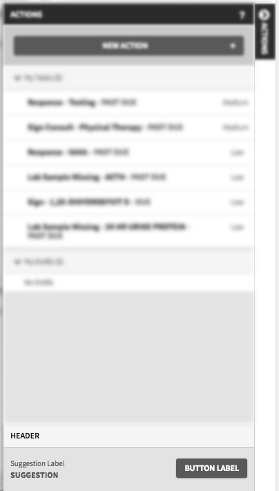

::: page-description
# Views #
ADK UI Library's Standardized Marionette Views that are ready-to-use and accessible.
:::

::: definition
Applet Views can be accessed and used by calling:
### **ADK.UI.[view-name]** ###
:::

## Error ##
The ADK UI Library's Error View is an extension of Marionette's ItemView that displays a error message based on the Backbone model handed to it on instantiation. This is the application's standard view to show when failing resource requests are received.
```JavaScript
var view = new ADK.UI.Error({
  model: new Backbone.Model({...})
});
```
Returns an ItemView that displays an appropriate error message to the user.

### Options ###
| Required  | Option                    | Type    | Description |
|:---------:|---------------------------|---------|-------------|
|           | **headingLevel**            | integer | value used to determine what HTML heading tag to use in the view's template. <br /> Value must be an integer between the range of 0 and 7. <br /> _(1, 2, 3, 4, 5, or 6)_ <br /> **Default:** `6`|

### Basic Usage ###
```JavaScript
initialize: function(options) {
...
    this.listenTo(collection, ERROR_EVENT_STRING, this.onError);
...
},
onError: function(response, collection) {
...
    this.ErrorView = new ADK.UI.Error({
      headingLevel: 3,
      model: new Backbone.Model(response)
    });
    this.appletRegion.show(this.ErrorView);
...
}
```

## Loading ##
The ADK UI Library's Loading View is an extension of Marionette's ItemView that displays a loading animation/message. This is the application's standard view to show while resources are pending.
```JavaScript
var view = new ADK.UI.Loading();
```

### Basic Usage ###
```JavaScript
initialize: function(options) {
...
  this.listenTo(collection, 'sync', this.onSync);
  this.loadingView = new ADK.UI.Loading();
...
},
onBeforeShow: function() {
...
  this.appletRegion.show(this.loadingView);
...
},
onSync: function() {
...
  this.appletRegion.show(this.appletView);
...
}
```

## Text Filter ##
Returns a LayoutView complete with a [ADK.UI.Form](#Form) view for entering text filters and an associated title, a Marionette Composite view for showing the list of saved filters, and a standardized text filter collection.  The view controls the logic for correctly displaying the right elements depending on the options passed in through instantiation.

### Options ###
| Required                          | Option                    | Type                | Description |
|:---------------------------------:|---------------------------|---------------------|-------------|
|<i class="fa fa-check-circle"></i> | **collection**            | Backbone Collection | must be an instance of **ADK.UI.TextFilter.prototype.Collection** otherwise it will throw an error and disregard the collection passed in through the options object and replace it with a new empty _ADK.UI.TextFilter.prototype.Collection_ |
|                                   | **showFilterTitle**       | Boolean             | determines whether the form view should show an input field for users to enter a string value that is associated as the **applet's filter title**. When enabled the text filter view will also handle the behavior of saving the string to the user's workspace preferences which will allow it to persist until deleted or changed.  <br/>**Default:** `false`|
|                                   | **multipleFilters**       | Boolean             | determines whether a list of applied filters should be shown to the user. When enabled, submitting a new filter string will generate a new list item associated with the text entered and clear the filter input field. Users will also be able to remove filter items individually by clicking on a single list item to remove it from the collection. If disabled, submitting a new filter string will not clear the filter input field and user will be required to use the input field to clear any unwanted filter strings. In both cases the collection is updated and appropriate events are fired.<br/>**Default:** `false` |
|                                   | **predefinedFilter**      | Boolean             | Set to true to make the filter title uneditable, the predifined filter items display, and prevent user defined filters from being added to the list view. User defined filters will be kept in the input box.<br/>**Default:** `false` |
|<i class="fa fa-check-circle"></i> | **instanceId**            | String              | unique applet identifier used for naming |
|                                   | **filterTitle**           | String              | string used as the initial value for the filter title input field<br/>**Default:** `''` _(empty string)_|

### Basic Usage ###
```JavaScript
var MyCollection = ADK.UI.TextFilter.prototype.Collection.extend({});
var myCollection = new MyCollection([...]);
var ServerPagingView = new ADK.UI.TextFilter({
  // Reminder: You must pass a new instance of the collection into the view and not just a definition
  collection: myCollection,

  // Standard: "true" when on an user-defined-workspace (workspace is not "predefined")
  showFilterTitle: false,

  // Standard: "true" when applet is "fullScreen" OR on an user-defined-workspace (workspace is not "predefined")
  multipleFilters: false,

  // This should be the unique applet "instanceId"
  instanceId: 'example-applet-instance-id',

  // Standard: the user-defined applet "filterName"
  filterTitle: 'My Filter'
});
```

::: side-note
The **filterName**, **fullScreen**, and **instanceId** values used in the standards above are found in the [appletConfig options](../conventions.md#Applet-Level-Conventions-Configuration-Options-appletConfig-Attributes-used-to-configure-the-applet-view) passed to the applet view.

The **predefined** value can be found on the `ADK.WorkspaceContextRepository.currentWorkspace` Backbone Model.
:::

### Collection ###
The standardized collection definition accessible via `ADK.UI.TextFilter.prototype.Collection` is the ordered set of filter models.

#### Model ####
Each model is composed of the follow attributes:

| Attribute   | Default Value           | Description |
|-------------|-------------------------|-------------|
| text        | `''` _(empty string)_   | String value used for filtering |
| shouldShow  | `true`                  | Boolean value that determines if the filter is ever displayed to the user.<br/>If "false" the filter is still applied but the user will never know about it. |
| removable   | `true`                  | Boolean value that determines if the user can ever remove the filter. |

#### Methods ####
In addition to the normal Backbone.Collection methods, the following methods are also provided for developer use:
##### getCombinedFilterString(conditionObject) {.method} #####
Iterates over the collection's models, building an array of models that have the properties of the given conditionObject. The array is then processed and the "text" attributes' string value is plucked and used to build the string of concatenated filter values which is return.
``` JavaScript
var Collection = ADK.UI.TextFilter.prototype.Collection
var collection = new Collection([{
    text: 'A',
    removable: true
}, {
    text: 'B',
    removable: false
}, {
    text: 'C',
    removable: true
}]);
var removableFilters = collection.getCombinedFilterString({removable: true});
// removableFilters equals "A C"
```

#### Events ####
In addition to the normal Backbone.Collection events which are recommended when listening for filter changes, the following events are also fired on the collection:
##### filter-entered {.method} #####
triggered when the user enters a new filter value via the form's input control
::: note warning
##### Warning #####
The text filter LayoutView listens for the `filter-entered` event in order to update the collection's models appropriately, so the event is fired even before the collection of filters is updated.
:::

## Table ##
The table view can support either a flat or grouped (collapsible groups) table body structure. The table view itself is a CompositeView which shows a header view in the template (`<thead></thead>`) and a body view within the `<tbody></tbody>` in the CompositeView's template. A collection, column array, and [initial sorted column](#Table-Initial-Sorted-Column) must be set on instantiation.

Should be provided with the following options upon instantiation:
```JavaScript
var table = new ADK.UI.Table({
  collection: myCollection, // REQUIRED -- See ADK.Collections documentation
  columns: COLUMNS, // REQUIRED -- see Column Configuration section
  initialSortedColumn: COLUMNS[0].name, // REQUIRED -- string matching desired column's name
  helpers: {}, // optional, see Helpers section for more info. Can also be function (returns object)
  onClickRow: function(rowModel) {}, // optional, function run on click of tbody tr
  label: '', // optional, used to describe table to screen reader
});
```

### Header view ###

The individual columns' labels come from the column configuration passed in to the parent CompositeView. A column is sortable if `sortKeys` is defined. Individual header cells can be formatted using [helpers](#Table-Helpers).

### Body view ###

The columns correspond to the column configuration passed in to the parent CompositeView. Each cell is rendered with the correct data by looking up the attribute on the row's model using the `name` property defined by the column configuration. Individual cells can be formatted using ['bodyTemplate' column option](#Table-Column-Configuration) and [helpers](#Table-Helpers).

### Column Configuration ###
The following options can be attributes on each column object. Columns when passed to view should be in form of array of column objects. Order of array will drive order of columns.

| Required                          | Option        | Type               | Description |
|:---------------------------------:|---------------|--------------------|-------------|
|<i class="fa fa-check-circle"></i> | **name**      | string             | mapping to the cell's desired model attribute value |
|<i class="fa fa-check-circle"></i> | **label**     | string             | label put on the column header |
|                                   | **hoverTip**  | string             | mapping to tooltip text in `_assets/js/tooltipMappings.js` |
|                                   | **sortKeys**  | object             | defines what to sort on when the column is sorted. Should contain **asc** and **desc** with string values as properties. **defaultDirection** (optional, "asc" or "desc", defaults to "asc") can also be specified <br />**Example:** `sortKeys: { asc: 'dateTime asc, referenceDateTime asc', desc: 'dateTime desc, referenceDateTime desc', defaultDirection: 'desc' }`|
|                                   | **bodyTemplate**  | string or Handlebars.compile    | cell template to use which gets injected into the `tbody`'s `td`'s'. By default, simply injects value on the model attribute defined by the **name** column option. The template will have the row's model attributes in scope.<br />**Example:** `bodyTemplate: '{{#if someValue}}{{someValue}}{{else if otherValue}}{{otherValue}}{{/if}}'`|
|                                   | **groupKey**  | function           | transforms current groupKey (if using a [Grouped collection](../using-adk.md#Collections-GroupingCollection)), takes in model value of column **name** attribute. This groupKey is used to match/group against. <br />**Example** if the current group is a date and you want to group by month and year only you could:<br />`groupKey: function(dataItem) {return dataItem.dateAttribute.substr(0, 6);}` |

### Initial Sorted Column ###
The Table view should have a column assigned as the default. This will drive the initial sort as well as the fall-back sort after other columns' sorts are cycled through. This can be done as shown below. The string value should match the `name` attribute on the desired [column configuration](views.md#Table-Column-Configuration). Doing this will allow the view to properly bootstrap the [table view](views.md#Table) to the correct column.

### Helpers ###
Extend Table with `helpers` object to be used as template helpers both for rendering the cell and, if using a Grouped collection, the group header. These helpers are special in the sense that the helper function will always receive the row's data model as the first argument.

**It is highly recommended to do presentation-only data transformations in a template helper**. For example, if the data for the cell being rendered has a value of `userName: 'Doe, John'` (i.e. the column configuration specified `name: 'userName'`), a template helper can be defined with `userName` as a key in order to transform the string as desired.

In this example, the name is being transformed to be in "{first name} {last name}" format:
```JavaScript
helpers: {
  userName: function(model) {
    // These helpers will always get the data model as the
    // first argument (through manual augmentation).
    // ---------------------
    // Normally, model attributes are made available like: `this.userName`...
    // However, since we're providing a template helper with `userName` key,
    // and since `this` actually consists of templateHelpers, serializeData,
    // AND model.attributes, using `this.userName` would be infinitely recursive.
    // ---------------------
    // THUS, the pattern should be (combine steps for brevity as desired):
    // 1) "get" the desired original value using provided data model
    var name = model.get('userName');
    // 2) transform as desired
    var names = name.split(',');
    var firstName = names.pop().trim();
    var lastName = names.pop().trim();
    var displayName = firstName + ' ' + lastName;
    // 3) return transformed data
    return displayName;
    // yields "John Doe"
  }
}
```

As mentioned in the comments in the code above, you should use `model.get('userName')` (or other model attribute if desired) when specifying a template helper using the same key as the value defined for the column configuration instead of `this.userName` because the template helpers are mixed into the same object (`this` in scope of template helpers).

In the example below, the `userName_cell` helper is being used to capitalize the whole name (for... reasons)
```JavaScript
helpers: {
  userName: function(model) {
    // as defined in previous example
    // Yields "John Doe"
  },
  userName_cell: function(model) {
    // NOTE: can use `this.userName`, which will run the `userName` helper above.
    // However, if no `userName` helper is defined, will get the `userName` from the model
    return this.userName.toUpperCase();
    // yields: "JOHN DOE"
    // If you don't want to daisy chain transformations, you can always use model value
    return model.get('userName').toUpperCase();
    // yields: "DOE, JOHN"
  }
}
```

Additionally, `{attribute}_groupHeader` can be used to transform the group headers (when a [Grouped collection](../using-adk.md#Collections-GroupingCollection) is in use) independently of `{attribute}` or `{attribute}_cell`. For the `userName` example, this means that helpers of `userName`, `userName_cell`, and `userName_groupHeader` can be all be defined to alter the rendered text in a different manner.

A caveat to consider with the `{attribute}_groupHeader` is that the model passed in as the first argument will be the group model (see [Grouped collection](../using-adk.md#Collections-GroupingCollection) for more information). As a result, the only value available (i.e model.get('userName')) will be the value transformed through the `groupKey` function (see column configuration option above) passed into the collection, if one is defined; otherwise the value will be the same as it would be in `{attribute}_cell`. Also note that in the case that a `groupKey` transformation is defined, the `{attribute}` helper will have the same limitation on the model value as the `{attribute}_groupHeader`. In this case, it is important to understand the transformations being done in both situations.

To illustrate this limitation see the example below, in which `userName_groupHeader` is defined along with a `groupKey` transformation function.

```JavaScript
// in column config:
var columns = [{
  //...
  name: 'userName',
  groupKey: function(item) {
    // item.userName === "Doe, John"
    // this function wants to only return last name (group on last name)
    return item.userName.split(',').shift();
  }
  //...
}];
// Now in helpers
helpers: {
  userName: function(model) {
    // When rendering data cell, model.get('userName') yields "Doe,John",
    // but when rendering group header, model.get('userName') yields "Doe".

    // So if we want to simply always capitalize (contents of value doesn't matter)
    // there should be no ill/unexpected effect
    return model.get('userName').toUpperCase();

    // However, if we want to do something like we did in earlier example,
    // like displaying "{first} {last}" format, we need to be careful (do a check).
    // In this case, it would be better to specify a `userName_cell` helper that can
    // safely expect "Doe, John" format -- as well as a `userName_groupHeader` helper, which can
    // safely assume "Doe" format.
  },
  userName_groupHeader: function() {
    // only called when rendering group header, so model.get('userName')
    // always yields "Doe" format
  },
  userName_cell: function() {
    // only called when rendering data cell, so model.get('userName')
    // always yields "Doe, John" format
  }
}
```

## Form ##
> **A list of supported form controls can be found by [clicking here][FormControls].**
### Overview ###
The ADK provides a way to generate, render and capture user input with an HTML form.  The data entered by the user is retrieved and stored in a Backbone model.  The form is rendered with a Marionette view. Any changes to the form are reflected back to the model and vice versa.  In order to POST (or PUT) the form to the server, a developer will simply have call the Backbone model's save method.

**ADK.UI.Form** provides a standard approach for developing forms including: form generation, model binding, and form validation. Form validation will be handled by Backbone.Model's validate method, which will have to be extended on a per-model basis and thus will be handled by the developer.  The form's html pieces have all been test and certified as 508 compliant.

### Options ###
**ADK.UI.Form** is the base form view that handles the form generation.  Each individual form can be customized by extending the base view with the following available options:

| Required     | Option          | Type   | Description                                                                                             |
|:------------:|-----------------|--------|---------------------------------------------------------------------------------------------------------|
|<i class="fa fa-check-circle"></i> | **model** | instance of a Backbone.Model | a model that the field's values will be binded to  |
|<i class="fa fa-check-circle note">*</i> | **fields** | array of controls | configuration of controls and how they are layed out in the form's UI |
|              | **events** | hash / function | see [backbone's documentation on events][BackboneViewEvents] |
|              | **modelEvents** | hash / function | see [marionette's documentation on modelEvents][MarionetteModelEvents] |
|              | **onRender** | function | see [marionette's documentation on onRender][MarionetteOnRender] |
|              | **onInitialize** | function | method gets called after the form's initialize method which gets called when the view is first created. <br /> **Note:** the options object passed to the constructor / initialize will get passed through as a argument of the _onInitialize_ method.  <br /> **Default:** `function(options){ }`|

::: callout
**<i class="fa fa-check-circle note">\*</i> Note:** the fields array is composed of a list of control objects.  Please see the [section below](#Form-Controls) for more information on what a control object is.
:::

### Basic Usage ###
```JavaScript
var ExampleFormView = ADK.UI.Form.extend({
    model: new Backbone.Model(),
    fields: [],
    events: {
        "event-selector": "callback-function"
        //...
    },
    modelEvents: {
        "event-selector": "callback-function"
        //...
    },
    onRender: function(){
        //...
    },
    onInitialize: function(options){
        //...
    }
});
```
::: callout
**Note:** ADK.UI.Form returns a Marionette View, and in order to create an instance of the view you must call **new** on the view returned. `var formViewInstance = new ExampleFormView(); `

**Important:** DO NOT EXTEND/OVERWRITE the following methods/properties of an ADK.UI.Form View: `tagName`, `attributes`, `template`, `initialize`, `onRenderCollection`, `childViewOptions`, and `getChildView`. Overwriting these will likely cause issues with rendering and showing a fully functional form.
:::

### Controls ###
The ADK has created a collection of form controls that are 508 Compliant and are available for use in the the **fields** array definition of ADK.UI.Form.  Each form control has a set of available attributes used to customize its look/feel and functionality.
::: callout
All form control objects **must** contain the attribute of **"control"** which tells the base view (ADK.UI.Form) which control is being defined/used.

Most controls also have a attribute of **"name"** which gets used to bind the control's value back to the form's model.

Control's with id's will have the Marionette view's `cid` appended to the **name** config option by default. As a result of this, the element id attribute should not be used as a selector, as it will be dynamically generated each time the view is shown. Most controls will have the **name** config option added as a class on the control's top level div. This class should be used as an anchor for your selector. Example input (given `name: 'example'`): `this.$('.example input')` as opposed to `this.$('#example')`.
:::

The following is an example of creating a Form with one input field, who's value is binded to the model's _"input1"_ attribute:
```JSON
var ExampleFormView = ADK.UI.Form.extend({
    model: new Backbone.Model({
        input1: ""
    }),
    fields: [{
        control: "input",
        name: "input1",
        label: "Input Label",
        placeholder: "Enter text..."
    }]
});
```

::: side-note
**The complete list of supported form controls can be found by [clicking here][FormControls].**
:::

### Form Validation ###
Form validation will be handled by Backbone.Model's **validate** method, which will have to be extended on a per-model basis and thus will be handled by the developer.

The validate method receives the model attributes as well as any options passed to set or save. If the attributes are valid, don't return anything from validate. If they are invalid return an error of your choosing. It can be as simple as a string error message to be displayed, or a complete error object that describes the error programmatically. If validate returns an error, save will not continue, and the model attributes will not be modified on the server. Failed validations trigger an "invalid" event, and set the validationError property on the model with the value returned by this method.

---

Below is an example of validating the model to ensure that the attribute _"numberInput"_ is between 10 and 20:
```JavaScript
var Model = Backbone.Model.extend({
    defaults: {
        numberInput: 1,
    },
    validate: function(attributes, options) {
        this.errorModel.clear();
        var number = parseFloat(this.get("numberInput"), 10);
        if (isNaN(number)) {
            this.errorModel.set({
                numberInput: "Not a number!"
            });
        } else if (number <= 10 || number >= 20) {
            this.errorModel.set({
                numberInput: "Must be between 10 and 20"
            });
        }
        if (!_.isEmpty(this.errorModel.toJSON())) {
            return "Validation errors. Please fix.";
        }
    }
});
```
``` JavaScript
var FormView = ADK.UI.Form.extend({
    events: {
        "submit": function(e) {
            e.preventDefault();
            // calling the form model's validate method
            if (this.model.isValid())
                // logic for when the model is valid
            else {
                // logic for when the model is not valid
            }
        }
    }
    ...
});
```
View [Backbone's Documentation on validate][BackboneModelValidate] for more details

### Setting focus on first error field ###
If the model does not pass validation (`[form model].isValid()`) generally the user's focus should be placed at the first failing form field.

By calling `[form view].transferFocusToFirstError()` the first form field with an error message will recieve focus.
``` JavaScript
var FormView = ADK.UI.Form.extend({
    events: {
        "submit": function(e) {
            e.preventDefault();
            // calling the form model's validate method
            if (this.model.isValid())
                // logic for when the model is valid
            else {
                // logic for when the model is not valid
                // ...
                this.transferFocusToFirstError();
            }
        }
    }
    ...
});
```

### Dynamic Hiding and Showing of Form Elements ###
Hiding and showing of form elements dynamically, should be handled by Marionette's **modelEvents** object.  The _modelEvents_ object parameter can be added to the form's view like shown in the example below:

```JavaScript
var ExampleFormView = ADK.UI.Form.extend({
    model: new Backbone.Model(),
    fields: [],
    modelEvents: {
        "event-selector": "callback-function"
    }
});
```

An example case where you might need to hide/show form elements dynamically could be to allow the user to provide more specific information on a particular selection.  So the following example is to show how once the user selects an option from the select dropdown, if the option they select is email then the appropriately email field will be enabled and required, otherwise if they choose phone-number then similarly the phone number input field will be enabled and required.

```JavaScript
var ExampleFormModel = Backbone.Model.extend({
    defaults: {
        perferredMethodOfContact: '',
        email: '',
        phoneNumber: ''
    }
});
ExampleFormView = ADK.UI.Form.extend({
    model: new ExampleFormModel(),
    ui: {
        "phoneNumberField": ".phoneNumber",
        "emailField": ".email",
    },
    fields: [{
        control: "select",
        name: "perferredMethodOfContact",
        label: "What is your preferred method of contact?",
        options: [{
            label: "Email",
            value: "email"
        }, {
            label: "Phone",
            value: "phone"
        }],
        required: true
    }, {
        control: "input",
        name: "email",
        label: "Email Address",
        placeholder: "Enter your email...",
        type: "email",
        extraClasses: ["hidden"],
        required: true
    }, {
        control: "input",
        name: "phoneNumber",
        label: "Phone Number",
        placeholder: "Enter your phone number...",
        type: "input",
        extraClasses: ["hidden"],
        required: true
    }],
    modelEvents: {
        'change:perferredMethodOfContact': function() {
            var method = this.model.get('perferredMethodOfContact');
            if (method === "email") {
                this.ui.phoneNumberField.trigger('control:hidden', true);
                this.ui.emailField.trigger('control:hidden', false);
            } else if (method === "phone") {
                this.ui.emailField.trigger('control:hidden', true);
                this.ui.phoneNumberField.trigger('control:hidden', false);
            } else {
                this.ui.emailField.trigger('control:hidden', true);
                this.ui.phoneNumberField.trigger('control:hidden', true);
            }
        }
    }
});
```

::: callout
**Please refer to each component's documentation individually to ensure which events are supported for each.** (Not all controls will support the events used above example)
:::

::: side-note
**Important Note:** In order to keep the form view's ui hash functionality in tack, the form re-binds it's UI elements as necessary when nested controls prompt it to. After the re-binding, the form view fires off the following `form:view:updated:bound:ui:elements` DOM event on it's element (this.$el) to indicate to views above, that ui hash selectors targeting elements inside of the form may have become stale.
:::

## Sub Tray Button ##
(_Built to be consumed by a registered sub-tray component in a ADK.UI.Workflow_)

The basic goal of the Sub Tray Button View is to provide a button view that contains the exact template utilized by the ADK.UI.SubTray view without actually utilizing a Sub Tray view (with a fly-out). This will allow an instance of the Sub Tray Button View to reside in the same space as a Sub Tray within a ADK.UI.Workflow and have the buttons look alike. This view also allows for easy configuration of both the click event and label. See options below.

### Options ###
| Required                          | Option        | Type               | Description |
|:---------------------------------:|---------------|--------------------|-------------|
|<i class="fa fa-check-circle"></i> | **label**     | string             | text shown on the button. Defaults to "Button". |
|<i class="fa fa-check-circle"></i> | **onClick**   | function           | called on click of the button. The context of `this` is the button view and the click event is available as the first argument.<br />Defaults to `function(event) {return true;}` |

### Basic Usage ###
```JavaScript
var ButtonInSubTray = ADK.UI.SubTrayButton.extend({
    options: {
        onClick: function(event) {
            alert('a non-subTray button was clicked!');
        },
        label: 'My Test Button'
    }
});
```

## Tray Action Summary List ##
(_Built to be consumed by a patient write-back tray_)

The basic goal of the tray action summary list view is to abstract out the layout and logic of retrieving the appropriate "[_application component items_](ui-library/application-component-registration.md#Application-Component-Registration-Registering-Items)" registered to a tray and displaying them in a drop-down list / action item format.  It also sets up the region in which the list view of the grouped items can be displayed.

### Options ###
| Required                          | Option            | Type                     | Description |
|:---------------------------------:|-------------------|--------------------------|-------------|
|<i class="fa fa-check-circle"></i> | **key**           | string                   | corresponds to the key provided when defining an application component item |
|<i class="fa fa-check-circle"></i> | **headerLabel**   | string                   | used to display the appropriate title in the header region of the tray container |
|<i class="fa fa-check-circle">*</i>| **dropdownLabel** | string                   | the text a user will see on the dropdown button if there are multiple application component items registered to that specific tray |
|                                   | **listView**      | Backbone View Definition | a Backbone / Marionette View Definition that will be shown below the list of actionable items |
|                         | **helpMapping**| string   | String that corresponds to help mappings found in helpMappings.js -- is used to generate a url. <br />**Note:** defining either this or `helpUrl`, a help button will be shown in the header, though it must be found in helpMappings.js. |
|                         | **helpUrl**| string   | String to be used as target on click of help button in header. <br />**Note:** defining either this or `helpMapping`, a help button will be shown in the header. |
|                         | **nextSuggestion**| object   | Object of configuration options used by the view to suggest something to the user. <br />**Note:** more details along with a list of configurable options is outlined in the [Next Suggestion Options](#Tray-Action-Summary-List-Options-Next-Suggestion-Options) section below. |

The diagram below helps depict where the options are being used inside the view's ui.


#### Next Suggestion Options ####
| Required                          | Option              | Type      | Description |
|:---------------------------------:|---------------------|-----------|-------------|
|                                   | **header**          | string    | text value to display as the header of the next suggestion section |
|                                   | **suggestionLabel** | string    | descriptive text to display in conjunction with the suggestion  |
|<i class="fa fa-check-circle"></i> | **suggestion**      | string    | text highlighting the suggestion |
|                                   | **buttonLabel**     | string    | button text that describes the action of the callback |
|                                   | **callback**        | function  | method to invoke on click of the button |

The diagram below helps depict where the options are being used inside the view's next suggestion section.


### Basic Usage ###
```JavaScript
ADK.UI.TrayActionSummaryList.extend({
  options: {
    key: "TRAY_KEY", // unique identifier of tray
    headerLabel: "TRAY_HEADER_LABEL",
    dropdownLabel: "DROPDOWN_MENU_LABEL"
    listView: ADK.UI.TraySummaryList.extend(...), // see Tray Summary List View documentation
    helpMapping: 'EXAMPLE_TRAY',
    nextSuggestion: {
      header: 'Header',
      suggestionLabel: 'Suggestion Label',
      suggestion: 'Suggestion',
      buttonLabel: 'Button Label',
      callback: function() {
        // Do something here
      }
    }
  }
})
```

::: definition
**Note**: When [registering an application component items](ui-library/application-component-registration.md#Application-Component-Registration-Registering-Items) to be used in a Tray Action Summary List View an extra option is required in order for the click listener on the item to be set up correctly.  Below is an example of including the extra `onClick` option in your registration object.
  ```JavaScript
  // the following would be placed inside an applet
  ADK.Messaging.trigger('register:component:item', {
      type: "tray",
      key: 'TRAY_KEY',
      label: 'ITEM_LABEL',
      onClick: function(){
          // this is where the applet's workflow would be triggered to show in the tray
      },
      shouldShow: function() {
          return true;
      }
  });
  ```
:::

## Tray Summary List ##
(_Built to be consumed by a patient writeback tray_)

The basic goal of the tray summary list view is to display a collection of grouped models (a.k.a. collection of collections).  The following is an example / default format for the collection tied to this view:

```JavaScript
var exampleCollection = new Backbone.Collection([{
    id: 'SAMPLE_ID',
    name: 'SAMPLE_NAME',
    items: new Backbone.Collection([{
        id: 'SAMPLE_ITEM_ID',
        label: 'SAMPLE_ITEM_LABEL',
        status: 'SAMPLE_ITEM_STATUS',
        dateTime: 'SAMPLE_ITEM_DATE_AND_TIME'
        nodes: 'SAMPLE_ITEM_NODES'
      },
      //...
    ])
  },
  //...
]);
```

### Options ###
If the model attributes are different than the ones shown above, an attributeMapping object is provided as part of the options defined on the view.  Below is a table of all the configurable options on the summary list view.

| Required                          | Option              | Type   | Description |
|:---------------------------------:|---------------------|--------|-------------|
|<i class="fa fa-check-circle"></i> | **label**           | string | string used for text in empty views (ie. "No ITEMS", "No Group1 ITEMS") |
|<i class="fa fa-check-circle"></i> | **onClick**         | function | called when item in the list is clicked.  Usually onClick method whould take action to show pre-populated form in tray with the data from the selected item.  |
|                                   | **itemTemplate**    | string or Handlebars template | used as the template of the individual rows. The row's model is available in this template, so any of its attributes are accessible using Handlebars (i.e. `{{myAttribute}}`). Simple logic can be used here, but if the template should differ substantially between two states, `getItemTemplate` should be used.<br />**Note:** will be overwritten if `getItemTemplate` is defined and will itself overwrite the default template.|
|                                   | **getItemTemplate**  | function | used as the individual rows' _getTemplate_ function, which determines the template to use. This should be used instead of `itemTemplate` when the templates between two states of a row differ substantially.<br />**Note:** will overwrite `itemTemplate` as well as the default template.|
|                                   | **emptyViewTemplate**   | string or Handlebars template | used as the template of the empty view that shows when there are no items within a group. By default, this is in the format of "This patient currently has no [label]." (where label is specified by the `label` option) |
|                                   | **attributeMapping**| object | Ensures for flexible naming of the model attributes<br />**Options:** `groupLabel`, `groupId`, `groupItems`, `itemUniqueId`, `itemLabel`, `itemStatus`, `itemDateTime`, and `nodes`<br /> **Example:** `attributeMapping: {groupID: "groupId", groupLabel: "groupLabel", groupItems: "groupItems", itemUniqueId: "itemId", itemLabel: "itemLabelText", itemStatus: "statusOfItem", itemDateTime: "itemDateTimeString", nodes: "addenda"}`|

### Basic Usage ###
```JavaScript
ADK.UI.TraySummaryList.extend({
  initialize: function() {
    // place where collection can be created
  },
  options: {
    label: "ITEMS",
    onClick: function(model) {
      //...
    },
    attributeMapping: {
      groupID: 'groupId',
      groupLabel: 'groupLabel',
      groupItems: 'groupItems',
      itemUniqueId: 'itemId',
      itemLabel: 'itemLabelText',
      itemStatus: 'statusOfItem',
      itemDateTime: 'itemDateTimeString',
      nodes: 'addenda"
    }
  }
})
```
The diagram below helps depict where the attributes are being used inside the view's ui.


[FormControls]: form-controls.md