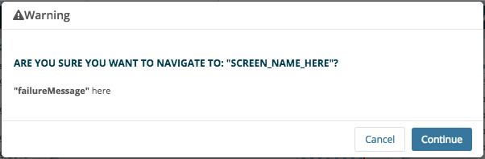

::: page-description
# Using the Application Development Kit #
API calls, utils, helpers, components, and views
:::

## ResourceService ##
> **ADK.ResourceService** is an application service that returns an object of functions that allows a developer to interact with the Software Development Kit's [Vista Exchange API][VXAPI].

Using ADK.ResourceService allows you to perform fetches against any domain listed in the [VX-API's Resource Directory][VXAPI].  New domains can be added to the Vista Exchange API through the SDK's [Resource Development Kit][RDK].

### Methods ###
**ADK.ResourceService.**[method below]

#### .fetchCollection(options) {.method .copy-link} ####
returns a Backbone Model of the requested resource
[(list of options)][ADK.RecordService.CommonOptions]
``` JavaScript
var data = ADK.ResourceService.fetchCollection({...});
```
#### .fetchModel(options) {.method .copy-link} ####
returns a Backbone Model of the requested resource
[(list of options)][ADK.RecordService.CommonOptions]
``` JavaScript
var data = ADK.ResourceService.fetchModel({...});
```
#### .fetchResponseStatus(options) {.method .copy-link} ####
returns a Backbone Model of the requested resource
[(list of options)][ADK.RecordService.CommonOptions]
``` JavaScript
var ResponseStatus = ADK.ResourceService.fetchResponseStatus({...});
```
#### .resetCollection(originalCollection, options) {.method .copy-link} ####
returns orginialCollection after a new fetch is called to update the collection's models
[(list of options)][ADK.RecordService.CommonOptions]
``` JavaScript
var data = ADK.ResourceService.fetchCollection({...});
    data = ADK.ResourceService.resetCollection(data, {...});
```
#### .filterCollection(originalCollection, filterFunction) {.method .copy-link} ####
returns the originialCollection after it is filtered by the filter function
``` JavaScript
var data = ADK.ResourceService.fetchCollection({...});
var filteredData = ADK.ResourceService.filterCollection(data, function(model) {
    if (typeof model.get('id') !== 'undefined') {
        return true;
    } else {
        return false;
    }
});
```
#### .buildUrl(resourceTitle, criteria) {.method .copy-link} ####
returns a resource's URL from VX-API's resource directory
``` JavaScript
var url = ADK.ResourceService.buildUrl('user-service-userinfo', {parameter1:'example'});
```
#### .buildJdsDateFilter(dateFilterOptions) {.method .copy-link} ####
returns a date filter string that is generated by dateFilterOptions
``` JavaScript
var dateFilter = ADK.ResourceService.buildJdsDateFilter({parameter1:'example'});
```
#### .clearAllCache(domainString) {.method .copy-link} ####
deletes all cached fetches from Backbone.fetchCache in the domain specified (if no domainString is specified, all cached data will be deleted)
``` JavaScript
ADK.ResourceService.clearAllCache('user-service-userinfo');
ADK.ResourceService.clearAllCache();
```
#### Common Options ####
The following are attributes that may be included in the **options** object parameter used in the following methods: **fetchCollection**, **fetchModel**, **resetCollection** (second parameter), and **fetchResponseStatus**.

| Attribute                | Type    | Description                                                                 |
|--------------------------|---------|-----------------------------------------------------------------------------|
| **resourceTitle**        | string  | resource title from VX-API's resource directory used to generate a url |
| **pageable**             | boolean | fetchCollection or resetCollection will return a Backbone.PageableCollection when _true_ |
| **collectionConfig**     | object  | collection config passed to constructor (see below for more details) |
| **viewModel**            | object  | view model object that contains a parse function that overrides the default model parse [(backbone documentation)][ModelParse] |
| **criteria**             | object  | key value pairs converted to query string parameters on fetch URL (see below for more details) |
| **cache**                | boolean | fetch from cache when _true_, bypass/expire cache when _false_. (default true) |
| **cacheExpiration**      | integer | cache expiration in seconds or _false_ for never expires.  (default 10 minutes) |

::: side-note
**Provided below is more details about common options for ADK.RecordService methods.**
##### collectionConfig {.option} #####
Available attributes for the collectionConfig object:

###### .collectionParse {.option} ######
function that receives a collection and returns an Object Array to override default collection parse.
```JavaScript
fetchOptions.collectionConfig = {
        collectionParse: function(collection) {
            return collection.where({
                summary: 'CHOCOLATE'
            });
        }
    };
```
##### criteria {.option} #####
Examples of possible criteria key - value pairs:

###### .filter {.option} ######
criteria option for passing JDS filter [(see JDS documentation for filter syntax)][RDK]
```JavaScript

criteria = {
  filter: 'lte(overallStart,"2013"),gte(overallStop,"2015")'
}

```
###### .sort {.option} ######
criteria option for passing JDS sort order
```JavaScript
criteria = {
  order: 'overallStop DESC'
}
```
###### .paging {.option} ######
(see resource directory for applicable resources)
```JavaScript
criteria = {
  paging: {
    'start': '0', //start showing results from this 0-based index
    'limit': '10' //show this many results
  }
}
```
:::
#### More Examples ####
The following is an example of fetching both a model and collection using ADK's ResourceService:
```JavaScript
define([
    "ADK",
    ...
], function (ADK, ...) {
    ...
    var fetchOptions = {
      cache: true,
      resourceTitle: 'some-resource-title', //resource title from resource directory
      viewModel: viewModel, //optional override of default viewModel
      pageable: true; //optional to return a Backbone.PageableCollection
      collectionConfig: { //optional
        collectionParse: function(collection) {
            return collection;
        }
      }
      criteria: criteria //optional criteria object gets converted to query string parameters on resource call
    };
    resourceCollection = ADK.ResourceService.fetchCollection(fetchOptions);
    resourceModel = ADK.ResourceService.fetchModel(fetchOptions);
});
```

## PatientRecordService ##
> **ADK.PatientRecordService** acts similar to ADK.ResourceService except it allows you to fetch resources from the ResourceDirectory in regards to a particular patient by passing in a patient attribute as part of the options parameter.

### Methods ###
**ADK.PatientRecordService.**[method below]
#### .fetchModel(options) {.method .copy-link} ####
returns a Backbone Model of the requested resource
``` JavaScript
var PatientData = ADK.PatientRecordService.fetchModel();
```
##### Options #####
In addition to the attributes available in the [options](#ADK-Services-ResourceService) object of ADK's ResourceService, the following attributes may be included in the **options** object parameter used in this method.

| Attribute    | Type           | Description                                                                 |
|--------------|----------------|-----------------------------------------------------------------------------|
| **patient**  | Backbone Model | Model containing a patient's identifying attributes. When left undefined the application's currently selected patient model will be used |
##### More Example(s) #####
###### Providing Options ######
The following grabs the application's current patient's demographic record data.
::: showcode Show example
```
var fetchOptions = {
  'resourceTitle' : 'patient-record-patient',  //resource title from resource directory
  'onSuccess': function(){
    // Alert others that the data is back ?
  }
};

var patientModel = ADK.PatientRecordService.fetchModel(fetchOptions);
```
:::
###### Fetch Data for a Specific Patient ######
The following grabs the demographic record data for a specific patient.
::: showcode Show example
```
var fetchOptions = {
  'resourceTitle' : 'patient-record-patient',  //resource title from resource directory
// Provide model of the patient you would like to receive the resource data on
  'patient' : Backbone.Model.extend({pid: "...."})
//
};

var patientModel = ADK.PatientRecordService.fetchModel(fetchOptions);
```
:::
#### .fetchCollection(options) {.method .copy-link} ####
returns a Backbone Collection of the requested resource
``` JavaScript
var PatientData = ADK.PatientRecordService.fetchCollection();
```
##### Options #####
In addition to the attributes available in the [options](#ADK-Services-ResourceService) object of ADK's ResourceService, the following attributes may be included in the **options** object parameter used in this method.

| Attribute    | Type           | Description                                                                 |
|--------------|----------------|-----------------------------------------------------------------------------|
| **patient**  | Backbone Model | Model containing a patient's identifying attributes. When left undefined the application's currently selected patient model will be used |
##### More Example(s) #####
###### Providing Options ######
The following grabs the application's current patient's medication record data.
::: showcode Show example
```
var fetchOptions = {
  'resourceTitle' : 'patient-record-med',  //resource title from resource directory
  'onSuccess': function(){
    // Alert others that the data is back ?
  }
};

var medicationCollection = ADK.PatientRecordService.fetchCollection(fetchOptions);
```
:::
###### Fetch Data for a Specific Patient ######
The following grabs the medication record data for a specific patient.
::: showcode Show example
```
var fetchOptions = {
  'resourceTitle' : 'patient-record-med',  //resource title from resource directory
// Provide model of the patient you would like to receive the resource data on
  'patient' : Backbone.Model.extend({pid: "...."})
//
};

var medicationCollection = ADK.PatientRecordService.fetchCollection(fetchOptions);
```
:::
#### .getCurrentPatient() {.method .copy-link} ####
returns a Backbone Model of the currently selected patient
``` JavaScript
var currentPatientModel = ADK.PatientRecordService.getCurrentPatient();
```
#### .setCurrentPatient(patient, options) {.method .copy-link} ####
sets the current patient using a given patient pid or model and navigates to patient workspace.  Patient confirmation modal will be displayed if the given patient is different from the current patient. Prior to modal display, it does navigation checking. By default it asks to confirm whether same patient or not, and this can be overwritten by an option.
``` JavaScript
ADK.PatientRecordService.setCurrentPatient('9E7A;149');
```
``` JavaScript
ADK.PatientRecordService.setCurrentPatient(PATIENT_MODEL);
```
##### Options #####

| Attribute                | Type    | Description                                                                |
|--------------------------|---------|----------------------------------------------------------------------------|
| **workspaceId** | string  | optional workspace id to be navigated upon confirmation. <br /> **default**: *patient* context's default workspace id |
| **callback** | function  | optional callback function to be invoked while patient header is being rendered which implies a target tray view module might have not been loaded yet |
| **reconfirm** | boolean  | optional flag. If true, always asks to confirm. If false, asks to confirm only if different patient. <br />**default**: true |
| **navigation** | boolean  | optional flag. If true, navigate to the next workspace upon confirmation. If false, the current screen stays where it is. <br /> **default**: true |

##### More Example(s) #####
###### Providing a Callback ######
The following demonstrates a workflow where the application's current patient is being changed and on success of the patient change a form should be opened inside a tray.
::: showcode Show example
``` JavaScript
  // Part 1. In some applet, set up a messsaging listener.
  ADK.Messaging.on('show:exampleForm', function(name) {
      var ExampleFormModel = Backbone.Model.extend({
          defaults: {
              perferredMethodOfContact: '',
              email: name || '',
              phoneNumber: ''
          }
      });
      var ExampleFormView = ADK.UI.Form.extend({
          fields: [{
              control: 'select',
              name: 'perferredMethodOfContact',
              label: 'What is your perferred method of contact?',
              options: [{
                  label: 'Email',
                  value: 'email'
              }, {
                  label: 'Phone',
                  value: 'phone'
              }],
              required: true
          }, {
              control: 'input',
              name: 'email',
              label: 'Email Address',
              placeholder: 'Enter your email...',
              type: 'email',
              required: true
          }, {
              control: 'input',
              name: 'phoneNumber',
              label: 'Phone Number',
              placeholder: 'Enter your phone number...',
              type: 'input',
              required: true
          }]
      });
      var workflowOptions = {
          title: 'Example Workflow',
          showProgress: true,
          steps: [{
              view: ExampleFormView,
              viewModel: new ExampleFormModel(),
              stepTitle: 'Step 1'
          }]
      };
      // After patient confirmation, this callback function might be invoked BEFORE the
      // tray view that form get shown in gets loaded. In that case this workflow controller takes
      // care of showing the workflow with the example form AFTER the tray view module is loaded.
      var workflowController = new ADK.UI.Workflow(workflowOptions);
      workflowController.show({
          inTray: 'TRAY_ID'
      });
  });
  // Part 2. Change patient and trigger new exampleForm to open inside the tray.
  ADK.PatientRecordService.setCurrentPatient('9E7A;149', {
      callback: function() {
             ADK.Messaging.trigger('show:exampleForm', 'billy.joel@acme.com');
       }
  });
```
:::

#### .refreshCurrentPatient() {.method .copy-link} ####
updates the current patient model in session with the latest data associated with the current site the user is logged into.

#### .fetchResponseStatus(options) {.method .copy-link} ####
returns HTTP response status from the fetch call (does not return a model or collection)
``` JavaScript
var ResponseStatus = ADK.PatientRecordService.fetchResponseStatus();
```
##### Options #####
In addition to the attributes available in the [options](#ADK-Services-ResourceService) object of ADK's ResourceService, the following attributes may be included in the **options** object parameter used in this method.

| Attribute    | Type           | Description                                                                 |
|--------------|----------------|-----------------------------------------------------------------------------|
| **patient**  | Backbone Model | Model containing a patient's identifying attributes. When left undefined the application's currently selected patient model will be used |

### Events ###
ADK's PatientRecordService exposes a few events for hooking into it's functionality.
All PatientRecordService events are fired on [ADK's global messaging channel][ADK.Messaging].
| Event Type                | Description                                                                         |
|---------------------------|-------------------------------------------------------------------------------------|
| **refresh.ehmp.patient**  | This event is fired immediately when the `refreshCurrentPatient` method has been called. |
| **refreshed.ehmp.patient**| This event is fired when the updated data has finished being set on the patient model in session. |

## UserService ##
> **ADK.UserService** is an application service that returns an object of functions that allows a developer to retrieve and update information about the current user.

### Methods ###
**ADK.UserService.**[method below]

#### .getUserSession() {.method .copy-link} ####
returns a Backbone Model from [SessionStorage](#SessionStorage) with data attributes of current user.
[(list of options)][ADK.RecordService.CommonOptions]
``` JavaScript
var userSession = ADK.UserService.getUserSession();
```
##### Response #####
The Following is an example output of what gets returned by _getUserSession()_:
```JavaScript
// ADK.UserService.getUserSession().attributes returns the following object:
  {
    "site": "9E7A",
    "expires": "2015-02-26T19:53:36.301Z",
    "status": "loggedin",
    "disabled": false,
    "divisionSelect": false,
    "duz": {
        "9E7A": "10000000227"
    },
    "facility": "PANORAMA",
    "firstname": "PANORAMA",
    "lastname": "USER",
    "permissions": [ ],
    "requiresReset": false,
    "section": "Medicine",
    "title": "Clinician",
    "provider": true,
    "infoButtonPanorama": "1.3.6.1.4.1.3768",
    "infoButtonKodak": "1.3.6.1.4.1.2000",
    "infoButtonSite": "www.somesite.com"
  }
```
#### .authenticate(userName, password, facility) {.method .copy-link} ####
authenticates against VX-API's Authenication resource with the provided credentials. Method returns a $.Deferred() promise. If successful at authenticating and setting the user session, promise.done() method will be called, otherwise promise.fail() method will be called with these [list of options][ADK.RecordService.CommonOptions].
``` JavaScript
function onSuccessfulLogin() {
    console.log("Successfully authenticated");
}
function onFailedLogin() {
    console.log("Failed to authenticate");
}

var authenticateUser = ADK.UserService.authenticate('JohnSmith', 'ExamplePassword', 'AAAA');
authenticateUser.done(onSuccessfulLogin).fail(onFailedLogin);
```
##### Parameters #####
| Attribute    | Type   | Description                                                                 |
|--------------|--------|-----------------------------------------------------------------------------|
| **userName** | string | The username to authenticate |
| **password** | string | The password to authenticate |
| **facility** | string | The Vista facility to authenticate against |

#### .clearUserSession() {.method .copy-link} ####
destroys the session of the current user both on the client side and resource side.
``` JavaScript
ADK.UserService.clearUserSession();
```
#### .hasPermission(permission) {.method .copy-link} ####
checks if the current user has the provided permission. Returns **true** if user has permission, otherwise will return **false**. [Handlebar helper available for use in template](#Handlebar-Template-Helpers-Has-Permission)
``` JavaScript
var hasPermissionBoolean = ADK.UserService.hasPermission('edit-patient-record');
if (hasPermissionBoolean) {
  console.log("User has permission to: Edit Patient Record");
} else {
  console.log("User does not have permission to: Edit Patient Record");
}
```
#### .checkUserSession() {.method .copy-link} ####
checks the user token's expiration to ensure the current user is still authenticated. Returns a _boolean_ where **false** indicates token/session is expired.
``` JavaScript
var isUserSessionAlive = ADK.UserService.checkUserSession();
if (isUserSessionAlive) {
  console.log("User is still active, and logged in.");
} else {
  console.log("User's session has ended!");
}
```
## WorkspaceContextRepository ##
> **ADK.WorkspaceContextRepository** is an application service that manages a repository of workspace contexts for patient, staff, and admin.

#### ADK.WorkspaceContextRepository.**currentContext** ####
- Returns a Backbone Model with data attributes of current *workspace* context.
    | Attribute                | Type    | Description                                                                |
    |--------------------------|---------|----------------------------------------------------------------------------|
    | **id** | string  | workspace context id. e.g. 'patient', 'admin', or 'staff' |

#### ADK.WorkspaceContextRepository.**currentWorkspace** ####
- Returns a Backbone Model with data attributes of current workspace.
    | Attribute                | Type    | Description                                                                |
    |--------------------------|---------|----------------------------------------------------------------------------|
    | **id** | string  | workspace id. e.g. 'overview' |

## Navigation ##
> **ADK.Navigation** controls the screen change and route/URL update throughout the application.

### Navigation Methods ###
#### ADK.Navigation.**navigate(workspaceId)** ####
- Changes the Application's current screen to the provided screen/workspace and updates the browser's URL/route

  Example of navigating to the _"allergy-list"_ workspace:
  ```JavaScript
  ADK.Navigation.navigate("allergy-list");
  ```
  | Required                           | Attribute          | Type     | Description |
  |:----------------------------------:|--------------------|----------|-------------|
  | <i class="fa fa-check-circle"></i> | **workspaceId**    | string   | unique identifier |
  |  | **options** | object   | optional parameter |
  ::: showcode options example:
  ```
    {
        route: {
            trigger: true
        },
        extraScreenDisplay: {
            dontLoadApplets: true // Skip applet loading during screen module loading
        },
        callback: function() {  // Run this callback before workspace is displayed on the browser
            console.log('Hi ADK!');
        }
    }
   ```

#### ADK.Navigation.**displayScreen(workspaceId)** ####
- Changes the Application's current screen to the provided screen/workspace but does **not** update the browser's URL/route (may want to use in a case where you don't want the provided screen/workspace change to be saved in the browser's history)

  Example of displaying the _"allergy-summary"_ workspace: workspace:
  ```JavaScript
  ADK.Navigation.displayScreen("allergy-summary");
  ```

### Navigation Checks ###
**DEPRECATED! PLEASE USE** [**ADK.Checks**](#Checks) **INSTEAD**

There are situations where the user should be warned or take an action before the workspace/screen is changed using either _ADK.Navigation_ or a browser refresh/change in url.  **Navigation Checks** allow a developer to register and unregister checks to a global collection at any time based on the business needs/requirements.  The collection of global checks is processed and executed once any navigation is triggered.

When a refresh is triggered on the browser or there is a change in the url that points to outside the application, the user will be presented a confirmation alert that includes all the registered navigation checks' _failureMessage_ as part of a disclaimer to the user.

::: side-note
**Example:** User starts a workflow that will write back to the server.  Before the user completes and saves the workflow on the client, an event is triggered to navigate to a screen where the in-progress workflow does not exist, which would cause the in-progress work to be lost.  If a navigation check is registered on start of the workflow, the navigation method will not complete until the registered check passes its condition to allow for navigation to continue, thus allowing the user the option to save or discard the changes. Upon completion of the workflow, this check can be unregistered and no interruption to the navigation method will occur (unless other checks have been registered).
:::

A **Navigation Check** is defined as a Backbone.Model with the following attributes:
| Required                           | Attribute          | Type     | Description |
|:----------------------------------:|--------------------|----------|-------------|
| <i class="fa fa-check-circle"></i> | **id**             | string   | unique identifier |
| <i class="fa fa-check-circle"></i> | **failureMessage** | string   | message to display to the user when the check fails <br/> _(ie. shouldNavigate returns false)_ |
| <i class="fa fa-check-circle"></i> | **shouldNavigate** | function | executes appropriate actions based on the workspace being navigated to <br/> **Important:** Must return `true` or `false` to indicate whether navigation should continue. <br/> _Note:_ the method is passed the following parameters: the name of the screen being navigated to and the config object used to register the navigation check |

::: showcode Naming standards for "id" attribute:

::: side-note
The "id" should be all lowercase separated by "-".
It should always begin with the applet's id followed by the action and brief description.

(`appletId`-`action`-`description`)

Example: "allergies-writeback-in-progress"
:::
::: showcode Example of registering a navigation check:
``` JavaScript
ADK.Navigation.registerCheck(new ADK.Navigation.PatientContextCheck({
    id: 'appletid-action-description-unique',
    failureMessage: 'This is a important message! Any unsaved changes will be lost if you continue.',
    shouldNavigate: function(screenName, config){
      //check to avoid navigation to the "demo-screen"
      if (screenName === "demo-screen"){
        return false;
      } else {
        return true;
      }
    }
}));
```
:::

#### ADK.Navigation.**registerCheck(model)** ####
- This method takes in a _navigation check_ model to register to the global collection and returns the instance of the model that was registered.

#### ADK.Navigation.**unregisterCheck(unique)** ####
- Takes in the "**id**" string or the whole model to determine which check to unregister from the global collection.  Once unregistered, navigation will no longer run the check.

::: definition
**Available Checks**

The following are common checks abstracted to the ADK for use throughout the application.

#### ADK.Navigation.PatientContextCheck ####
- Determines if the user is being taken away from the "patient" context.  If the user is navigating away from a patient context workspace to a different context, the navigation process will be ended and the user will be presented with a confirmation alert that includes the navigation check's _failureMessage_ as part of the disclaimer to the user.
- Below is an example of the alert that is presented to the user when trying to navigate away from a patient context workspace:


The table below displays the attributes to define when extending the _PatientContextCheck_.
| Required                           | Attribute          | Type     | Description |
|:----------------------------------:|--------------------|----------|-------------|
| <i class="fa fa-check-circle"></i> | **id**             | string   | unique identifier |
| <i class="fa fa-check-circle"></i> | **failureMessage** | string   | message to display to the user when the check fails <br/> _(ie. shouldNavigate returns false)_ |
|                                    | **onCancel**       | function | method gets called on click of the "Cancel" button inside the alert confirmation |
|                                    | **onFailure**      | function | method gets called once the check fails (before the alert pops up) |

**Important:** Do not overwrite the **shouldValidate** method on the _PatientContextCheck_.

**Note:** Follow same naming standards for **id** attribute as defined above.

:::

## Checks ##

> **ADK.Checks** enables custom logical interruptions in the user's workflow. An example of this would be stopping the user from navigating away from a screen when a form is in progress. This is achieved by registering logic traps and callbacks as models in the collection of checks which can be triggered at any time (please use responsibly)

Below is an example of how to register and run a simple check. Feel free to try it out in the browser's console. Obviously, it has no inherent value to the application. A list of predefined check model definitions are provided in the **Available Predefined Checks** section below.

```JavaScript
// should define a reusable class of checks with a common group and purpose
// i.e. a check to be run on navigation (group: 'navigation')
var MyCheck = ADK.Checks.CheckModel.extend({
  validate: function(attributes, validationOptions) {
    // validate is called by isValid, which is called
    // by ADK.Checks.run. Both validate and inValid are
    // predefined patterns in Backbone
    validationOptions = validationOptions || {};
    var myCustomOptions = validationOptions.options || {};
    if (myCustomOptions.shouldFail){
      return "My check failed!";
    }
  },
  defaults: {
    group: 'my-group',
    onInvalid: function(invalidOptions) {
      // ran after isValid returns false
      invalidOptions = invalidOptions || {};
      var checkConfig = invalidOptions.checkConfig;
      var onPassCallback = invalidOptions.onPass || function() {};
      var runCheckOptions = invalidOptions.options;
      if (confirm(checkConfig.failureMessage)) {
        // Hey, it's just an example! window.confirm returns true or
        // false depending on which button was pressed.
        // ADK.UI.Alert should be used for any popup interaction displayed
        // to the user
        ADK.Checks.unregister(checkConfig.id);
        ADK.Checks.run(checkConfig.group, onPassCallback, runCheckOptions);
      } else {
        console.log('User cancelled the action!');
      }
    }
  }
});
ADK.Checks.register(new MyCheck({
  id: 'example-id',
  label: 'Example',
  failureMessage: 'My example check has failed! Would you like to continue?'
}));
var myCheckOptions = {
  shouldFail: true
}
ADK.Checks.run('my-group', function(){
  // method to run after all checks pass
  console.log('My checks all passed! Now do something :)');
}, myCheckOptions);
```

### Check Model Definition ###
In the case that a new check model class need be defined, it it highly recommended to extend **ADK.Checks.CheckModel**, which is used as a base for all predefined checks. It is important to specify a **group** in order to have new instances of your check model definition run all together. Similarly, **validate** and **onInvalid** should also be specified since without **validate**, `isValid()` will return true, and if `isValid()` returns false, without **onInvalid** nothing will happen.

:::side-note
**validate** should be defined on the top-level of the model, while **group** and **onInvalid** should be defined under the model's `defaults` attribute.
:::

#### Group ####
The **group** attribute should be defined as a string under the models `defaults` attribute. This string is used to namespace and logically group multiple checks, and should be both concise and descriptive of the purpose of the group of checks.

Example group:

```JavaScript
var MyCheckModel = ADK.Checks.CheckModel.extend({
  // ... rest of definition
  defaults: {
    group: 'my-group'
    // ... rest of definition
});
```

#### Validate ####
The **validate** attribute should be defined as a function on the model and is run when the model's isValid function is called (See [Backbone isValid documentation](http://backbonejs.org/#Model-isValid)), which is called by ADK.Checks.run. If the check should fail, a string describing the failure should be returned. It receives two arguments: _attributes_ (attributes on the check model, passed in by isValid) and _validationOptions_ (object with additional options passed by ADK.Checks.run). The _validationOptions_ argument will receive **checkConfig** (attributes on the check model -- provided for consistency and convenience), **onPass** (method passed into ADK.Checks.run, in order to continue to the next check), and **options** (custom options passed into ADK.Checks.run, useful for the validation condition).

Example validate function:

```JavaScript
var MyCheckModel = ADK.Checks.CheckModel.extend({
  validate: function(attributes, validationOptions) {
    if (/*someCondition*/) {
      return "Some condition failed";
    }
  },
  // ... rest of definition
});
```

#### OnInvalid ####
The **onInvalid** attribute should by defined as a function on the model's `defaults` attribute, and is called when isValid (called by ADK.Checks.run) returns false. Any user interruption should be invoked in this callback. This function receives _invalidOptions_ (an object) as its only argument, which will receive **checkConfig** (attributes on the check model -- provided for consistency and convenience), **onPass** (method passed into ADK.Checks.run, in order to continue to the next check), and **options** (custom options passed into ADK.Checks.run, used primarily as an argument to chain).

:::side-note
Additional callbacks or options can be expected and passed into the instantiation of the check model upon registration. An example of this would be **onCancel**, which can then be used by the **onInvalid** function. This allows for extensibility of the onInvalid callback (i.e. avoid requiring new definitions of onInvalid for each instance). See example below.
:::

Example onInvalid:

```JavaScript
var MyCheckModel = ADK.Checks.CheckModel.extend({
  // ... rest of definition
  defaults: {
    onInvalid: function(invalidOptions) {
      invalidOptions = invalidOptions || {};
      var checkConfig = invalidOptions.checkConfig;
      var onPassCallback = invalidOptions.onPass || function() {};
      var runCheckOptions = invalidOptions.options;
      if (confirm(checkConfig.failureMessage)) {
        // it is important to unregister checks when done with them
        ADK.Checks.unregister(checkConfig.id);
        // since ADK.Checks.run stops and executes only the first failing check
        // the check callback should run the checks again in order to chain them.
        ADK.Checks.run(checkConfig.group, onPassCallback, runCheckOptions);
      } else {
        // otherwise, perform some other action, such as
        // hiding the ADK.UI.Alert view which should be used
        // instead of this window.confirm
        console.log('User cancelled the action!');
        // example of additional custom callback expected by this function
        if (_.isFunction(checkConfig.onCancel)) {
          checkConfig.onCancel();
        }
      }
    },
    // ... rest of definition
});
```

### Registration of Checks ###
#### ADK.Checks.**register(models)** ####
Adds the provided model(s) to the Backbone collection of checks. The **models** argument can be either a single Backbone model or array of models. The model(s) passed in should be instantiated with any options required by the check model definition used.

Upon instantiation, all check models require an **id** attribute (string, should be indicative of the originator), **label** (string, should be "pretty" title for originator), and **failureMessage** (string, used for message to user in the check model's chosen user interruption). See example below.

:::callout
**Note:** on initialize of any model extended from ADK.Checks.CheckModel, the _group_ attribute is appended to the _id_ attribute, separated by a '-' (hyphen). For example, given `id: 'my-originator'` and `group: 'my-group'`, the post-initialization id would be "my-originator-my-group"
:::

Example registration:

```JavaScript
// where MyCheck extends ADK.Checks.CheckModel
ADK.Checks.register(new MyCheck({
  id: 'example-id', // used to distinguish between checks
  label: 'Example', // used by ADK.Checks.getAllLabels -- which can be used by onInvalid
  failureMessage: 'My example check has failed! Would you like to continue?'
  // ^ used by onInvalid and ADK.Checks.getAllMessages
}));
```

:::side-note
**Registering Multiple Checks:** simply pass ADK.Checks.register an array of models. There is no need to specify different id's for each model passed since each id has the individual check's group appended to it.
:::


#### ADK.Checks.**unregister(id)** ####
Removes model(s) matched by **id** argument, which can be in one of the following formats: string (single id), array of strings (multiple ids), object with id and/or group (single or multiple ids), or the model(s) to be removed themselves (array for multiple). See the below example for examples of valid unregister formats.

Example unregister:

```JavaScript
var commonCheckOptions = {
  id: 'example-id',
  label: 'Example',
  failureMessage: 'My example check has failed! Would you like to continue?'
}
// where MyCheck extends ADK.Checks.CheckModel with group of 'my-group'
var MyOtherCheck = MyCheck.extend({
  defaults: _.defaults({
    group: 'my-other-group'
  }, MyCheck.prototype.defaults)
});
var myCheckInstance = new MyCheck(commonCheckOptions);
var myOtherCheckInstance = new MyOtherCheck(commonCheckOptions);
ADK.Checks.register([myCheckInstance, myOtherCheckInstance]);

// Given the above (two separate checks of different groups)
// the following methods of unregistration are valid
-------------------------------------------------
// removes both checks due to _.includes (id used for namespace)
ADK.Checks.unregister('example-id');
// removes only myOtherCheckInstance
ADK.Checks.unregister('example-id-my-other-group');
// removes both checks
ADK.Checks.unregister(['example-id-my-group','example-id-my-other-group']);
ADK.Checks.unregister({ // removes both checks
  id: 'example-id'
});
ADK.Checks.unregister({ // removes only myOtherCheckInstance
  id: 'example-id-my-other-group'
});
ADK.Checks.unregister({ // removes only myOtherCheckInstance
  id: 'example-id',
  group: 'my-other-group'
});
ADK.Checks.unregister({ // removes both checks
  id: 'example-id',
  group: ['my-group','my-other-group']
});
// removes only myOtherCheckInstance
ADK.Checks.unregister(myOtherCheckInstance);
// removes both checks
ADK.Checks.unregister([myCheckInstance, myOtherCheckInstance]);
```

### Execution of Checks ###

#### ADK.Checks.**run(group, onPass, options)** ####
Requires **group** (string, corresponds to relevant group) and **onPass** (function, post-check target action) parameters to be defined. The **options** parameter will be passed into the _validate_ and _onInvalid_ functions.


### Retrieval of Data From Checks ###
#### ADK.Checks.**getAllMessages(group)** ####
Returns all failure messages from the checks collection filtered on provided **group** argument (will return all failure messages if not specified).

Example:

```JavaScript
// with two checks registered in 'my-group'
var myGroupMessages = ADK.Checks.getAllMessages('my-group');
```

#### ADK.Checks.**getAllLabels(group, options)** ####
Designed to be used in onInvalid. Thus, only invalid checks' labels will be retrieved (determined by calling isValid). Retrieves labels from all checks filtered on **group** (string, should correlate to a group in use). Returns an array of strings. The **options** argument will be passed into the isValid call, and should be in object format. Specifying **exclude** (string, should match a check's id) as an attribute on the options object will cause that check's label to be excluded from the returned array.

Example:

```JavaScript
// Let's say this is inside an onInvalid and checkConfig has been defined
// ...
// this will return all active checks that are of group "my-group" and do not
// have the id of this check
var myGroupLabels = ADK.Checks.getAllLabels('my-group', {exclude:checkConfig.id});
```

#### ADK.Checks.**getFailingChecks(group, options)** ####
Designed to be used in onInvalid. Thus, only invalid checks will be retrieved (determined by calling isValid). Retrieves all checks filtered on **group** (string, should correlate to a group in use). Returns an array of models. The **options** argument will be passed into the isValid call, and should be in object format. Specifying **exclude** (string, should match a check's id) as an attribute on the options object will cause that check's label to be excluded from the returned array, while specifying **getAttribute** (string, should correlate to an attribute on the check models, i.e. "label") will return an array of values corresponding to the values at the specified attribute on each matching check's model. NOTE: when **getAttribute** is specified, an object will be returned with **checks** (array of models) and **targetAttribute** (array of values from matching checks), instead of just an array of models.

Example:

```JavaScript
// Let's say this is inside an onInvalid and checkConfig has been defined
// ...
// this will return all active checks that are of group "my-group" and do not
// have the id of this check
var myGroupLabels = ADK.Checks.getFailingChecks('my-group', {exclude:checkConfig.id, getAttribute: 'label'});

```

### Available Predefined Checks ###
The below are predefined checks provided for different workflow points.
- Navigation
- Visit Context

#### Navigation ####
Available at **ADK.Navigation.PatientContextCheck** and triggered by **ADK.Navigation.navigate**. Upon failure, displays an alert which contains all other failing navigation checks. Upon confirming the alert, will unregister and run the **onContinue** for each failing check.

:::definition
Provided configuration:
- **group:** `'navigation'`
- **validate:** fails if target screen is outside of patient context
- **onInvalid:** presents user with alert displaying _failureMessage_ which upon "Continue" unregisters check and continues navigation. Also allows the following callbacks to be defined when initializing the check model:
  - **onCancel:** function fired in alert's "Cancel" click event.
  - **onContinue:** function fired in alert's "Continue" click event.
  - **onFailure:** function fired when alert is displayed.

Example registration:

```JavaScript
var checkOptions = {
    id: 'example-writeback-in-progress',
    label: 'Example',
    failureMessage: 'Example Writeback Workflow In Progress! Any unsaved changes will be lost if you continue.',
    onContinue: _.bind(function(model) {
        form.workflow.close();
    }, form)
};
ADK.Checks.register(new ADK.Navigation.PatientContextCheck(checkOptions));
// Note: the id ends up being the provided id, plus the group
// so for the above check, the id is 'example-writeback-in-progress-navigation'
// To unregister:
ADK.Checks.register('example-writeback-in-progress');
```
:::

#### Visit Context ####
Available at **ADK.Checks.predefined.VisitContextCheck** and triggered by a change in patient visit context. Upon failure, displays an alert which contains all other failing visit context checks. Upon confirming the alert, will unregister and run the **onContinue** for each failing check.

:::definition
Provided configuration:
- **group:** `'visit-context'`
- **validate:** always fails. In other words, if you're registered, the onInvalid will fire.
- **onInvalid:** presents user with alert displaying _failureMessage_ which upon "Continue" unregisters check and continues to the next check. Also allows the following callbacks to be defined when initializing the check model:
  - **onCancel:** function fired in alert's "Cancel" click event.
  - **onContinue:** function fired in alert's "Continue" click event.
  - **onFailure:** function fired when alert is displayed.
:::

Example registration:

```JavaScript
var checkOptions = {
    id: 'example-writeback-in-progress',
    label: 'Example',
    failureMessage: 'Example Writeback Workflow In Progress! Any unsaved changes will be lost if you continue.',
    onContinue: _.bind(function(model) {
        form.workflow.close();
    }, form)
};
ADK.Checks.register(new ADK.Checks.predefined.VisitContextCheck(checkOptions));
// Note: the id ends up being the provided id, plus the group
// so for the above check, the id is 'example-writeback-in-progress-visit-context'
// To unregister:
ADK.Checks.register('example-writeback-in-progress');
```

## Messaging ##

> **ADK.Messaging** allows for global-scope eventing to facilitate a variety of functionality, such as applet to applet commmunication and global date range eventing.

#### ADK.**Messaging** ####
- The global Backbone.Radio channel [Backbone.Radio docs][BackboneRadio]

```JavaScript
ADK.Messaging.on("<someGlobalEvent>", function(...) {...});
// OR ('this' being a view)
this.listenTo(ADK.Messaging, "<someGlobalEvent>", function(...) {...});
```

#### ADK.Messaging.**getChannel(channelName)** ####
- returns a private channel specific to communications directed towards the _channelName_
- example case would be to have a channel for a speciifc applet (see code example below)

```JavaScript
var someAppletChannel = ADK.Messaging.getChannel('<AppletID>');
// These are two examples of using Backbone.Radio's handlers and trigger methods
someAppletChannel.request("<someAppletRequest>", optionalParameter);
someAppletChannel.comply("<someCommandName>", function(...) {...});
```
::: side-note
Be sure to read the docs ([**Backbone.Radio**][BackboneRadio]) to understand all of the differences between events, requests, and commands. For instance, you can have many listeners for a given _event_ on a given channel, but only _one_ listener for a given _command_ on a given channel (registering a new listener for command B on channel A will overwrite any previous listener for command B on channel A).
:::

The following is an example of setting up listener to a date change.
```JavaScript
/*
 * First the date change event should be registered through ADK.Messaging, this time in date picker:
 */

// "this" = the event-triggering/date-picker view
this.model.set({
    fromDate: fromDate,
    toDate: toDate
});
// Note the model being served up to whomever subscribes to the event.
// Also note that no channel is being requested, so scope is global.
ADK.Messaging.trigger('date:selected', this.model);
```
```JavaScript
/*
 * Then the listener is set up, this time in an applet view:
 */

// "this" = the applet view
var self = this;
// note: listenTo is being used so that when the view is destroyed the eventListener is destroyed as well, ".on" should be used if the the listener needs to persist
this.listenTo(ADK.Messaging, 'date:selected', function(dateModel) {
    ... // Do something

    // ie. Below would execute the applet view's dateRangeRefresh function
    self.dateRangeRefresh('date');
});
```

The following is an example of setting up listener to receive a config:
```JavaScript
/*
 * First the reply needs to be set up.
 */

var appletConfig = {
  'configAttribute1': 'test Attribute Value',
  'configAttribute2': 'generic Attribute Value'
};
// getting channel so as not to be global scope
var configChannel = ADK.Messaging.getChannel('getAppletConfig');
// when this request is made, send this reply to the first requester on this channel
configChannel.reply('config:request', appletConfig);
```
```JavaScript
/*
 * Then the request is made:
 */

var configChannel = ADK.Messaging.getChannel('getAppletConfig');
// request made on same channel as the appropriate reply.
var receivedAppletConfig = configChannel.request('config:request', function(config){
  return config;
});
receivedAppletConfig.get('configAttribute1');
```
**Note:** the request/reply pattern is used when only **one** requester should get a reply

## SessionStorage ##
### ADK's Session Object ###
This refers to the in-memory object that gets used to persist the changes to the following models:
**user**, **patient**, and **globalDate**

::: definition
For **saving** data, ADK.SessionStorage _always_ defaults to saving the key/value pairs to both the in-memory object as well as the browser's session storage, unless explicitly stating a preference.

For **retrieving** data, ADK.SessionStorage _always_ defaults to using the in-memory session data, unless explicitly stating a preference and the key exists as part of ADK's Session models.

### **Note**: ADK's Session Object should only be transformed through the ADK.SessionStorage methods ###
:::

### ADK.SessionStorage.**set** ###
#### **sessionModel(key, value, preference)** ####
- Adds a key/value pair into the browser's Session Storage and sets the ADK's Session Object _(if applicable)_.
- method parameters:
  + **key** : unqiue identifier in session
  + **value** : backbone model to save in session
  + **preference** : (string) options: "sessionStorage" | "session" | null   (default: null)
    * when preference equals "sessionStorage" the ADK's Session Object will **not** be set
    * otherwise the key/value pair will get set into the ADK's Session Object if the key exists as one of [ADK's Session models](#SessionStorage-ADK-s-Session-Object).

The following is an example of calling the method and its expected response.
  ```JavaScript
  var userModel = new Backbone.Model({...});
  ADK.SessionStorage.set.sessionModel('user', userModel, 'session');
  ```
  The attributes of the userModel get stored in the browser's Session Storage as a JSON object. Example user object below:
  ```JavaScript
  user: {
    "facility": "PANORAMA",
    "firstname": "PANORAMA",
    "lastname": "USER",
    "permissions": [],
    ...
  }
  ```
  **Note:** The user model will also get set in ADK's Session object as a Backbone model since preference was set to _'session'_

#### **appletStorageModel(...)** ####
- Gets the browser's Session Storage object titled 'context
-appletStorage' (e.g. patient-appletStorage) and retrieves its object associated with the given _appletId_ (if _appletId_ is not an attribute of the appletStorage object, it will create a new blank object with _workspaceId
$appletId
_ as its key e.g. provider-centric-view$todo_list). Then the _key_ / _value_ pair will be used to add / update the _appletId_ object.

The following is an example of adding lab results specific data to Session Storage.
```JavaScript
ADK.SessionStorage.set.appletStorageModel('overview', 'lab_results', 'key1', 'value1', /* optional */ contextName);
```
The Browser's Session Storage will store the model value as a JSON object:
```JavaScript
patient-appletStorage: { // current context is 'patient' in this case.
  'overview$lab_results': {
    'key1': 'value1'
  }
}
```

### ADK.SessionStorage.**get** ###
#### **sessionModel(key, preference)** ####
- Gets the object associated with the _key_ from browser's Session Storage **unless** _preference_ is set to 'session' and the key exists as one of [ADK's Session models](#SessionStorage-ADK-s-Session-Object).

The following is an example of retrieving the user model from ADK's Session object.
```JavaScript
ADK.SessionStorage.get.sessionModel('user', 'session');
```

The following is an example of retrieving the user model from the browser's Session Storage.
```JavaScript
ADK.SessionStorage.get.sessionModel('user', 'sessionStorage');
```
**Note:** if the model is returned from ADK's Session object, it will respond to model events when ADK's Session model updates. Otherwise, a new Backbone Model with identical attributes will be returned.

#### **appletStorageModel(appletId)** ####
- Gets the browser's Session Storage object titled 'appletStorage', and retrieves and returns its object associated with the given _appletId_.

The following is an example of getting lab results specific data from Session Storage.
```JavaScript
ADK.SessionStorage.get.appletStorageModel('overview', 'lab_results', /* optional */ contextName);
```

**Note:** the model returned will be a new Backbone model that has attributes identical to those stored in the browser's Session Storage object.

### ADK.SessionStorage.**delete** ###
#### **sessionModel(key, setDefault)** ####
- Removes object associated with the given _key_ from ADK's Session object and the browser's Session Storage object. Specifying _setDefault_ to **true** will reset the ADK's Session model associated with the given _key_ to it's specified default values.

```JavaScript
// this one will reset the user model to its defaults
ADK.SessionStorage.delete.sessionModel('user', true);

// this one will completely delete all of patient's attributes from Session
ADK.SessionStorage.delete.sessionModel('patient');
```

#### **appletStorageModel(appletId)** ####
- Removes the object associated with the given _appletId_ from the appletStorage object in the browser's Session Storage object.

```JavaScript
ADK.SessionStorage.delete.appletStorageModel('lab_results');
```

#### **all()** ####
- Clears all attributes from browser's Session Storage object and removes user, patient, and global date models from ADK's Session models.

::: callout
This permanently clears out session until items are set again. In other words, this should not be used unless the user's workflow has ended, such as on logout.
:::

```JavaScript
ADK.SessionStorage.delete.all();
```

## ADK Utilities ##

The following are the available utilities that have been created thus far in the ADK:

### Collection Manipulation ###

#### ADK.utils.**sortCollection(collection, key, sortType, ascending)** ####
- _collection_ - The collection to be sorted
- _key_ - The key to sort by
- _sortType_ - Alphabetical, Alphanumerical, Numerical
- _ascending_ - Boolean: True for sorting. False for reverse sorting

```JavaScript
sortCollection: function(collection, key, sortType, ascending) {
    ADK.utils.sortCollection(collection, key, sortType, ascending);
}
```
---
The following collection filters are available for convenience.  However, backbone collections have a built in filter method based on Underscore, [Underscore][underscoreFilterWebPage].

#### ADK.utils.**resetCollection(collection)** ####
- _collection_ - The collection to be reset

#### ADK.utils.**filterCollectionByDays(collection, numberOfDays, dateKey)** ####
- _collection_ - The collection to be filtered
- _numberOfDays_ - The key to sort by
- _dateKey_ - the model key of the date field to filter on

#### ADK.utils.**filterCollectionByDateRange(collection, startDate, endDate, dateKey)** ####
- _collection_ - The collection to be filtered
- _startDate_ - JavaScript Date object of Start range
- _endDate_ - JavaScript Date object of End range
- _dateKey_ - the model key of the date field to filter on

#### ADK.utils.**filterCollectionBeginsWith(collection, key, filterValue)** ####
- _collection_ - The collection to be filtered
- _key_ - the model key of the field to filter on
- _filterValue_ - the string value to filter by

#### ADK.utils.**filterCollectionByValue(collection, key, filterValue)** ####
- _collection_ - The collection to be filtered
- _dateKey_ - the model key of the field to filter on
- _filterValue_ - the string value to filter by


### Date Utilities ###

#### ADK.utils.**formatDate(date, displayFormat, sourceFormat)** ####
Returns a string that has been tranformed the given _date_ using the given _displayFormat_ and _sourceFormat_.

The following example would return '12252014'
```JavaScript
var date = '20141225';
date = ADK.utils.formatDate(date, 'MMDDYYYY', 'YYYYMMDD');
```


#### ADK.utils.**getTimeSince(dateString, showMinutes)** ####
Returns an object containing the attributes specified below. The timeSince attribute is calculated with the given _dateString_. If time elapsed is less than 1 hour timeSince will have the value '< 1h' unless _showMinutes_ parameter is set to **true**, in which case timeSince will be the actual number of minutes.

- timeSince : time elapsed since the given moment in time
- timeUnits : unit of time in which result is returned ('y': year, 'm': month, 'd': days, 'h': hours, '\'': minutes)
- count : the number of timeUnits since the given date
- timeSinceDescription : result in formatted string
- isRecent : is **true** if timeSince is less than 6 months

Example returned values:
```JavaScript
// this would be returned if the given dateString was 1 year ago
{
  timeSince: '1y',
  timeUnits: 'y',
  count: '1',
  timeSinceDescription: '1 Year',
  isRecent: false
}
```


### Miscellaneous Utilities ###

#### ADK.utils.**extract(obj, expr, args)** ####

The default response from the PatientRecordService is the VPR JSON format.  In many cases you may want to flatten or simplify the model for use in a view template.  The model is overridden by passing in an optional viewModel parameter including a new parse method to the PatientRecordService.

- _obj_ - object representing the response
- _expr_ - path expression
- _args_ - key value pairs in which the 'key' is used to assign a new param to response, and the 'value' is the name of the value being assigned to the new param.

```JavaScript
var viewModel = {
    parse: function(response) {
        if (response.reactions) {
            response = ADK.utils.extract(response, response.reactions[0], {reaction:"name"});
        }
        return response;
    }
};
```
#### ADK.utils.**chartDataBinning(graphData, config)** ####
The function is used to create binning data series for highchart.
::: side-note
**graphData** - The data for highchart
  ```JavaScript
   var graphData = {
                    series : [{dateTime, val}, ...]  // highchart seriea
                    oldestDate: dateTime        // oldest event
                    newestDate: dateTime        // newest event
                   }
   ```
**config** - the configuration for binning
  ```JavaScript
     var config = {
                      chartWidth:  100,           // chart width in pixels
                      barWidth:    5,             // width of chart bar   / 5 by default
                      barPadding:  2,             // padding bitween bars / 2 by default
                      normal_function : function(val) {return Math.log((val*val)/0.1);},
                                                  // data normalization function (optional)
                      debug: true                 // false by default
                     }
  ```
**returns** - new binned data series ([{datetime, value},....])
  ```JavaScript
      var config = this.options.binningOptions;
      var chartConfig = new EventGistGraph(this.model.get('graphData'));
      this.chartPointer = $('#graph_' + this.model.get('id'));
          if (config) {
              config.chartWidth = (this.chartPointer).width();
              chartConfig.series[0].data = Utils.chartDataBinning(this.model.get('graphData'), config);
          }
      this.chartPointer.highcharts(chartConfig);
  ```
:::

<br />

### CRS Highlight ###
Visual notification to the user of relationships in data when a is concept is selected and applied.

The originator for now is only the Condition/Problem domain.

In the appletsManifest file the applet that will display the highlight needs to have a property called 'crsDomain' that has one of the following values [Vital, Medication, Laboratory, Problem]

```JavaScript
  {
    id: 'vitals',
    title: 'Vitals',
    context: ['patient'],
    maximizeScreen: 'vitals-full',
    showInUDWSelection: true, //true to show up in User Defined Workspace Carousel
    permissions: ['read-vital'],
    crsDomain: ADK.utils.crsUtil.domain.VITAL
  }
```

If your applet is using any of the following domains [medication, laboratory, vital, problem] and it inherits from datagrid or baseDisplayApplet then the model only needs to have the following properties:

```JavaScript
  crsDomain: ADK.utils.crsUtil.domain.MEDICATION,
  codes: [{
            "code": "197518",
            "display": "Clindamycin 150 MG Oral Capsule",
            "system": "urn:oid:2.16.840.1.113883.6.88"
          }]
```

<b>The instructions below is only needed if the applet doesn't inherit from datagrid or baseDisplayApplet.</b>

When you call applyConceptCodeId() it will add dataCode on the model that was passed to it. You only need to make sure that the model you pass has the 'crsDomain' property defined:

```JavaScript

 crsDomain: ADK.utils.crsUtil.domain.MEDICATION, (the domain the resource is coming from)

```
You can use an ADK utility to get the following values:

```Javascript
ADK.utils.crsUtil.domain.LABORATORY returns 'Laboratory'
ADK.utils.crsUtil.domain.MEDICATION returns 'Medication'
ADK.utils.crsUtil.domain.PROBLEM returns 'Problem'
ADK.utils.crsUtil.domain.VITAL returns 'Vital'

ADK.utils.crsUtil.applyConceptCodeId(model) accepts one parameter and returns an object
{
  dataCode:
}
```

<b>dataCode</b> comes from the codes array in the model based on the domain being used for that applet <br />

In the html there should be attributes called data-code on each row to be highlighted
```JavaScript
<div data-code="{{dataCode}}"></div>
```

<b>Removing CRS Highlighting</b>

To remove the current active CRS highlighting you need to pass the current view to the removeStyle() method. This function will remove the STYLE element from the page and also hide the CRS icons from the applet title bars.

```JavaScript

 ADK.utils.crsUtil.removeStyle(this);

 // NOTE: You can also access the STYLE elemnent ID and CRS icon class names by doing the following:
 ADK.utils.crsUtil.getCssTagName();
 ADK.utils.crsUtil.getCrsIconClassName();

```

## Handlebar Template Helpers ##
**Found In:** production/_assets/templates/helpers/

The following are the available handlebar helpers that have been created for use in templates:
### Format Date ###
{{**formatDate** _[date]  "[displayFormat]"  "[sourceFormat]"_ }}

```Handlebars
<span>{{formatDate dateOfBirth}}</span>
<span>{{formatDate dateOfBirth "YYYY-MM-DD"}}</span>
<span>{{formatDate dateOfBirth "YYYY-MM-DD" "DDMMYYYY"}}</span>
```

### Format SSN ###
{{**formatSSN** _[ssn] [mask boolean]_ }}

If mask boolean is true, the helper will return the ssn string with all but the last four digits replaced by a "**\***"
```Handlebars
<span>{{formatSSN ssn}}</span>
<span>{{formatSSN ssn true}}</span>
<span>{{formatSSN ssn false}}</span>
```

### Format Phone ###
{{**formatPhone** _[number] [defaultVal]_ }}

Utilizes libphonenumber (https://github.com/googlei18n/libphonenumber) to consistently format phone numbers.
```Handlebars
<span>{{formatPhone phone}}</span>
<span>{{formatPhone phone "Not Specified"}}</span>
```

### Get Age ###
{{**getAge** _[date of birth] "[sourceFormat]"_ }}

```Handlebars
<span>{{getAge dateOfBirth}}y</span>
<span>{{getAge dateOfBirth "DDMMYYYY"}}</span>
```

### Has Permission ###
{{**hasPermission** _"[permission string]"_ }}

Used to check if the current user has the specified permission. Returns html inside "hasPermission" tags if the user has the specified permission.
```Handlebars
{{hasPermission "edit-patient-record"}}
<button>Add</button>
{{/hasPermission}}
```

## ADK Components ##

The following are the available components that have been created thus far in the ADK:

### Global Date Range ###

The ADK Global Date Range provides a standardized way to apply server side fetching based on selection of global date range options on the navigation bar by a user.

```JavaScript
initialize: function(options) {
...
  var self = this;
  ADK.Messaging.on('globalDate:selected', function(dateModel) {
    // This call refreshes the applet filtered by the given date field with
    // the global date range.
    self.dateRangeRefresh('observed');
  });

  // Sets this option to use the inital global date range setting of 1yr for the inital server side fetching when the coversheet is loaded for the first time.
  fetchOptions.criteria = {
      filter: this.buildJdsDateFilter('observed')
  };

},
onBeforeDestroy: function() {
  ADK.Messaging.off('globalDate:selected');
},
```
Replace 'observed' with an appropriate field of a model that represent a date.

Make sure to stop listening to the globalDate:selected event when Applet gets destroyed.

This feature assumes that a corresponding resource api supports a criteria filter syntax 'between(field, fromValue, toValue)'. E.g. between(observed,'20141025','20141025')

### Global Date Picker/Input Mask ###

The ADK Global Date Picker provides a standardized way to invoke the datepicker with masking utilizing the global convention for date formatting. The utility takes two arguments, the first of which is the reference to the input DOM element for which the datepicker and input masking is to be applied, and the second is an options object.

```JavaScript
ADK.utils.dateUtils.datepicker(selector, options);
```

For example:

```JavaScript
var currentDateTime = new Moment().format(ADK.utils.dateUtils.defaultOptions().placeholder);
ADK.utils.dateUtils.datepicker(this.$('#myDateInput'), {
  'endDate': currentDateTime
});
//Should one need to retrieve options set against an element...
var startDate = this.$('#myDateInput').data('dateUtilOptions').startDate;
```

Note in the above example that all configuration options can be retrieved with the options function call. Also note that the placeholder does not need to be explicitly set on the DOM element, but since this method expects and input element type, manual configuration is required for an icon to trigger the datepicker.

```JavaScript
$('#myDateInput').parent().find('.glyphicon-calendar').on('click', function() {
   $('#myDateInput').datepicker('show');
});
```

The following are the default options configured for both the datepicker and input mask. Start date defaults to the oldest date vista can accept. All datepicker or input mask options can be configured (please refer to each libraries documentation for more information).

```JavaScript
{
    format: 'mm/dd/yyyy',
    placeholder: 'MM/DD/YYYY',
    regex: /^(0[1-9]|1[012])\/(0[1-9]|[12][0-9]|3[01])\/(19|20)\d\d$/g,
    clearIncomplete: true,
    todayHighlight: true,
    endDate: new Moment().format('mm/dd/yyyy'),
    startDate: new Moment('01/01/1800').format('mm/dd/yyyy'),
    keyboardNavigation: false,
    onincomplete: function(e) { //Required to ensure model is sync'd to field
        $(this).val('').trigger('change');
    },
    inputmask: 'm/d/y'
}
```
<br />

### Popup ###

A popup is an extention of a Bootstrap popover which allows extra options to define placement and alignement to the trigger element.  This element can be used anytime a developer wishes to place a floating element in relation to another element that isn't explicitly a dropdown.  The trigger element must be visible.  All rules of Bootstrap popover apply, including event triggering, and the Bootrap pattern should be used.  Be sure to keep event triggering within the scope of a view and don't use global selectors to apply or trigger events.

```JavaScript
var myView = new Marionette.ItemView({
    template: Handlebars.compile('<div tabindex="0" data-toggle="popover">Click me to open popover</div>'),
    initialize: function() {
        this.headerView = new Marionette.ItemView({template: Handlebars.compile('<div>I\'m a header</div>')});
        this.bodyView = new Mareiontte.ItemView({template: Handlebars.compile('<div>I\'m a body</div>')});
    },
    onRender: function() {
        this.headerView.render();
        this.bodyView.render();
        this.$('[data-toggle="popover"').popup({
            placement: 'right', //auto right would tell it to bias right but shift left if off screen
            valign: 'top', //align the top of the popup with the top of the trigger element
            content: this.bodyView.$el,
            title: this.bodyView.$el
        });
    },
    onDestroy: function() {
        //We must explicitly destroy these views if we don't use a view type which handles children
        //Failure to do so may result in a memory leak
        this.headerView.destroy();
        this.bodyView.destroy();
    }
});
```
In addition to Bootstrap options for a popover, the following options are available

```JavaScript
{
    margin-left:  0px, //Margin will reference the trigger element
    margin-top: 0px,
    //Offset is absolute position in reference to base position.
    //This can be used to place popup over trigger element
    xoffset: 0px,
    yoffset: 0px, //Negative offsets can be used as well
    //The two following options are not recommended to be used together
    valign: top,  //[ top | bottom ] Used with placement: [ right | left ]
    halign: right //[ right | left ] Used with placement: [ top | bottom ]
}
```
<br />

## Applet Chrome ##

ADK's Applet Chrome refers to the optional (though **highly recommended**) applet wrapper that composes the visual container that surrounds an applet. Chrome was designed as a mechanism for consistent styling desired for most applets.

However, Chrome provides much more than simple styling. It provides access to common applet eventing, such as triggering data refreshes and toggling between applet views.

> In order to enable Chrome, an applet developer simply has to include **chromeEnabled: true** as an attribute within one of an applet's viewType objects.

```JavaScript
...
var applet = {
    id: 'sampleApplet',
    viewTypes: [{
        type: 'sample',
        view: new SampleView,
        chromeEnabled: true   // This enables chrome for this viewType
                              // Note: will not work with getRootView...
                              // Must use viewType array to use Chrome
    }],
    defaultViewType: 'sample'
};
...

```
**Note:** Chrome only works with an applet config that utilizes the _viewType_ array methodology for specifying views. Chrome will not work with _getRootView_.

::: side-note
Here's what Chrome would look like:
<div class="panel panel-primary chrome-example"><div class="panel-heading grid-applet-heading"><span class=pull-left><span class=grid-refresh-button><span><button type=button class="applet-refresh-button btn btn-sm btn-link" tabindex=0 title=Refresh><i class="applet-title-button fa fa-refresh"></i> <span class=sr-only>Refresh</span></button></span></span></span> <span class=pull-right><span class=grid-titlebar></span> <span class=grid-add-button><span><button type=button class="applet-add-button btn btn-sm btn-link" tabindex=0 title="Add Item"><span class="applet-title-button fa fa-plus"><span class=sr-only>Add Item</span></span></button></span></span> <span class=grid-filter-button><span><button type=button id=grid-filter-button-applet-1 data-toggle=collapse data-target=#grid-filter-applet-1 class="applet-filter-button btn btn-sm btn-link" tabindex=0 title="Show Filter"><span class="applet-title-button fa fa-filter"><span class=sr-only>Show Filter</span></span></button></span></span> <span class=grid-options-button><span><button type=button id=grid-options-button- data-toggle=collapse data-target=#grid-options- class="applet-options-button btn btn-sm btn-link" tabindex=0 title="Show Options"><span class="applet-title-button fa fa-cog"><span class=sr-only>Show Options</span></span></button></span></span> <span class=grid-resize><span><button type=button class="applet-maximize-button btn btn-sm btn-link" tabindex=0 title="Maximize Applet"><span class="applet-title-button fa fa-expand"><span class=sr-only>Maximize Applet</span></span></button></span></span></span> <span class="center-block text-center panel-title">Applet Title</span></div><div class=appletDiv_ChromeContainer><div class="applet-view">Applet View</div></div><div class=grid-footer><span class="gs-resize-handle gs-resize-handle-both"></span></div></div>
:::

### Using chrome with BaseDisplayApplet ###

Chrome is very easy to use with BaseDisplayApplet or a viewType that extends BaseDisplayApplet (**[any ADK.AppletView](#ADK-AppletViews)**) since it is already set up with many of the requirements

The table below contains the full list of elements and buttons available through Chrome and how to enable them using BaseDisplayApplet.

|  | Elements/Buttons | Description | Required to Work with BaseDisplayApplet |
|--|------------------|-------------|-----------------------------------------|
| <i class="applet-title-button fa fa-filter"></i> | **filter** | button that fires an event to toggle the display of the filter view(s) | applet's _appletOptions_ contains either attribute 'filterFields' or 'filterDateRangeField'  |
| <i class="applet-title-button fa fa-refresh"></i> | **refresh**   | button that triggers the applet view's _refresh_ method | refresh method is built in but can be overwriten by including a _'refresh'_ method to applet's _appletOptions_ |
| <i class="applet-title-button fa fa-plus"></i> | **add**  | button that triggers applet view's _onClickAdd_ method | applet's _appletOptions_ includes 'onClickAdd' method (to be called on click of **add** button) |
| <i class="applet-title-button fa fa-expand"></i> <i class="applet-title-button fa fa-close"></i> | **resize** | button that triggers 'minimize' or 'maximize' event depending on which state the applet is in | applet's screen config must have _'maximizeScreen'_ or _'fullScreen'_ attribute ([info on applet's screen config][AppletScreenConfig]) |
| | **title** | span that displays the name of the applet specified in screen config | applet's screen config object must have a _'title'- attribute|
| <i class="applet-title-button fa fa-cog"></i> | **switch viewType** | button that triggers an event that shows a switch viewType view (**only on user-derfined workspaces**) | applet is within a user-defined workspace and must have _viewTypes_ array defined in the applet's configuration |

### Using chrome with a custom view ###

If BaseDisplayApplet (or a viewType that extends it) is not being used, and instead a view is being created by extending one of Marionette's views, more must be done for the built-in elements/buttons to display in Chrome.

The following table describes the requirements for displaying the various elements/buttons provided by Chrome when creating a custom applet view from scratch (extending one of Marionette's views). For the descriptions of each element, please see table above.

|  | Elements/Buttons | Additional Requirements for inclusion in a custom view |
|--|------------------|--------------------------------------------------------|
| <i class="applet-title-button fa fa-filter"></i> | **filter** | applet view must contain at least one of the following attributes: **'filterDateRangeView'** or **'filterView'** and also contain a region with an id equal to _"#grid-filter-' + appletInstanceId"_ and class of _"collapse"_.
| <i class="applet-title-button fa fa-refresh"></i> | **refresh** | applet view must contain a **'eventMapper'** object with an attribute of **"refresh"** with a value of: view's method name. This method should reset/re-fetch the applet's collection in this method |
| <i class="applet-title-button fa fa-plus"></i> | **add** | applet view must contain a **'eventMapper'** object with an attribute of **"add"** with a value of: view's method name. This method should handle write-back functionality desired for the applet |
| <i class="applet-title-button fa fa-expand"></i> <i class="applet-title-button fa fa-close"></i> | **resize** | _SAME INSTRUCTIONS AS BASEDISPLAYAPPLET_ (table directly above) |
|  | **title** | _SAME INSTRUCTIONS AS BASEDISPLAYAPPLET_ (table directly above)|
|  |  |  |
| <i class="applet-title-button fa fa-cog"></i> | **switch viewType**  | _SAME INSTRUCTIONS AS BASEDISPLAYAPPLET_ (table directly above)|

Below is an example of using applet chrome without with a custom view:

```JavaScript
define([
  'main/ADK',
  'underscore',
  'handlebars'
], function (ADK, _, Handlebars) {

  var fetchOptions = {
    resourceTitle: 'example-resource',
    pageable: true // enables infinite scrolling (makes a pageable collection)
  };

  var FilterView = Backbone.Marionette.ItemView.extend({
    template: Handlebars.compile("I am a filter view!")
  });

  var SimpleItemView = Backbone.Marionette.ItemView.extend({
    template: Handlebars.compile("<li>Tile: <%= title %></li>")
  });

  var CollectionView = Backbone.Marionette.CollectionView.extend({
    template: Handlebars.compile("<li>Tile: <%= title %></li>"),
    childView: SimpleItemView
  });

  var SampleView = Backbone.Marionette.LayoutView.extend({
    initialize: function(options){
      this.collection = ADK.ResourceService.fetchCollection(fetchOptions);

      // creating a Collection View and giving it a collection
      this.collectionView = new CollectionView;
      this.collectionView.collection = this.collection;

      // creating a filterView to enable Applet Chrome's filter button
      this.filterView = new FilterView;
    },
    onRender: function(){
      this.collectionViewRegion.show(this.collectionView);
      this.textFilterRegion.show(this.filterView);
    },
    /*
     * this eventMapper with the attributes "refresh" and "add"
     * tied to the view's "refreshCollection" and "onClickAdd" methods
     * will enable the Applet Chrome's "refresh" and "add" buttons
     */
    eventMapper: {
      'refresh': 'refreshMethod',
      'add': 'onClickAdd'
    },
    onClickAdd: function(){
      // call writeBack
    },
    refreshCollection: function(){
      // Example Code: clear the cached data,
      // call reset and fetch on the collection to get the updated models
      // -----------------------------------
        var collection = this.collection;

        if (collection instanceof Backbone.PageableCollection) {
            collection.fullCollection.reset();
        } else {
            collection.reset();
        }
        ADK.ResourceService.clearCache(collection.url);
        ADK.ResourceService.fetchCollection(collection.fetchOptions, collection);
      // -----------------------------------
    },
    regions: {
      collectionViewRegion: '.grid-container',
      textFilterRegion: '.grid-filter'
    },
    // It is preferable to specify a separate html file, especially with larger/complex templates
    template: Handlebars.compile([
      '<div class="panel-body grid-applet-panel" id="grid-panel-{{instanceId}}">',
      '<div id="grid-filter-{{instanceId}}" class="collapse">',
      '<div class="grid-filter"></div>',
      '</div>',
      '<div class="grid-container"></div>',
      '</div>'
    ].join('\n'))
  });

  var appletConfig = {
    id: 'sampleApplet',
    // having viewTypes array will enable the "switch viewType" button
    // in Applet Chrome on User defined workspaces
    viewTypes: [{
      type: 'base',
      view: SampleView,
      chromeEnabled: true // enabling the applet chrome for this view
    }],
    defaultViewType: 'base'
  };

  return appletConfig;
});
```

### Adding Additional Buttons to Chrome Container ###

> In order to add additional buttons to the Chrome container, an applet developer has to include a **chromeOptions: {}**  object as an attribute within one of an applet's viewType objects.
>
> In the **chromeOptions** object, the developer can specify an **additionalButtons** array attribute, that contains object(s) with the attributes **id** and **view** for each additional chrome button.
>   - **id**: an unique identifier for the button
>   - **view**: a Marionette view to show in the new chrome button region. (see example below)

```JavaScript
...
var ExampleButtonView = Backbone.Marionette.ItemView.extend({
    template: Handlebars.compile("<button>Sample Button</button>"),
    tagName: 'span'
});
var applet = {
    id: "example",
    viewTypes: [{
        type: 'summary',
        view: AppletLayoutView,
        chromeEnabled: true,
        chromeOptions: {
            additionalButtons: [{
                'id': 'example-button',
                'view': ExampleButtonView
            }]
        }
    }],
    defaultViewType: 'summary'
};
...
```
**Note:** Any event handling/listeners for the additional buttons should be taken care of in their respective views which are included in the _additionalButtons_ array.

### Adding Notifications to Chrome Container ###

One more multiple notifications can be added to the Chrome header via the **chromeOptions** configuration.  Notifations can be any view specified by a user, but the most basic notification will extend from **ADK.AppletViews.ChromeView.NotificationView** and will inform a user about information within the applet's collection.  When extending from **NotificationView**, the most common application will be to override the ```getNotifications``` method in order to display a count.  By default, the the model's **count** attribute, or the value returned by ```getNotifications``` will be the value displayed within the badge.

```JavaScript
var applet = {
    id: 'some_applet',
    viewTypes: [{
        type: 'summary',
        view: AppletLayoutView.extend({
            columnsViewType: "summary"
        }),
        chromeEnabled: true,
        chromeOptions: {
            notificationView: ADK.AppletViews.ChromeView.NotificationView.extend({
                getNotifications: function(collection) { //the applet's colleciton is passed in
                    //return the number of models that have
                    //the attribute 'facilityName' equal to 'DOD'
                    return collection.where({
                        facilityName: 'DOD'
                    }).length;
                }
            })
        }
    }
}
```

Each view type can have it's own **NotificationView**, and even multiples can be specified.

```JavaScript
var applet = {
    id: 'some_applet',
    viewTypes: [{
        type: 'gist',
        view: GistViewDefinition,
        chromeEnabled: true,
        chromeOptions: {
            notificationView: [{
                view: ADK.AppletViews.ChromeView.NotificationView.extend({
                    getNotifications: function(collection) {
                        return collection.length;
                    }
                }),
                orderIndex: 1
            }, {
                view: ADK.AppletViews.ChromeView.NotificationView.extend({
                    getNotifications: function(collection) {
                        return 1;
                    }
                }),
                orderIndex: 0
            }]
        }
    }, {
        type: 'expanded',
        view: AppletLayoutView.extend({
            columnsViewType: "expanded"
        }),
        chromeEnabled: true,
        chromeOptions: {
            notificationView: ADK.AppletViews.ChromeView.NotificationView.extend({
                getNotifications: function(collection) {
                    return collection.where(function(model) {
                        return !_.isUndefined(model.get('radiationExposure'));
                    }).length;
                }
            })
        }
    }
}
```

When multiples are specified, **orderIndex** will specify the sort order, and the expected format will be as follows:

```JavaScript
var applet = {
    viewTypes: [{
        chromeOptions: {
            notificationView: [{
                view: ViewDefinition,
                orderIndex: 0
            }, {
                view: ViewDefinition,
                orderIndex: 1
            }]
        }
    }
}
```

In some cases, there may be logic to determine the icon to be displayed.  This can be accomplished by overriding **getTemplate** method to change the template based on certain counts:

```JavaScript
var applet = {
    id: 'some_applet',
    viewTypes: [{
        type: 'gist',
        view: SomeViewDefinition,
        chromeEnabled: true,
        chromeOptions: {
            notificationView: ADK.AppletViews.ChromeView.NotificationView.extend({
                getNotifications: function(collection) {
                    return collection.where(function(model) {
                        return !_.isUndefined(model.get('radiationExposure'));
                    }).length;
                },
                somewhatUrgentTemplate: Handlebars.compile([
                  '{{#if count}}',
                    '<strong class="badge">{{count}}</strong>',
                    '<i class="fa fa-exclamation-circle"></i>',
                  '{{/if}}'
                ].join('\n')),
                veryUrgentTemplate: Handlebars.compile([
                  '{{#if count}}',
                    '<strong class="badge">{{count}}</strong>',
                    '<i class="fa fa-exclamation-triangle"></i>',
                  '{{/if}}'
                ].join('\n')),
                getTemplate: function() {
                    var urgency = collection.where(function(model) {
                        return model.get('urgency') > 0;
                    }).length;

                    if(urgency > 30) return this.getOption('veryUrgentTemplate');
                    if(urgency > 15) return this.getOption('somewhatUrgentTemplate');
                    return this.getOption('tempalte');
                }
            })
        }
    }]
};
```

**Note:** All model attributes will be avilable for consumption in the templates, but **count** can and will be overriden by **getNotifications**, which will default to ```0``` if **getNotifications** is not overriden by the developer.

## BaseDisplayApplet ##

ADK.BaseDisplayApplet encapsulates the following commonly used applet functionality: **text filtering**, **date filtering**, **collection refreshing**, and **write back eventing**

ADK.Applets.BaseDisplayApplet encapsulates the following commonly used applet functionality: **text filtering**, **date filtering**, **collection refreshing**, and **write back eventing**

When extending BaseDisplayApplet, the following attributes can be set in the view's **appletOptions** object:

| Required                                | Attribute                | Description                                                                 |
|-----------------------------------------|--------------------------|-----------------------------------------------------------------------------|
|<i class="fa fa-check-circle center"></i>| **collection**           | backbone collection that is used to populate AppletView |
|<i class="fa fa-check-circle center"></i>| **AppletView**           | view that displays the details/models of the collection |
|                                         | **toolbarView**          | view to be displayed above the AppletView |
|                                         | **filterFields**         | array of strings that point to attributes in the collection's models in which to enable text filtering |
|                                         | **filterDateRangeField** | object with string attributes (_name, label, format_) that configures how the collection is filtered by date |
|                                         | **refresh**              | method to be called for refresh collection event |
|                                         | **onClickAdd**           | method to be called for write-back event |

ADK.Applets.BaseDisplayApplet has the following methods: _intitialize_, _onRender_, _onShow_, _setAppletView_, onSync, _onError_, _loading_, _refresh_, _buildJdsDateFilter_, _dateRangeRefresh_, _showFilterView_

> **Note:**  assigning a **_super** attribute equal to ADK.Applets.BaseDisplayApplet.prototype, in the extending view, allows applet developers to augment BaseDisplayApplet's methods. If the extending view also contains a method with the same name, be sure to use the **_super** attribute to call the corresponding BaseDisplayApplet method (e.g. _this._super.[method name].apply(this, arguments)_)

The following is an example of how an applet developer would use BaseDisplayApplet

```JavaScript
define([
  'main/ADK',
  'underscore',
  'handlebars'
], function (ADK, _, Handlebars) {

  var SimpleView = Backbone.Marionette.ItemView.extend({
      template: Handlebars.compile("<li>Name: <%= name %> Age: <%= age %></li>")
  });

  var CollectionView = Backbone.Marionette.CollectionView.extend({
    childView: SimpleView,
    tagName: "ul"
  });

  var ToolBarView = Backbone.Marionette.ItemView.extend({
    template: Handlebars.compile("<div>I am a ToolBarView</div>")
  });

  var SampleView = ADK.Applets.BaseDisplayApplet.extend({
    // use super to reference ADK.BaseDisplayApplet's methods
    super: ADK.Applets.BaseDisplayApplet.prototype,
    initialize: function(options){
      /* always need to define this.appletOptions in the initialize
       * with a minimum of the required attributes
       *
       * see the above table for attributes that are required
       */
      this.appletOptions = {
        collection: new Backbone.Collection([
          {name: "Tim", age: 5, dob: "20100101"},
          {name: "Ida", age: 26, dob: "19890101"},
          {name: "Rob", age: 55, dob: "19600101"}
        ]),
        AppletView: CollectionView,
        filterFields: ['name', 'age'],
        filterDateRangeField: {
          name: "dob",
          label: "Date of Birth",
          format: "YYYYMMDD"
        },
        toolbarView: new ToolBarView
      }

      // calling ADK.Applets.BaseDisplayApplet's initialize method
      this._super.initialize.apply(this, arguments);
    }
  });

  var appletConfig = {
    id: 'sampleApplet',
    viewTypes: [{
      type: 'base',
      view: SampleView
    }],
    defaultViewType: 'base'
  };

  return appletConfig;
});
```

## ADK AppletViews ##
ADK.AppletViews is an object that contains predefined views extended from **ADK.BaseDisplayApplet**

Functionality provided by these views through extending BaseDisplayApplet: **text filtering**, **date filtering**, **collection refresh**, and **write-back eventing**

**Note:** Many of the predefined viewTypes below are a type of "gist" view. With a gist view, the intent is to display meaningful data in a very quick time in order to lessen the time needed to be spent by users looking at data. This can be done in various ways, and can include grouping, graphical representations, popovers, etc... In contrast, an applet using the GridView type, or one similar to it, would focus on displaying more inclusive and explicit data sets.


> Each of these predefined applet views can be extended and customized by an applet developer by setting the view's _appletOptions_ object (**this.appletOptions** ... See examples below)

### GridView ###
ADK.AppletViews.GridView


GridView is a straight forward DataGrid applet. The applet's collection is rendered in table format with rows and columns, with built in text filtering (from BaseDisplayApplet) and column sorting (provided the appropriate requirements are met).

Functionality provided by GridView in addition to that already provided by BaseDisplayApplet are as follows:
- **infinite scrolling** : if the collection passed in with appletOptions is of type Backbone.PageableCollection
- **column sorting** : enabled by default since passing in an appletOptions.columns attribute is a requirement for GridView

Below are the addiontial **appletOptions** available/required with GridView:

| Required     | Option          | Type   |Description                                                                                                                               |
|--------------|-----------------|--------|------------------------------------------------------------------------------------------------------------------------------------------|
|              | **onClickRow**  | method | handles event when user clicks a row.     |
|              | **detailsView** | view   | if specified and onClickRow is not in appletOptions, will be shown between the row clicked on and the next row. |
|<i class="fa fa-check-circle note center">*</i> | **columns** | array of objects | specified column objects are used to config what columns to display |
|<i class="fa fa-check-circle note center">*</i> | **summaryColumns** | array of objects | specified column objects are used to config what columns to display (on a screen with "fullScreen: false" specified in the applet's screen config) |
|<i class="fa fa-check-circle note center">*</i> | **fullScreenColumns** | array of objects | specified column objects are used to config what columns to display (on a screen with "fullScreen: true" specified in the applet's screen config) |
|              | **groupable** | boolean | (default: _false_) set to true to enable the groupable behavior |

::: callout
 **Note:** specifying neither onClickRow nor detailsView will result in nothing happening when a row is clicked, unless specified in an applet event.
:::

::: callout
 **<i class="fa fa-check-circle note"></i>\***: it is required to either have a **columns** or **summaryColumns** or **fullScreenColumns** attribute specified. (_summaryColumns_ and _fullScreenColumns_ take precedence over the _columns_ atrribute) All three attributes correspond to an array of objects that have the following attributes, listed in the box below:
:::

::: side-note
#### **Column** Object Attributes: ####
- **name** : Model key mapped to collection
- **label** : Column heading displayed in table
- **cell** : [Cell type](http://backgridjs.com/ref/cell.html) (default "string")
- **template** : Optional handlebars template for use with cell: "handlebars"
- **sortable** : Enable sorting (default true)
- **renderable** : Enable rendering (default true)
- **groupable** : Enable grouping (default false)
- **groupableOptions** : object with grouping options
:::

::: definition
### Grouping in GridView ###
In addition to grouping rows, two other pieces of grouping options.
- Group Header - This is a row that is inserted at the top of the group. Clicking on the row either hides all of the rows in that group, providing a count in the header row, or it shows all of the rows in that group.
- Clicking on column headers changes the group by category - When a column header is clicked, the grid is regrouped by that column.
    For example, when the Entered By column is clicked on, the grid will group all of the providers with the same name together.
    Note: On the third click of a column header, the grid reverts back to what it looked like before you started clicking on headers (the same view that was loaded with the page)

To enable the behavior, several things need to be done. Firstly, appletOptions.groupable needs to be true.
The second thing that needs to be done, is that the columns need to be configured properly.
Much of the grouping functionality is modeled after Backgrid's sorting behavior.

::: side-note
  #### Column.**groupableOptions** Attributes: ####
  - **primary** : (_optional_) (default: _false_) : When a column is marked primary, when the grid is loaded, refreshed, or on the '3rd click', the grid is grouped by this column. At least one column should be marked as primary innerSort - In practice, this isn't optional. The requirements are that the groups should be sorted in reverse chronological order (most recent at the top). In theory, it is optional. The group sort will be the insertion order into the collection without it. (needs to be tested).
  - **groupByFunction** : (_optional_) : Defaults to the name of the column. You can pass in an optional function. Dictates the sorting key - all rows that return the same result of this function will be grouped together.  You can access the model via collectionElement.model. Handy for grouping by date ranges. (year & month for example)
  - **groupByRowFormatter** : (_optional_) : Defaults to the name of the column. Whatever this function returns is what will be displayed as the group header.

:::

The following is a sample implementation of a GridView applet
```JavaScript
define([
  'main/ADK',
  'underscore'
], function (ADK, _) {

    var sampleColumns = [{      // Specifies which columns are included and enables column sorting
      name: 'name',           // field mapped to in collection
      label: 'Name',          // displayed in the table
      cell: 'string'
    }, { // this column is not groupable or sortable. Clicking on the column will do nothing.
      name: 'description',
      label: 'Description',
      cell: 'string',
      sortable: false
    }, {
      name: 'observedDate',
      label: 'Date',
      cell: 'string'
    }, {
      //this column takes 2 optional groupableOptions, groupByFunction & groupByRowFormatter
      name: 'kind',
      label: 'Type',
      cell: 'string',
      groupable:true,
      groupableOptions: {
          primary:true,  //When a column is marked primary, when the grid is loaded, refreshed, or on the '3rd click', the grid is grouped by this column
          innerSort: "activityDateTime", //this is reverse chronological (desc) order.
      }
    }, {
      //this column takes 2 optional groupableOptions, groupByFunction & groupByRowFormatter
      //this is because we want to group by year & month.
      name: 'activityDateTime',
      label: 'Date & Time',
      cell: 'handlebars',
      template: formatDateTemplate,
      groupable:true,
      groupableOptions: {
        innerSort: "activityDateTime", //in practice, this isn't optional. In theory it is (not tested though)
        groupByFunction: function(collectionElement) {
            return -collectionElement.model.get("activityDateTime").substr(0,6);
        },
        //this takes the item returned by the groupByFunction
        groupByRowFormatter: function(item) {
            return moment(item, "YYYYMM").format("MMMM YYYY");
        }
      }
    }];

   var fetchOptions = {
        resourceTitle: 'example-resource',
        pageable: true                    // enables infinite scrolling (makes a pageable collection)
    };

  var SampleGridView = ADK.GridView.extend({
    // use super to reference ADK.GridViews's methods
    super: ADK.GridView.prototype,
    initialize: function(options){
      this.appletOptions = {
        columns: sampleColumns,
        collection: ADK.PatientRecordService.fetchCollection(fetchOptions),
        filterFields: ['name', 'description'],
        filterDateRangeField: {
          name: "observedDate",
          label: "Date",
          format: "YYYYMMDD"
        },
        onClickRow: this.sampleOnClickRowHandler
      }

      // calling ADK.GridView's initialize method
      this._super.initialize.apply(this, arguments);
    },
    // event handler for row click. Opens a modal with the detailed view
    sampleOnClickRowHandler : function(model, event) {
      var view = new ModalView({model: model});
      var modalOptions = {
        title: 'Details'
      }
      ADK.showModal(view, modalOptions);
    }
  });

  var appletConfig = {
    id: 'sampleGridApplet',
    viewTypes: [{
      type: 'grid',
      view: SampleGridView,
      chromeEnabled: true
    }],
    defaultViewType: 'grid'
  };

  return appletConfig;
});

```

### PillsGistView ###
ADK.AppletViews.PillsGistView


PillsGistView is a simple gist view that displays only the amount of data required to differentiate between other entries (ie. An allergies applet only displaying the name of an allergy per pill) in a pill shaped button/container.

Below are the addiontial **appletOptions** available/required with PillsGistView:

| Required     | Option               | Type   |Description                                                                                                                               |
|--------------|----------------------|--------|------------------------------------------------------------------------------------------------------------------------------------------|
|<i class="fa fa-check-circle center"></i> | **gistModel**        | array  | array of objects with attributes id and field (ie. [{id: 'name', field: 'summary'}]).|
|              | **collectionParser** | method | returns a manipulated/parsed collection |

The following is a sample implementation of a PillsGistView sample applet.

```JavaScript
define([
  'main/ADK',
  'underscore'
], function (ADK, _) {

    var fetchOptions = {
        resourceTitle: 'example-resource'
    };

    var samplePillsGistView = ADK.AppletViews.PillsGistView.extend({
        ._super:  ADK.AppletViews.PillsGistView.prototype,
        initialize: function(options) {
            var self = this;
            this.appletOptions = {
                filterFields: ["name"],
                filterDateRangeField: {
                  name: "dob",
                  label: "Date of Birth",
                  format: "YYYYMMDD"
                },
                collectionParser: self.transformCollection,
                gistModel: self.gistModel,
                collection: ADK.PatientRecordService.fetchCollection(fetchOptions)
            };
            this._super.initialize.apply(this, arguments);
        },
        transformCollection: function(collection) {
            return collection;
        },
        gistModel: [{
              id: 'name',
              field: 'name'
          }]
        }
    });
    var appletConfig = {
        id: 'samplePillsGistApplet',
        viewTypes: [{
          type: 'gist',
          view: samplePillsGistView
        }],
        defaultViewType: 'gist'
  };

  return appletConfig;
});

```

### InterventionsGistView ###
ADK.AppletViews.InterventionsGistView


Below are the addiontial **appletOptions** available/required with InterventionsGistView:

| Required     | Option               | Type   |Description                                                                                                                               |
|--------------|----------------------|--------|------------------------------------------------------------------------------------------------------------------------------------------|
|<i class="fa fa-check-circle center"></i>| **gistModel** | array  | array of objects with attributes id and field (ie. [{id: 'name', field: 'summary'}]). |
|              | **collectionParser** | method | returns a manipulated/parsed collection |
|              | **gistHeaders**      | object | configruation object for column headers which will be displayed and sortable. |
|              | **onClickRow**       | method | event handler for when user clicks on a row. Will default to opening a popover containing most recent events |

The following is a sample implementation of a InterventionsGistView sample applet.

```JavaScript
define([
  'main/ADK',
  'underscore'
], function onResolveDependencies(ADK, _) {

    var fetchOptions = {
        resourceTitle: 'example-resource'
    };

    var sampleInterventionsGistView = ADK.AppletViews.InterventionsGistView.extend({
        ._super:  ADK.AppletViews.InterventionsGistView.prototype,
        initialize: function(options) {
            var self = this;
            this.appletOptions = {
                filterFields: ["name"],
                filterDateRangeField: {
                  name: "dob",
                  label: "Date of Birth",
                  format: "YYYYMMDD"
                },
                gistHeaders: {
                  name: {
                    title: 'Name',
                    sortable: true,
                    sortType: 'alphabetical'
                  },
                  description: {
                    title: 'Description',
                    sortable: false
                  },
                  graphic: {
                      title: '',
                      sortable: true,
                      sortType: 'alphabetical'
                  },
                  age: {
                      title: 'Age',
                      sortable: true,
                      sortType: 'date'
                  },
                  count: {
                      title: 'Refills',
                      sortable: true,
                      sortType: 'numerical'
                  }
                },
                collectionParser: self.transformCollection,
                gistModel: self.gistModel,
                collection: ADK.PatientRecordService.fetchCollection(fetchOptions)
            };
            this._super.initialize.apply(this, arguments);
        },
        transformCollection: function(collection) {
            return collection;
        },
        gistModel: [{
              id: 'name',
              field: 'name'
          }]
        }
    });
    var appletConfig = {
        id: 'sampleInterventionsGistApplet',
        viewTypes: [{
          type: 'gist',
          view: sampleInterventionsGistView
        }],
        defaultViewType: 'gist'
  };

  return appletConfig;
});

```

### EventsGistView ###
ADK.AppletViews.EventsGistView


The EventsGistView viewType is a more complicated gist featuring clumping of recurring data points (ie. if a patient gets a flu shot every year). Another feature of this gist is an in-line graph that displays ocurrences over time, useful for the user to determine quickly how many and how recently these events occur. This gist view also displays events in a column/row structure with built in column sorting.

Below are the addiontial **appletOptions** available/required with EventsGistView:

| Required     | Option               | Type   |Description                                                                                                                               |
|--------------|----------------------|--------|------------------------------------------------------------------------------------------------------------------------------------------|
|<i class="fa fa-check-circle center"></i>| **gistModel** | array  | array of objects with attributes id and field (ie. [{id: 'name', field: 'summary'}]). |
|              | **collectionParser** | method | returns a manipulated/parsed collection |
|              | **gistHeaders**      | object | configruation object for column headers which will be displayed and sortable. |
|              | **onClickRow**       | method | event handler for when user clicks on a row. Will default to opening a popover containing most recent events |

The following is a sample implementation of a EventsGistView sample applet.

```JavaScript
define([
  'main/ADK',
  'underscore'
], function (ADK, _) {

    var fetchOptions = {
        resourceTitle: 'example-resource'
    };

    var sampleEventsGistView = ADK.AppletViews.EventsGistView.extend({
        ._super:  ADK.AppletViews.EventsGistView.prototype,
        initialize: function(options) {
            var self = this;
            this.appletOptions = {
                filterFields: ["name"],
                filterDateRangeField: {
                  name: "dob",
                  label: "Date of Birth",
                  format: "YYYYMMDD"
                },
                gistHeaders: {
                  name: {
                    title: 'Name',
                    sortable: true,
                    sortType: 'alphabetical',
                    key: 'groupName'
                  },
                  acuityName: {
                    title: 'Acuity',
                    sortable: true,
                    sortType: 'alphabetical',
                    key: 'acuityName'
                  },
                  graph: {
                    title: '',
                    sortable: false,
                  },
                  itemsInGraphCount: {
                    title: 'Hx Occurrence',
                    sortable: true,
                    sortType: 'numeric',
                    key: 'encounterCount'
                  },
                  age: {
                    title: 'Age',
                    sortable: true,
                    sortType: 'date',
                    key: 'timeSinceDateString'
                  }
                },
                collectionParser: self.transformCollection,
                gistModel: self.gistModel,
                collection: ADK.PatientRecordService.fetchCollection(fetchOptions)
            };
            this._super.initialize.apply(this, arguments);
        },
        transformCollection: function(collection) {
            return collection;
        },
        gistModel: [{
              id: 'name',
              field: 'name'
          }]
        }
    });
    var appletConfig = {
        id: 'sampleEventsGistApplet',
        viewTypes: [{
          type: 'gist',
          view: sampleEventsGistView
        }],
        defaultViewType: 'gist'
  };

  return appletConfig;
});

```

### ObservationsGistView ###
ADK.AppletViews.ObservationsGistView

> **Note**: Not yet supported!

## ADK Views ##

ADK includes several build in, ready-to-use views that are accessible.  Each of the ADK views returns an object with an **create** method that returns a new instance of the view.  The following is a list of currently support views:

### Error View ###
```JavaScript
ADK.Views.Error.create({
  model: new Backbone.Model(resp)
});
```
Returns an ItemView that displays an appropriate error message to the user.


### Loading View ###

The ADK Loading View provides a standardized view instance to show during applet loading

#### ADK.Views.Loading.create() ####

Returns an ItemView that displays a Loading spinner and message.

The following is an example of how to use ADK's Loading View.

```JavaScript
initialize: function(options) {
...
  this.listenTo(collection, 'sync', this.onSync);
  this.loadingView = ADK.Views.Loading.create();
...
},
onRender: function() {
...
  this.appletRegion.show(this.loadingView);
...
},
onSync: function() {
...
  this.appletRegion.show(this.appletView);
...
}
```

### Sub Tray Button View ###
(_Built to be consumed by a registered sub-tray component in a workflow_)

The basic goal of the Sub Tray Button View is to provide a button view that contains the exact template utilized by the ADK.UI.SubTray view without actually utilizing a Sub Tray view (with a flyout). This will allow an instance of the Sub Tray Button View to reside in the same space as a Sub Tray within a workflow and have the buttons look alike. This view also allows for configurability of both the click event and label. See options below.

| Required                          | Option        | Type               | Description |
|:---------------------------------:|---------------|--------------------|-------------|
|<i class="fa fa-check-circle"></i> | **label**     | string             | text shown on the button. Defaults to "Button". |
|<i class="fa fa-check-circle"></i> | **onClick**   | function           | called on click of the button. The context of `this` is the button view and the click event is available as the first argument.<br />Defaults to `function(event) {return true;}` |

Example Usage:
```JavaScript
var ButtonInSubTray = ADK.Views.SubTrayButton.extend({
    options: {
        onClick: function(event) {
            alert('a non-subTray button was clicked!');
        },
        label: 'My Test Button'
    }
});
```

### Tray Action Summary List View ###
(_Built to be consumed by a patient writeback tray_)

The basic goal of the tray action summary list view is to abstract out the layout and logic of retrieving the appropriate "[_application component items_](ui-library/application-component-registration.md#Application-Component-Registration-Registering-Items)" registered to a tray and displaying them in a dropdown list / action item format.  It also sets up the region in which the list view of the grouped items can be displayed.

| Required                          | Option            | Type                     | Description |
|:---------------------------------:|-------------------|--------------------------|-------------|
|<i class="fa fa-check-circle"></i> | **key**           | string                   | corresponds to the key provided when defining an application component item |
|<i class="fa fa-check-circle"></i> | **headerLabel**   | string                   | used to display the appropriate title in the header region of the tray container |
|<i class="fa fa-check-circle">*</i>| **dropdownLabel** | string                   | the text a user will see on the dropdown button if there are multiple application component items registered to that specific tray |
|                                   | **listView**      | Backbone View Definition | a Backbone / Marionette View Definition that will be shown below the list of actionable items |

The diagram below helps depict where the options are being used inside the view's ui.


```JavaScript
ADK.Views.TrayActionSummaryList.extend({
  options: {
    key: "TRAY_KEY", // unique identifier of tray
    headerLabel: "TRAY_HEADER_LABEL",
    dropdownLabel: "DROPDOWN_MENU_LABEL"
    listView: ADK.Views.TraySummaryList.extend(...) // see Tray Summary List View documentation
  }
})
```

::: definition
**Note**: When [registering an application component items](ui-library/application-component-registration.md#Application-Component-Registration-Registering-Items) to be used in a Tray Action Summary List View an extra option is required in order for the click listener on the item to be set up correctly.  Below is an example of including the extra `onClick` option in your registration object.
  ```JavaScript
  // the following would be placed inside an applet
  ADK.Messaging.trigger('register:component:item', {
      type: "tray",
      key: 'TRAY_KEY',
      label: 'ITEM_LABEL',
      onClick: function(){
          // this is where the applet's workflow would be triggered to show in the tray
      },
      shouldShow: function() {
          return true;
      }
  });
  ```
:::

### Tray Summary List View ###
(_Built to be consumed by a patient writeback tray_)

The basic goal of the tray summary list view is to display a collection of grouped models (a.k.a. collection of collections).  The following is an example / default format for the collection tied to this view:

```JavaScript
var exampleCollection = new Backbone.Collection([{
    id: 'SAMPLE_ID',
    name: 'SAMPLE_NAME',
    items: new Backbone.Collection([{
        id: 'SAMPLE_ITEM_ID',
        label: 'SAMPLE_ITEM_LABEL',
        status: 'SAMPLE_ITEM_STATUS',
        dateTime: 'SAMPLE_ITEM_DATE_AND_TIME'
        nodes: 'SAMPLE_ITEM_NODES'
      },
      //...
    ])
  },
  //...
]);
```

If the model attribute's are different than the ones shown above, an attributeMapping object is provided as part of the options defined on the view.  Below is a table of all the configurable options on the summary list view.

| Required                          | Option              | Type   | Description |
|:---------------------------------:|---------------------|--------|-------------|
|<i class="fa fa-check-circle"></i> | **label**           | string | string used for text in empty views (ie. "No ITEMS", "No Group1 ITEMS") |
|<i class="fa fa-check-circle"></i> | **onClick**         | function | called when item in the list is clicked.  Usually onClick method whould take action to show pre-populated form in tray with the data from the selected item.  |
|                                   | **itemTemplate**    | string or Handlebars template | used as the template of the individual rows. The row's model is available in this template, so any of its attributes are accessible using Handlebars (i.e. `{{myAttribute}}`). Simple logic can be used here, but if the template should differ substantially between two states, `getItemTemplate` should be used.<br />**Note:** will be overwritten if `getItemTemplate` is defined and will itself overwrite the default template.|
|                                   | **getItemTemplate**  | function | used as the individual rows' _getTemplate_ function, which determines the template to use. This should be used instead of `itemTemplate` when the templates between two states of a row differ substantially.<br />**Note:** will overwrite `itemTemplate` as well as the default template.|
|                                   | **emptyViewTemplate**   | string or Handlebars template | used as the template of the empty view that shows when there are no items within a group. By default, this is in the format of "This patient currently has no [label]." (where label is specified by the `label` option) |
|                                   | **attributeMapping**| object | Ensures for flexible naming of the model attributes<br />**Options:** `groupLabel`, `groupId`, `groupItems`, `itemUniqueId`, `itemLabel`, `itemStatus`, `itemDateTime`, and `nodes`<br /> **Example:** `attributeMapping: {groupID: "groupId", groupLabel: "groupLabel", groupItems: "groupItems", itemUniqueId: "itemId", itemLabel: "itemLabelText", itemStatus: "statusOfItem", itemDateTime: "itemDateTimeString", nodes: "addenda"}`|

```JavaScript
ADK.Views.TraySummaryList.extend({
  initialize: function() {
    // place where collection can be created
  },
  options: {
    label: "ITEMS",
    onClick: function(model) {
      //...
    },
    attributeMapping: {
      groupID: 'groupId',
      groupLabel: 'groupLabel',
      groupItems: 'groupItems',
      itemUniqueId: 'itemId',
      itemLabel: 'itemLabelText',
      itemStatus: 'statusOfItem',
      itemDateTime: 'itemDateTimeString',
      nodes: 'addenda"
    }
  }
})
```
The diagram below helps depict where the attributes are being used inside the view's ui.


## Behaviors ##

Marionette provides a mechanism to define a centralized pool of reusable behaviors.  Behaviors sit on top of a view, but can access elements or components within a view.  It is important to maintain an event-observer pattern to ensure proper abstraction when developing a behavior.

Behaviors live in the ADK, and each behavior needs to be included in ```behavior.js``` in order to be available in the behavior pool.
```
▼ main
  ▼ components
    ▼ behaviors
```

All behaviors defined in this manner are globally accessible from any view.  The view will lookup the behavior from the ```Backbone.Marionette.Behaviors.behaviorsLookup``` method defined in ```behaviors.js```.

Nothing needs to be required or included in the file which owns the view.  The only thing needed to add a behavior from the pool to any view within the application is to include it in the behaviors attribute in the view's definition.  Behaviors can be nested and multiple behaviors can be specified in a view.

```
var config = {};
var view = Backbone.Marionette.ItemView.extend({
  behaviors: {
    Tooltip: config,
    Popover: {}
  }
});
```

### Tooltip ###

The ```Tooltip``` behavior initializes the tooltip when a view is rendered, ensures that the tooltip is destroyed if it's shown when a view is destroyed, and will pull the necessary configuration from the DOM element or a configuration can be specified in the behavior's options.  Views that use Bootstrap tooltips need to use the ```Tooltip``` behavior to ensure the tooltip display container is not left attached to the body if the view is destroyed while the tooltip is still open.

```
var view = Backbone.Marionette.ItemView.extend({
  template: Handlebars.compile(['<div tooltip-data-key="Refresh">',
                               '<button>Refresh View</button>',
                               '</div>'].join()),
  model: resourceModel,
  modelEvents: {
    'sync': 'render'
  },
  events: {
    'click button': 'refreshAction'
  },
  refreshAction: function(event) {
    this.model.fetch();
  },
  behaviors: {
    //see Bootstrap documentation for options
    Tooltip: config || {}
  }

});

```

In the above example, the ```tooltip-data-key``` will be cross referenced with ```_assets/js/tooltipMappings.js``` in the ADK to produce the tooltip contents.  If no contents are found, the default tooltip configuration options will be used, and if ```data-original-title``` or ```title``` cannot be found, then it will set the tooltip contents as the attribute value, in this case, ```Refresh```.  Note that any Bootstrap configuration can be passed in as the behavior options, above shown as ```config```.

Since the attributes are read from the HTML elements in most cases, help tooltips will continue to work as expected so long as this behavior is defined on views which contain help tooltips, and mapping standards are followed.  Note that help tooltips are looked up against ```_assets/js/helpMappings.js```.


### Popover ###

Bootstrap popovers are enhanced from tooltips, so the same possible problem can apply, in that the popover can be orphaned if the control element is lost, which happens when a view is destroyed while the popover is opened.  The popover behavior doesn't default any configuration at this time, so it would be advisable to pass in any configuration options necessary into the behavior options.

```
var view = Backbone.Marionette.ItemView.extend({
  template: Handlebars.compile('<div data-toggle="popovers">Quicklook</div>'),
  modelEvents: {
    'sync': 'render'
  },
  events: {
    'click button': 'refreshAction'
  },
  refreshAction: function(event) {
    this.model.fetch();
  },
  behaviors: {
    //see Bootstrap documentation for options
    Popover: {
      title: function() {
        return this.getTitle();
      },
      trigger: 'click',
      html: 'true'
    }
  },
  getTitle: function() {
    return '<div>Popover Contents</div>';
  }
});
```

### FlexContainer ###

The FlexContainer behavior provides an easy, yet limited, mechanism for arranging flexbox styled layouts. An example usage would be to have one or more regions be fixed in place with one or more regions scrolling. This should be used in a layout view with all desired flex regions as top level elements in the view. Each of these elements will be given a flex-width of none unless another is specified.

```JavaScript
// this example makes .region2 a scrollable region with the other
// regions remaining fixed. Note: the regions must be siblings of each other
var view = Backbone.Marionette.LayoutView.extend({
  template: Handlebars.compile([
    '<div class="region1"></div>', // will receive flex-width: none
    '<div data-flex-width="1" class="region2 auto-overflow-y"></div>',
    '<div class="region3"></div>'  // will receive flex-width: none
  ].join('\n')),
  regions: {
    Region1: '.region1',
    Region2: '.region2',
    Region3: '.region3'
  },
  behaviors: {
    FlexContainer: {
      direction: 'column' // or any other flex-direction (row row-reverse column-reverse)
    }
  }
});
```


[adkSourceCode]: https://code.vistacore.us/scm/app/adk.git
[ehmpuiSourceCode]: https://code.vistacore.us/scm/app/ehmp-ui.git
[standardizedIdeWikiPage]: https://wiki.vistacore.us/display/VACORE/Team+Standardized+IDE+for+JavaScript+Development
[workspaceSetupWikiPage]: https://wiki.vistacore.us/display/VACORE/Creating+DevOps+workspace+environment
[sublimeWebsite]: http://www.sublimetext.com/3
[sublimeSettingsWikiPage]: https://wiki.vistacore.us/x/RZsZ
[adkBuildJenkins]: https://build.vistacore.us/view/adk/view/Next%20Branch/
[bsCSS]: http://getbootstrap.com/css/
[bsComponents]: http://getbootstrap.com/components/
[bsJQ]: http://getbootstrap.com/javascript/
[backboneWebPage]: http://backbonejs.org/
[marionetteWebPage]: https://github.com/marionettejs/backbone.marionette/tree/master/docs
[requireJsWebPage]: http://requirejs.org/
[amdWebPage]: http://requirejs.org/docs/whyamd.html
[handlebarsWebPage]: http://handlebarsjs.com/
[underscoreFilterWebPage]: http://underscorejs.org/#filter
[BackboneRadio]: https://github.com/marionettejs/backbone.radio
[sass]: http://sass-lang.com/
[AppletScreenConfig]: getting-started.md#How-to-build-screens-Applet-Screen-Config-Object
[VXAPI]: vx-api/
[RDK]: /rdk/index.md
[ModelParse]: http://backbonejs.org/#Model-parse
[ADK.Messaging]: using-adk.md#ADK-Messaging
[ADK.RecordService.CommonOptions]: using-adk.md#ResourceService-Methods-Common-Options